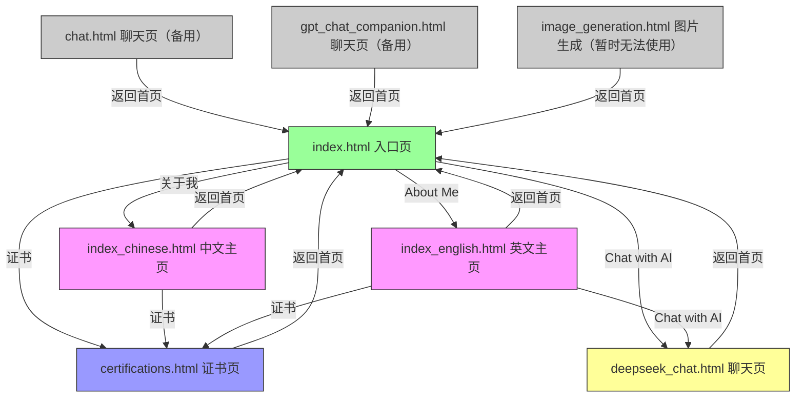
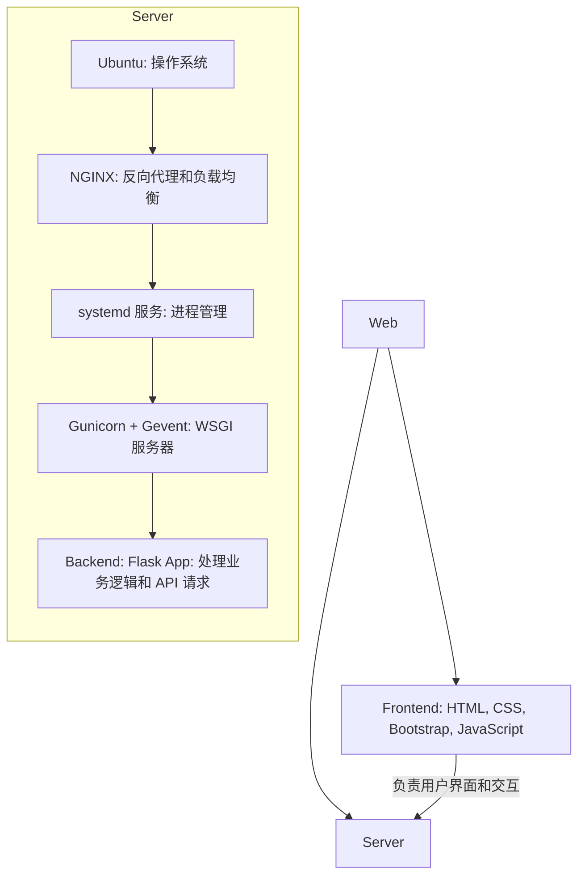

<!-- START doctoc generated TOC please keep comment here to allow auto update -->
<!-- DON'T EDIT THIS SECTION, INSTEAD RE-RUN doctoc TO UPDATE -->
**Table of Contents**  *generated with [DocToc](https://github.com/thlorenz/doctoc)*

- [张人大 (Renda Zhang) · 轻量级网站](#%E5%BC%A0%E4%BA%BA%E5%A4%A7-renda-zhang-%C2%B7-%E8%BD%BB%E9%87%8F%E7%BA%A7%E7%BD%91%E7%AB%99)
  - [简介](#%E7%AE%80%E4%BB%8B)
  - [网站功能](#%E7%BD%91%E7%AB%99%E5%8A%9F%E8%83%BD)
  - [页面功能](#%E9%A1%B5%E9%9D%A2%E5%8A%9F%E8%83%BD)
  - [页面跳转逻辑](#%E9%A1%B5%E9%9D%A2%E8%B7%B3%E8%BD%AC%E9%80%BB%E8%BE%91)
  - [页面内容介绍](#%E9%A1%B5%E9%9D%A2%E5%86%85%E5%AE%B9%E4%BB%8B%E7%BB%8D)
  - [技术栈](#%E6%8A%80%E6%9C%AF%E6%A0%88)
    - [参考架构](#%E5%8F%82%E8%80%83%E6%9E%B6%E6%9E%84)
  - [依赖项目部署](#%E4%BE%9D%E8%B5%96%E9%A1%B9%E7%9B%AE%E9%83%A8%E7%BD%B2)
    - [**后端**](#%E5%90%8E%E7%AB%AF)
    - [**Nginx**](#nginx)
  - [使用说明 | Usage](#%E4%BD%BF%E7%94%A8%E8%AF%B4%E6%98%8E--usage)
  - [🤝 贡献指南 | Contributing Guide](#-%E8%B4%A1%E7%8C%AE%E6%8C%87%E5%8D%97--contributing-guide)
  - [🔒 License](#-license)
  - [📬 联系方式](#-%E8%81%94%E7%B3%BB%E6%96%B9%E5%BC%8F)

<!-- END doctoc generated TOC please keep comment here to allow auto update -->


<!-- DON'T EDIT THIS SECTION, INSTEAD RE-RUN doctoc TO UPDATE -->

- [张人大 (Renda Zhang) · 轻量级网站](#张人大-renda-zhang--轻量级网站)
  - [简介](#简介)
  - [网站功能](#网站功能)
  - [页面功能](#页面功能)
  - [页面跳转逻辑](#页面跳转逻辑)
  - [页面内容介绍](#页面内容介绍)
  - [技术栈](#技术栈)
    - [参考架构](#参考架构)
  - [依赖项目部署](#依赖项目部署)
    - [**后端**](#后端)
    - [**Nginx**](#nginx)
  - [使用说明 | Usage](#使用说明--usage)
  - [🤝 贡献指南 | Contributing Guide](#-贡献指南--contributing-guide)
  - [🔒 License](#-license)
  - [📬 联系方式](#-联系方式)

<!-- END doctoc generated TOC please keep comment here to allow auto update -->

# 张人大 (Renda Zhang) · 轻量级网站

- **作者**: 张人大 (Renda Zhang)
- **最后更新**: July 15, 2025, 00:00 (UTC+8)

---

## 简介

这是我个人维护的中英文双语技术展示的 **轻量级** 网站，旨在作为我的简历、作品集和技术能力的在线展示平台。

**网站链接**: 🌐 [www.rendazhang.com](https://www.rendazhang.com)

---

## 网站功能

- 💬 与 AI 在线对话
- 🖼️ 文本到图像生成功能（出于成本原因，暂时关闭）
- 📱 自适应布局 (移动端和桌面端)
- 💤 图片懒加载
- 🎖️ 证书展示
- 📝 简历展示和下载 (English & 中文，PDF 格式)
- 📂 项目展示
- ✉️ 联系表单 (通过 Formspree)
- 🎵 背景音乐播放开关
- 🌏 多语言支持 (英文 + 中文)
- 💻 技术文档展示页 (docs.html)
- 🔗 内容平台链接

---

## 页面功能

各 HTML 页面核心职责如下：

- `index.html`：入口页，提供语言选择及快捷导航。
- `index_chinese.html`：中文版主页，展示个人信息、技能与联系方式。
- `index_english.html`：英文版主页，内容与中文版对应。
- `certifications.html`：证书列表页。
- `deepseek_chat.html`：AI 聊天界面。

其他 HTML 页面：

- `404.html`，`50x.html`：错误提示页面。
- `image_generation.html`：文本转图片功能页（因为成本，功能暂时关闭）。
- `chat.html`，`gpt_chat_companion.html`：作为备份的旧 AI 聊天界面。

---

## 页面跳转逻辑

- `index.html` 链接到中英文主页、DeepSeek Chat 和证书页。
- 各子页面均包含返回入口页的按钮。
- 中英文主页内部通过锚点导航跳转到 About、Skills 等板块，并提供聊天或证书链接。

Mermaid Flow 图示：



---

## 页面内容介绍

- `index.html`：简洁布局，包括语言选择区、AI 聊天入口、证书入口和技术文档链接，并展示五个指向微信公众号、知乎、今日头条、CSDN 与 Medium 的内容平台图标。
- `index_chinese.html`，`index_english.html`：带侧边菜单的多 Section 页面，包含 "Hero"、"About"、"Skills"、"Resume/Experience"、"Blog/Projects"、"Contact" 等模块。
- `certifications.html`：栅格卡片形式展示证书，并嵌入 Credly 验证链接。
- `deepseek_chat.html`：聊天记录区域与输入框组成的对话界面，可渲染 AI 返回的 Markdown，支持一键复制原始内容，并会在刷新后保留历史。
- `image_generation.html`：包含文本输入框与生成按钮，展示生成的图片。
- `404.html / 50x.html`：简单文本提示页面。

---

## 技术栈

| 分类                  | 技术                                    |
| --------------------- | --------------------------------------- |
| 前端 Frontend         | HTML, CSS, Bootstrap, JavaScript        |
| 后端 Backend          | Flask (Python), OpenAI API              |
| 服务器 Server         | Ubuntu, NGINX, Gunicorn + Gevent        |
| 工具 Tools            | Git, Gitee, Markdown, Docker (optional) |
| 页面架构 Architecture | 多页面静态网站 (MPA)                    |

### 参考架构

ASCII 图示：

```text
Web Application Architecture
============================

Frontend (
   HTML + CSS + Bootstrap + JavaScript
   - 负责用户界面和交互
) → Server (
   Ubuntu (操作系统)
   ↓
   NGINX (反向代理和负载均衡)
   ↓
   systemd 服务 (进程管理)
   ↓
   Gunicorn + Gevent (WSGI 服务器)
   ↓
   Backend: Flask App (处理业务逻辑和 API 请求)
)
```

Mermaid Flow 图示：



---

## 依赖项目部署

### **后端**

> 具体操作请参考后端项目：📁 [Python Cloud Chat](https://github.com/RendaZhang/python-cloud-chat)

### **Nginx**

> 具体操作请参考 Nginx 项目：📁 [Nginx Conf](https://github.com/RendaZhang/nginx-conf)

---

## 使用说明 | Usage

你可以直接访问各模块页面：

- 🌐 [About Me / 关于我](https://www.rendazhang.com/index_english.html)
- 🌐 [中文介绍页](https://www.rendazhang.com/index_chinese.html)
- 🌐 [Chat with AI / 与 AI 聊天](https://www.rendazhang.com/deepseek_chat.html)
- 🌐 [Certifications / 证书](https://www.rendazhang.com/certifications.html)

如果你想查看渲染后的技术文档页面，请访问：
🌐 [www.rendazhang.com/docs.html](https://www.rendazhang.com/docs.html)

---

## 🤝 贡献指南 | Contributing Guide

- Fork & clone this repo.
- 安装依赖并启用 **pre-commit**:

```bash
npm install
pip install -r requirements-dev.txt
pre-commit install
```

- 在每次提交前，钩子会自动运行。你也可以手动触发：

```bash
pre-commit run --all-files
```

> ✅ 所有提交必须通过 pre-commit 检查；CI 会阻止不符合规范的 PR。

---

## 🔒 License

本项目采用 **MIT 协议** 开源发布。这意味着你可以自由地使用、修改并重新发布本仓库的内容，只需在分发时附上原始许可证声明。

---

## 📬 联系方式

- 联系人：张人大（Renda Zhang）
- 📧 Email: [952402967@qq.com](mailto:952402967@qq.com)
- 📄 English Resume: [Resume PDF Version](https://www.rendazhang.com/images/Resume_RendaZhang.pdf)
- 📄 中文简历: [个人简历 PDF 格式](https://www.rendazhang.com/images/%E4%B8%AA%E4%BA%BA%E7%AE%80%E5%8E%86_%E5%BC%A0%E4%BA%BA%E5%A4%A7.pdf)


> ⏰ **Maintainer**：@Renda — 如果本项目对你有帮助，请不要忘了点亮 ⭐️ Star 支持我们！
