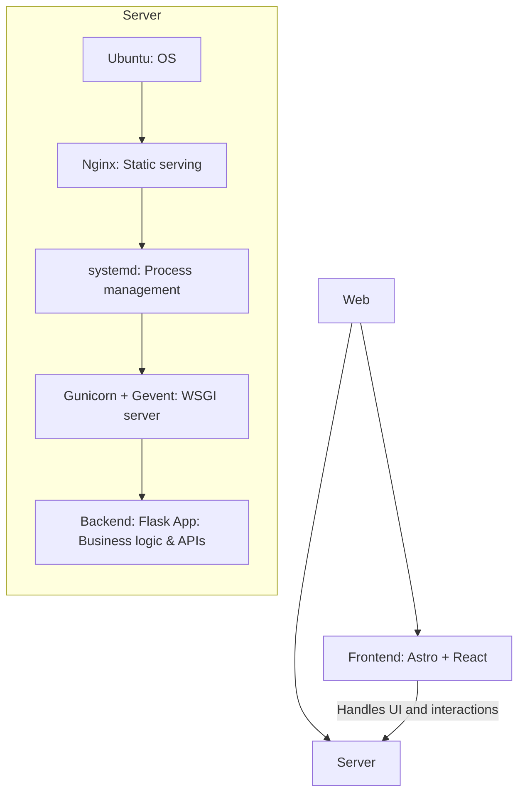
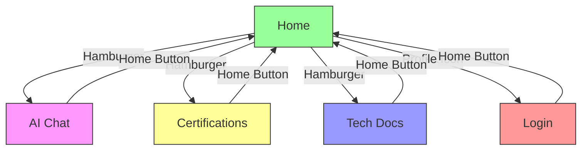

<!-- START doctoc generated TOC please keep comment here to allow auto update -->
<!-- DON'T EDIT THIS SECTION, INSTEAD RE-RUN doctoc TO UPDATE -->

- [Renda Zhang · Lightweight Website](#renda-zhang-%C2%B7-lightweight-website)
  - [Introduction](#introduction)
  - [Tech Stack](#tech-stack)
    - [Directory Structure](#directory-structure)
    - [Reference Architecture](#reference-architecture)
  - [Frontend](#frontend)
    - [Architecture Overview](#architecture-overview)
      - [BaseLayout Component Design Notes](#baselayout-component-design-notes)
    - [Local Development & Preview](#local-development--preview)
      - [GitHub Actions](#github-actions)
      - [Usage Guide](#usage-guide)
    - [Website Features](#website-features)
      - [Page Functionality](#page-functionality)
      - [Page Navigation](#page-navigation)
      - [Page Content](#page-content)
      - [Page Optimization](#page-optimization)
      - [Color Scheme](#color-scheme)
  - [**Backend**](#backend)
  - [**Nginx Server**](#nginx-server)
  - [Documentation](#documentation)
    - [Git Branching & Release Workflow](#git-branching--release-workflow)
    - [CI/CD Workflow](#cicd-workflow)
    - [BUG Tracking](#bug-tracking)
    - [Development Requirements](#development-requirements)
    - [Native to Astro + React Migration](#native-to-astro--react-migration)
    - [Responsive Image System Maintenance](#responsive-image-system-maintenance)
    - [Error Tracking](#error-tracking)
    - [Utilities Reference](#utilities-reference)
    - [Comprehensive Pre-Commit Guide](#comprehensive-pre-commit-guide)
    - [Style System Description](#style-system-description)
  - [🤝 Contribution Guide](#-contribution-guide)
  - [🔒 Open Source License](#-open-source-license)
  - [📬 Contact](#-contact)

<!-- END doctoc generated TOC please keep comment here to allow auto update -->

# Renda Zhang · Lightweight Website

- **Author**: Renda Zhang
- **Last Updated**: August 12, 2025, 04:50 (UTC+08:00)

---

## Introduction

**[点击这里查看 Github 上的中文版](https://github.com/RendaZhang/rendazhang/blob/master/README.md)**

This is my personally maintained **lightweight** technical showcase website, serving as an online portfolio of my technical capabilities.

**Live Site**: 🌐 [www.rendazhang.com](https://www.rendazhang.com)

The website is optimized for SEO and GEO.

> If you need a more robust server solution, you can refer to my cloud-native project: 📁 [Renda Cloud LAB](https://github.com/RendaZhang/renda-cloud-lab). This project provides a complete cloud-native architecture design, suitable for large-scale and high-availability scenarios.

---

## Tech Stack

| Category         | Technologies                                        |
| ---------------- | --------------------------------------------------- |
| Frontend         | **Astro**, **React**, TypeScript                    |
| State Management | React `useState`, `useContext` (Zustand compatible) |
| Build Tools      | Astro built-in (Vite-based)                         |
| Backend          | Flask + OpenAI API                                  |
| Deployment       | GitHub Actions + Nginx                              |

### Directory Structure

```text
src/
├── assets/
├── constants/           # Site metadata, asset paths, and app settings
├── features/            # Feature-based modules
│   ├── chat/
│   │   ├── components/
│   │   ├── hooks/
│   │   └── services/
│   └── auth/
│       ├── components/
│       ├── hooks/
│       └── services/
├── hooks/               # Custom hooks for business logic
├── styles/
│   ├── core/               # Core variables
│   │   ├── tokens.css      # Design tokens (colors, spacing, etc.)
│   │   └── _gradients.css  # Gradient system
│   ├── components/         # Component styles
│   ├── utilities/          # Utility classes
│   └── theme.css           # Main entry file
├── scripts/
├── utils/               # Utility helpers
├── models/              # Domain models
├── services/           # API interaction layer
└── components/
    ├── ui/
    ├── layouts/
    ├── forms/
    ├── chat/
    ├── sections/
    └── providers/
```

### Reference Architecture

ASCII Diagram:

```text
Web Application Architecture
============================

Frontend (
   Astro + React
   - Handles UI and interactions
) → CI/CD (
   GitHub Actions auto-build & deploy
) → Server (
   Ubuntu (OS)
   ↓
   Nginx (static file serving)
   ↓
   systemd service (process management)
   ↓
   Gunicorn + Gevent (WSGI server)
   ↓
   Backend: Flask App (business logic & API handling)
)
```

Mermaid Flow Diagram:



---

## Frontend

This repository contains the frontend project: 📁 [Renda Zhang WEB](https://github.com/RendaZhang/rendazhang)

### Architecture Overview

#### BaseLayout Component Design Notes

`src/layouts/BaseLayout.astro` serves as the global page framework for the site, responsible for setting `<head>` metadata, SEO tags, and root-level slots. The navigation bar and hamburger menu now render on the server and hydrate with `client:load`, avoiding language flicker while preserving interactivity. The primary reasons for keeping this file as an Astro component are as follows:

- **Static Content Does Not Require JavaScript**: The layout structure and metadata generation are purely static content. Astro can directly output HTML without introducing the React runtime.
- **Maintain Partial Hydration Benefits**: Only interactive regions such as the navigation bar and hamburger menu use React, rendering static HTML first and hydrating on the client via `client:load`. The rest of the layout remains zero-JS, keeping bundle size minimal. Rewriting the entire layout in React would introduce additional script and hydration overhead.
- **Leverage Astro Features**: Astro-specific syntax such as `<slot>` and `is:inline` is extensively used in the layout. Migrating to React would require additional encapsulation or plugin support, increasing maintenance costs.

Consider rewriting `BaseLayout.astro` only if there are plans to fully migrate the site to React or if there is a need to share complex React state/context at the layout level. For now, maintaining the Astro version is more concise and efficient.

To satisfy Nginx CSP restrictions and allow static pages like 404/500 to reuse theme and language logic, the former inline initialization script has been moved to a blocking external script `/js/base-layout-init.js`. The file is generated from `src/scripts/base-layout-init.ts` and passes storage keys via `data-theme-key` and `data-lang-key` attributes so that theme and language are applied before the page renders.

### Local Development & Preview

1. Install dependencies and enable pre-commit:

   ```bash
   npm install
   pip install pre-commit
   pre-commit install
   ```

2. Start local dev server:

   ```bash
   npm run dev
   ```

3. Build and preview production version:

   ```bash
   npm run build
   npm run preview
   ```

4. To connect to a custom backend API, set the `PUBLIC_API_BASE_URL` in the root directory's `.env` / `.env.local` file:

   ```bash
   PUBLIC_API_BASE_URL=https://api.example.com
   ```

5. Sentry integration also requires:

   ```bash
   SENTRY_DSN=<server dsn>
   PUBLIC_SENTRY_DSN=<browser dsn>
   SENTRY_PROJECT=<your project>
   SENTRY_AUTH_TOKEN=<auth token>
   ```

   When running local checks or pre-commit without Sentry, prepend:

   ```bash
   SKIP_SENTRY=true pre-commit run --all-files
   SKIP_SENTRY=true npm run astro -- check --incremental
   ```

   To temporarily skip ESLint checks and speed up commits, use:

   ```bash
   SKIP_ESLINT=true pre-commit run --all-files
   ```

6. Environment Variables Explanation

   Local configurations can be set in `.env` or `.env.local`, and read via the `getEnv()` function in `src/utils/env.ts`:

   ```sh
   # Public Information
   PUBLIC_SITE_BASE_URL = "https://www.rendazhang.com"
   PUBLIC_CDN_BASE="https://cdn.jsdelivr.net/gh/rendazhang/rendazhang@1.0.1/"
   PUBLIC_API_BASE_URL="/cloudchat"
   PUBLIC_SENTRY_DSN="https://e184a284f1b7342d197ee0a0151f8353@o4509770577543168.ingest.us.sentry.io/4509770780377088"
   PUBLIC_TAG_NAME="v1.0.1"
   NODE_ENV="production"
   PUBLIC_NODE_ENV="development" # Override to "development" for local debugging
   SKIP_SENTRY="true" # Skip Sentry
   SKIP_ESLINT="true" # Skip ESLint checks

   # Sensitive configurations (example values below)
   SENTRY_AUTH_TOKEN="sntrys_xxx"
   SENTRY_DSN="https://private-key@xxx.ingest.us.sentry.io/xxx"
   SENTRY_PROJECT="xxx"
   SENTRY_ORG="xxx"
   ```

After running `npm run build`, the `dist/_astro` directory will contain fingerprinted files with hash suffixes, allowing browsers to cache them long-term.

Access via `http://localhost:4321`.

Verify builds using `npm run preview`.

#### GitHub Actions

Pushing to `master` triggers GitHub Actions Auto-Deployment:

1. Code checkout & dependency installation
2. `npm run build` generates static files
3. `appleboy/scp-action` deploys `dist/` to server (e.g., `/var/www/html`)
4. Nginx serves content post-deployment

Configure server IP, SSH user, and private key in Repository Secrets. Details: 📄 [GitHub Actions Setup](https://github.com/RendaZhang/rendazhang/blob/master/docs/guides/NATIVE_TO_ASTRO_REACT_UPGRADE.md#%E9%85%8D%E7%BD%AE-github-actions)

#### Usage Guide

Access all modules post-deployment:

- 🌐 [Homepage](https://www.rendazhang.com/)
- 🌐 [AI Chat](https://www.rendazhang.com/deepseek_chat/)
- 🌐 [Certifications](https://www.rendazhang.com/certifications/)
- 🌐 [Tech Docs](https://www.rendazhang.com/docs/)
- 🌐 [Login](https://www.rendazhang.com/login/)
- 🌐 [Register](https://www.rendazhang.com/register/)

### Website Features

For details on the core functionality system of the website, please refer to the following documentation link: 📄 [Core Functionality System](https://github.com/RendaZhang/rendazhang/blob/master/docs/REQUIREMENTS.md#-%E6%A0%B8%E5%BF%83%E5%8A%9F%E8%83%BD%E4%BD%93%E7%B3%BB). This document provides a detailed description of the website's core functional modules, including feature design and technical implementation. It serves as an essential reference for development and maintenance.

- Theme switching (light / dark)
- Language toggle (Chinese / English)
- Real-time AI chat
- Floating AI chat widget
- Back-to-top button
- Tech documentation rendering (docs/)
- Login/registration forms
- Contact form
- Content platform links
- Certification showcase
- Resume download

#### Page Functionality

Core responsibilities (generated from `.astro` files):

- `index.astro`: Personal intro with ChatWidget
- `certifications.astro`: Certification gallery
- `deepseek_chat.astro`: AI chat interface
- `docs.astro`: Technical documentation page
- `login.astro`: Login page
- `register.astro`: Registration page
- `404.astro`, `500.astro`: Error pages

#### Page Navigation

1. **Return to Homepage**
   All pages have "Home" button in navigation

2. **Menu Navigation**
   - The navigation bar and hamburger menu render on the server and hydrate on the client via `client:load`, preserving interactivity without hydration errors.
   - Hamburger menu provides access to:
     - Homepage
     - AI Chat
     - Certifications
     - Tech Docs

3. **Login Page Access**
   Profile icon in nav redirects to login



#### Page Content

- `index.astro`: A multi-section homepage containing modules such as "Hero", "About Me", "Education", "Blog", "Skills & Abilities", "Experience", and "Contact Me", with a default floating `ChatWidget` badge.
- `certifications.astro`: Grid-based certification cards with Credly verification
- `deepseek_chat.astro`: A conversational interface consisting of a chat history area and an input box, supporting streaming output and real-time rendering of AI-generated Markdown content. It provides a one-click copy feature for the original content and automatically retains the chat history upon page refresh, and loads both `github-code-highlight.css` and `github-markdown-light.css` for consistent GitHub-style code highlighting. The chat UI has been refactored into reusable components such as `ChatMessageList` and `ChatInput` for better maintainability.
- `docs.astro`: Technical documentation page that loads both `github-code-highlight.css` and `github-markdown-light.css` together with highlight.js for GitHub-style Markdown layout and code highlighting.
- `login.astro`: Login form page.
- `register.astro`: Register form page.
- `404.astro/500.astro`: Custom error pages designed to handle Page Not Found (404) and Internal Server Error (500) scenarios. These pages provide clear error messages, user-friendly guidance, and a link to return to the homepage, enhancing the overall user experience.

#### Page Optimization

**Adaptive Layout**: Optimizes the display effect of the page on different devices, reduces unnecessary resource loading and layout calculations, and thereby improves performance. Ensures that the page displays well on various screen sizes (e.g., desktop, tablet, mobile), enhancing user experience.

**Lazy Loading**: All images have lazy loading enabled with a loading animation. For high-definition images, LQIP (Low-Quality Image Placeholder) lazy loading optimization is applied (e.g., the Hero section on the homepage).

#### Color Scheme

The core colors of the project are designed using OKLCH design tokens and provide sRGB fallback through `color-mix` to ensure perceptual consistency across light and dark modes.

For detailed information, refer to the documentation: 📄 [Color Scheme](https://github.com/RendaZhang/rendazhang/blob/master/docs/STYLE_GUIDE.md#%E9%85%8D%E8%89%B2%E6%96%B9%E6%A1%88).

---

## **Backend**

> For detailed steps and configurations on backend deployment, please refer to the following project: 📁 [Python Cloud Chat](https://github.com/RendaZhang/python-cloud-chat). This project provides a complete backend implementation and deployment guide, helping you quickly set up and run backend services.

---

## **Nginx Server**

> The frontend project is automatically built via GitHub Actions and pushed to the `/var/www/html` directory on the server, where Nginx serves the static resources.

> For detailed Nginx configurations and operational instructions, please check the following repository: 📁 [Nginx Conf](https://github.com/RendaZhang/nginx-conf). This repository includes commonly used Nginx configuration files and examples, making it easy for you to get started.

> To fully leverage the hashed assets under `/_astro`, add a long-term cache rule in Nginx:

```nginx
location /_astro/ {
    access_log off;
    add_header Cache-Control "public, max-age=31536000, immutable";
}
```

> If you need a more robust server solution, you can refer to my cloud-native project: 📁 [Renda Cloud LAB](https://github.com/RendaZhang/renda-cloud-lab). This project provides a complete cloud-native architecture design, suitable for large-scale and high-availability scenarios.

---

## Documentation

### Git Branching & Release Workflow

> The project follows a `master`/`develop` dual-branch model with conventions for `feature`, `hotfix`, and `experiment` branches. Details: 📄 [Git Workflow](https://github.com/RendaZhang/rendazhang/blob/master/docs/GIT_WORKFLOW.md#git-workflow).

### CI/CD Workflow

> `deploy.yml` defines the deployment process triggered when code is pushed or merged into `master`, including tag management and environment variable mappings. See: 📄 [CI / CD Pipeline](https://github.com/RendaZhang/rendazhang/blob/master/docs/CI_CD.md#ci--cd-pipeline).

### BUG Tracking

> For BUGs encountered during frontend development and their solutions, please refer to the following document: 📄 [Frontend BUG Tracking Database](https://github.com/RendaZhang/rendazhang/blob/master/docs/TROUBLESHOOTING.md#%E5%89%8D%E7%AB%AF-bug-%E8%B7%9F%E8%B8%AA%E6%95%B0%E6%8D%AE%E5%BA%93). This document provides detailed records of BUG descriptions, reproduction steps, solutions, and developer notes, helping you quickly identify and resolve issues.

### Development Requirements

> For project feature requirements, priorities, and development plans, please refer to the following document: 📄 [Project Requirements List](https://github.com/RendaZhang/rendazhang/blob/master/docs/REQUIREMENTS.md#%E9%A1%B9%E7%9B%AE%E9%9C%80%E6%B1%82%E6%B8%85%E5%8D%95). This document lists all requirements for the current version, along with detailed descriptions and development statuses, making it easy for you to track project progress and plan development tasks.

### Native to Astro + React Migration

The front-end currently adopts an architecture based on **Astro** + **React**, following a layered design philosophy. It utilizes **GitHub Actions** for automated builds and deploys the build artifacts to a specified directory on the server's **Nginx**.

For detailed steps on upgrading from native frontend, please refer to the following documentation: 📄 [Upgrade Plan](https://github.com/RendaZhang/rendazhang/blob/master/docs/guides/NATIVE_TO_ASTRO_REACT_UPGRADE.md#%E6%97%A7%E7%89%88%E5%8E%9F%E7%94%9F%E5%89%8D%E7%AB%AF%E5%88%B0-astro--react-%E6%96%B0%E5%89%8D%E7%AB%AF%E7%9A%84%E6%B8%90%E8%BF%9B%E5%8D%87%E7%BA%A7%E8%AE%A1%E5%88%92). This document provides a comprehensive plan and implementation steps for gradually migrating from the old native frontend to a new frontend architecture based on Astro and React.

For detailed steps on setting up the development environment, please refer to the following documentation: 📄 [Environment Preparation](https://github.com/RendaZhang/rendazhang/blob/master/docs/guides/NATIVE_TO_ASTRO_REACT_UPGRADE.md#%E9%98%B6%E6%AE%B5-1%E7%8E%AF%E5%A2%83%E5%87%86%E5%A4%87%E4%B8%8E-astro-%E9%A1%B9%E7%9B%AE%E5%88%9D%E5%A7%8B%E5%8C%96). This document provides a comprehensive guide on configuring the development environment and initializing an Astro project, ensuring you can smoothly proceed with subsequent development tasks.

### Responsive Image System Maintenance

The website uses an automated pipeline to generate responsive images with built-in LQIP placeholders. For maintenance and extension instructions, see 📄 [Responsive Image System Maintenance](https://github.com/RendaZhang/rendazhang/blob/master/docs/guides/RESPONSIVE_IMAGE_SYSTEM_MAINTENANCE.md#%E9%80%9A%E7%94%A8%E5%93%8D%E5%BA%94%E5%BC%8F%E5%9B%BE%E7%89%87%E5%A4%84%E7%90%86%E7%B3%BB%E7%BB%9F%E7%BB%B4%E6%8A%A4%E6%96%87%E6%A1%A3)

### Error Tracking

Sentry collects runtime and network errors. See 📄 [Error Tracking Integration](https://github.com/RendaZhang/rendazhang/blob/master/docs/guides/SENTRY_ERROR_TRACKING.md#sentry-error-tracking-integration) for configuration.

### Utilities Reference

`src/utils/env.ts`, `src/utils/langUtils.ts`, `src/utils/storage.ts`, and `src/utils/logger.ts` provide unified access to environment variables, language parsing, multi-backend storage solutions, and an extensible logging interface.

Docs: 📄 [Utilities Reference](https://github.com/RendaZhang/rendazhang/blob/master/docs/guides/UTILITIES_REFERENCE.md#%E5%B7%A5%E5%85%B7%E5%87%BD%E6%95%B0%E5%8F%82%E8%80%83%E6%96%87%E6%A1%A3).

### Comprehensive Pre-Commit Guide

For a detailed explanation of the pre-commit hooks, refer to the [Comprehensive Pre-Commit Guide](https://github.com/RendaZhang/rendazhang/blob/master/docs/guides/PRE_COMMIT_GUIDE.md#%E9%A2%84%E6%8F%90%E4%BA%A4%E9%92%A9%E5%AD%90%E7%BB%BC%E5%90%88%E6%8C%87%E5%8D%97).

### Style System Description

> Introduce the project's CSS architecture, the OKLCH-based design token system, and the build process. Demonstrate how `postcss-import` inlines the core and utility styles referenced by `theme.css` during the compilation phase to reduce runtime requests. For details, see: 📄 [Style Guide](https://github.com/RendaZhang/rendazhang/blob/master/docs/STYLE_GUIDE.md#%E6%A0%B7%E5%BC%8F%E8%AF%B4%E6%98%8E).

---

## 🤝 Contribution Guide

- Fork and clone this repository.
- Enter the virtual environment:
  ```bash
  # If the virtual environment is not yet installed, run: python -m venv venv
  source venv/bin/activate
  ```
- Install dependencies and enable **pre-commit**:
  ```bash
  pip install pre-commit
  pre-commit install
  ```
- Before each commit, the hooks will automatically run and perform the following tasks:
  - Automatically fix basic formatting issues (trailing whitespace, end-of-file newlines, etc.)
  - Update the documentation table of contents and the last updated timestamp
  - Synchronize the README file to the assets directory
  - Validate static resource naming conventions
  - Automatically generate module `index.ts` files
  - Perform code formatting and static checks

> ✅ All commits must pass the pre-commit checks; CI will block PRs that do not meet the standards.

---

## 🔒 Open Source License

Released under **MIT License** - free for use and modification. Retain original license notices when redistributing.

---

## 📬 Contact

- Contact: Renda Zhang
- 📧 Email: [952402967@qq.com](mailto:952402967@qq.com)

> ⏰ **Maintainer**: @RendaZhang — If this project helps you, please give it a ⭐️!
