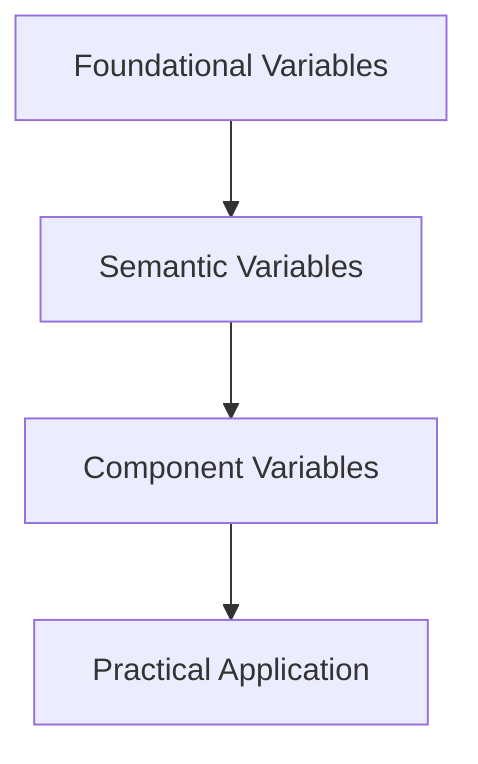
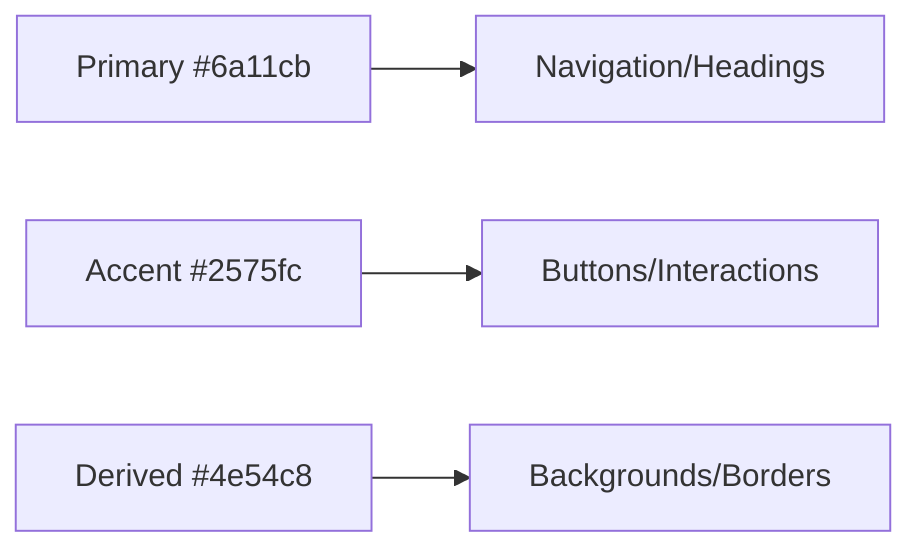

<!-- START doctoc generated TOC please keep comment here to allow auto update -->
<!-- DON'T EDIT THIS SECTION, INSTEAD RE-RUN doctoc TO UPDATE -->

- [Renda Zhang · Lightweight Website](#renda-zhang--lightweight-website)
  - [Introduction](#introduction)
  - [Tech Stack](#tech-stack)
    - [Directory Structure](#directory-structure)
    - [Reference Architecture](#reference-architecture)
  - [Frontend](#frontend)
    - [Local Development \& Preview](#local-development--preview)
      - [GitHub Actions](#github-actions)
      - [Usage Guide](#usage-guide)
    - [Website Features](#website-features)
      - [Page Functionality](#page-functionality)
      - [Page Navigation](#page-navigation)
      - [Page Content](#page-content)
      - [Page Optimization](#page-optimization)
      - [Color Scheme](#color-scheme)
  - [**Backend**](#backend)
  - [**Nginx Server**](#nginx-server)
  - [Documentation](#documentation)
    - [BUG Tracking](#bug-tracking)
    - [Development Requirements](#development-requirements)
    - [Native to Astro + React Migration](#native-to-astro--react-migration)
    - [Static Asset Naming Validation](#static-asset-naming-validation)
    - [Responsive Image System Maintenance](#responsive-image-system-maintenance)
    - [Error Tracking](#error-tracking)
    - [Language Utilities](#language-utilities)
    - [Storage Utility](#storage-utility)
  - [🤝 Contribution Guidelines](#-contribution-guidelines)
  - [🔒 Open Source License](#-open-source-license)
  - [📬 Contact](#-contact)

<!-- END doctoc generated TOC please keep comment here to allow auto update -->

# Renda Zhang · Lightweight Website

- **Author**: Renda Zhang
- **Last Updated**: August 04, 2025, 00:54 (UTC+8)

---

## Introduction

**[点击这里查看 Github 上的中文版](https://github.com/RendaZhang/rendazhang/blob/master/README.md)**

This is my personally maintained **lightweight** technical showcase website, serving as an online portfolio of my technical capabilities.

**Live Site**: 🌐 [www.rendazhang.com](https://www.rendazhang.com)

The website is optimized for SEO and GEO.

> If you need a more robust server solution, you can refer to my cloud-native project: 📁 [Renda Cloud LAB](https://github.com/RendaZhang/renda-cloud-lab). This project provides a complete cloud-native architecture design, suitable for large-scale and high-availability scenarios.

---

## Tech Stack

| Category         | Technologies                                        |
| ---------------- | --------------------------------------------------- |
| Frontend         | **Astro**, **React**, TypeScript                    |
| State Management | React `useState`, `useContext` (Zustand compatible) |
| Build Tools      | Astro built-in (Vite-based)                         |
| Backend          | Flask + OpenAI API                                  |
| Deployment       | GitHub Actions + Nginx                              |

### Directory Structure

```text
src/
├── assets/
├── constants/           # Path constants and API endpoints
├── features/            # Feature-based modules
│   ├── chat/
│   │   ├── components/
│   │   ├── hooks/
│   │   └── services/
│   └── auth/
│       ├── components/
│       ├── hooks/
│       └── services/
├── hooks/               # Custom hooks for business logic
├── styles/
│   ├── core/               # Core variables
│   │   ├── _colors.css     # Color system
│   │   ├── _spacing.css    # Spacing system
│   │   └── _gradients.css  # Gradient system
│   ├── components/         # Component styles
│   ├── utilities/          # Utility classes
│   └── theme.css           # Main entry file
├── scripts/
├── utils/               # Utility helpers
├── models/              # Domain models
├── services/           # API interaction layer
└── components/
    ├── ui/
    ├── layouts/
    ├── forms/
    ├── chat/
    ├── sections/
    └── providers/
```

### Reference Architecture

ASCII Diagram:

```text
Web Application Architecture
============================

Frontend (
   Astro + React
   - Handles UI and interactions
) → CI/CD (
   GitHub Actions auto-build & deploy
) → Server (
   Ubuntu (OS)
   ↓
   Nginx (static file serving)
   ↓
   systemd service (process management)
   ↓
   Gunicorn + Gevent (WSGI server)
   ↓
   Backend: Flask App (business logic & API handling)
)
```

Mermaid Flow Diagram:


---

## Frontend

This repository contains the frontend project: 📁 [Renda Zhang WEB](https://github.com/RendaZhang/rendazhang)

### Local Development & Preview

1. Install dependencies and enable pre-commit:

   ```bash
   npm install
   pip install pre-commit
   pre-commit install
   ```

2. Start local dev server:

   ```bash
   npm run dev
   ```

3. Build and preview production version:

   ```bash
   npm run build
   npm run preview
   ```

4. To point the frontend at a custom backend, create a `.env` file and set `PUBLIC_API_BASE_URL`:

   ```bash
   PUBLIC_API_BASE_URL=https://api.example.com
   ```

   Sentry integration also requires:

   ```bash
   SENTRY_DSN=<server dsn>
   PUBLIC_SENTRY_DSN=<browser dsn>
   SENTRY_PROJECT=<your project>
   SENTRY_AUTH_TOKEN=<auth token>
   ```

After running `npm run build`, the `dist/_astro` directory will contain fingerprinted files with hash suffixes, allowing browsers to cache them long-term.

Access via `http://localhost:4321`.

Verify builds using `npm run preview`.

#### GitHub Actions

Pushing to `master` triggers GitHub Actions Auto-Deployment:

1. Code checkout & dependency installation
2. `npm run build` generates static files
3. `appleboy/scp-action` deploys `dist/` to server (e.g., `/var/www/html`)
4. Nginx serves content post-deployment

Configure server IP, SSH user, and private key in Repository Secrets. Details: 📄 [GitHub Actions Setup](https://github.com/RendaZhang/rendazhang/blob/master/docs/NATIVE_TO_ASTRO_REACT_UPGRADE.md#%E9%85%8D%E7%BD%AE-github-actions)

#### Usage Guide

Access all modules post-deployment:

- 🌐 [Homepage](https://www.rendazhang.com/)
- 🌐 [AI Chat](https://www.rendazhang.com/deepseek_chat/)
- 🌐 [Certifications](https://www.rendazhang.com/certifications/)
- 🌐 [Tech Docs](https://www.rendazhang.com/docs/)
- 🌐 [Login](https://www.rendazhang.com/login/)
- 🌐 [Register](https://www.rendazhang.com/register/)

### Website Features

For details on the core functionality system of the website, please refer to the following documentation link: 📄 [Core Functionality System](https://github.com/RendaZhang/rendazhang/blob/master/docs/REQUIREMENTS.md#-%E6%A0%B8%E5%BF%83%E5%8A%9F%E8%83%BD%E4%BD%93%E7%B3%BB). This document provides a detailed description of the website's core functional modules, including feature design and technical implementation. It serves as an essential reference for development and maintenance.

- Theme switching (light / dark)
- Language toggle (Chinese / English)
- Real-time AI chat
- Floating AI chat widget
- Tech documentation rendering (docs/)
- Login/registration forms
- Contact form
- Content platform links
- Certification showcase
- Resume download

#### Page Functionality

Core responsibilities (generated from `.astro` files):

- `index.astro`: Personal intro with ChatWidget
- `certifications.astro`: Certification gallery
- `deepseek_chat.astro`: AI chat interface
- `docs.astro`: Technical documentation page
- `404.html`, `50x.html`: Error pages
- `login.astro`：Login page
- `register.astro`：Registration page

#### Page Navigation

1. **Return to Homepage**
   All pages have "Home" button in navigation

2. **Menu Navigation**
   Hamburger menu provides access to:
   - Homepage
   - AI Chat
   - Certifications
   - Tech Docs

3. **Login Page Access**
   Profile icon in nav redirects to login


#### Page Content

- `index.astro`: A multi-section homepage containing modules such as "Hero", "About Me", "Education", "Blog", "Skills & Abilities", "Experience", and "Contact Me", with a default floating `ChatWidget` badge.
- `certifications.astro`: Grid-based certification cards with Credly verification
- `deepseek_chat.astro`: A conversational interface consisting of a chat history area and an input box, supporting streaming output and real-time rendering of AI-generated Markdown content. It provides a one-click copy feature for the original content and automatically retains the chat history upon page refresh, and loads both `github.min.css` and `github-markdown-light.min.css` for consistent GitHub-style code highlighting. The chat UI has been refactored into reusable components such as `ChatMessageList` and `ChatInput` for better maintainability.
- `docs.astro`: Technical documentation page that loads both `github.min.css` and `github-markdown-light.min.css` together with highlight.js for GitHub-style Markdown layout and code highlighting.
- `login.astro`: Login form page.
- `register.astro`: Register form page.
- `404.html/50x.html`: Custom error pages designed to handle Page Not Found (404) and Internal Server Error (50x) scenarios. These pages provide clear error messages, user-friendly guidance, and a link to return to the homepage, enhancing the overall user experience.

#### Page Optimization

**Adaptive Layout**: Optimizes the display effect of the page on different devices, reduces unnecessary resource loading and layout calculations, and thereby improves performance. Ensures that the page displays well on various screen sizes (e.g., desktop, tablet, mobile), enhancing user experience.

**Lazy Loading**: All images have lazy loading enabled with a loading animation. For high-definition images, LQIP (Low-Quality Image Placeholder) lazy loading optimization is applied (e.g., the Hero section on the homepage).

#### Color Scheme

**Unified Management**:

- Browser controls adapt to the theme (`color-scheme`).
- Public component styles are uniformly managed by `theme.css`.
- Markdown dark mode and error pages also have independent color tokens, which can be maintained in `src/styles/core/_colors.css`.
- Overlay and shadow-related colors are also set via `--color-black-rgb` and `--color-white-rgb` tokens, facilitating transparency adjustments and theme switching.
- Error page gradients also rely on these tokens, defined uniformly in `src/styles/core/_gradients.css`.

**Style Architecture Layering**:

- `src/styles/core/`: Defines foundational design tokens, including variables for colors, spacing, gradients, etc.
- `src/styles/components/`: Component-level styles (e.g., `about.css`, `chat_widget.css`, etc.).
- `src/styles/utilities/`: Layout and general utility classes, including `.debug` for debugging outlines.
- `src/styles/theme.css`: The entry point for styles, automatically importing `core/` and `utilities/`.

**Variable Dependency Diagram**:



**Color Emotion Evaluation**:

- Deep Purple: Conveys professionalism and innovation.
- Vibrant Blue: Symbolizes technology and trust.
- Combined Effect: Professional yet vibrant, suitable for tech products.

**Contrast Assurance**:
| Combination | Contrast Ratio | Suitability |
|----------------------|----------------|-------------|
| Primary + White Text | 7.2 : 1 | ✅ Perfect |
| Accent + Dark Gray | 5.1 : 1 | ✅ Good |
| Primary + Accent | 2.8 : 1 | ⚠️ Decorative Only |

**Primary Color**:

- Deep Violet `#6a11cb`
- Serves as the **core gradient** starting color, with strong visual recognition.
- Can be applied to navigation bars, core buttons, important headings, etc.
- Auxiliary values:
  - #5a0eb7 (hover state)
  - #7a24df (active state)

**Accent Color**:

- Vibrant Blue `#2575fc`
- Forms a perfect gradient transition with the **primary color**, providing visual focus.
- Can be applied to interactive elements, floating buttons, progress indicators.
- Auxiliary values:
  - #1c68e8 (hover state)
  - #3e86ff (active state)

**Core Gradient** transitions from Deep Purple `#6a11cb` to Vibrant Blue `#2575fc`, enhanced by **derived colors** for added depth.

**Primary-Secondary Relationship**:



**Color Testing**:

1. Accessibility Verification: Use [WebAIM Contrast Checker](https://webaim.org/resources/contrastchecker/) to test text readability.
2. Visual Hierarchy Test:
   ```
   /* Debug grayscale mode */
   .grayscale-mode {
     filter: grayscale(100%);
   }
   ```

---

## **Backend**

> For detailed steps and configurations on backend deployment, please refer to the following project: 📁 [Python Cloud Chat](https://github.com/RendaZhang/python-cloud-chat). This project provides a complete backend implementation and deployment guide, helping you quickly set up and run backend services.

---

## **Nginx Server**

> The frontend project is automatically built via GitHub Actions and pushed to the `/var/www/html` directory on the server, where Nginx serves the static resources.

> For detailed Nginx configurations and operational instructions, please check the following repository: 📁 [Nginx Conf](https://github.com/RendaZhang/nginx-conf). This repository includes commonly used Nginx configuration files and examples, making it easy for you to get started.

> To fully leverage the hashed assets under `/_astro`, add a long-term cache rule in Nginx:

```nginx
location /_astro/ {
    access_log off;
    add_header Cache-Control "public, max-age=31536000, immutable";
}
```

> If you need a more robust server solution, you can refer to my cloud-native project: 📁 [Renda Cloud LAB](https://github.com/RendaZhang/renda-cloud-lab). This project provides a complete cloud-native architecture design, suitable for large-scale and high-availability scenarios.

---

## Documentation

### BUG Tracking

> For BUGs encountered during frontend development and their solutions, please refer to the following document: 📄 [Frontend BUG Tracking Database](https://github.com/RendaZhang/rendazhang/blob/master/docs/TROUBLESHOOTING.md#%E5%89%8D%E7%AB%AF-bug-%E8%B7%9F%E8%B8%AA%E6%95%B0%E6%8D%AE%E5%BA%93). This document provides detailed records of BUG descriptions, reproduction steps, solutions, and developer notes, helping you quickly identify and resolve issues.

### Development Requirements

> For project feature requirements, priorities, and development plans, please refer to the following document: 📄 [Project Requirements List](https://github.com/RendaZhang/rendazhang/blob/master/docs/REQUIREMENTS.md#%E9%A1%B9%E7%9B%AE%E9%9C%80%E6%B1%82%E6%B8%85%E5%8D%95). This document lists all requirements for the current version, along with detailed descriptions and development statuses, making it easy for you to track project progress and plan development tasks.

### Native to Astro + React Migration

The front-end currently adopts an architecture based on **Astro** + **React**, following a layered design philosophy. It utilizes **GitHub Actions** for automated builds and deploys the build artifacts to a specified directory on the server's **Nginx**.

For detailed steps on upgrading from native frontend, please refer to the following documentation: 📄 [Upgrade Plan](https://github.com/RendaZhang/rendazhang/blob/master/docs/NATIVE_TO_ASTRO_REACT_UPGRADE.md#%E6%97%A7%E7%89%88%E5%8E%9F%E7%94%9F%E5%89%8D%E7%AB%AF%E5%88%B0-astro--react-%E6%96%B0%E5%89%8D%E7%AB%AF%E7%9A%84%E6%B8%90%E8%BF%9B%E5%8D%87%E7%BA%A7%E8%AE%A1%E5%88%92). This document provides a comprehensive plan and implementation steps for gradually migrating from the old native frontend to a new frontend architecture based on Astro and React.

For detailed steps on setting up the development environment, please refer to the following documentation: 📄 [Environment Preparation](https://github.com/RendaZhang/rendazhang/blob/master/docs/NATIVE_TO_ASTRO_REACT_UPGRADE.md#%E9%98%B6%E6%AE%B5-1%E7%8E%AF%E5%A2%83%E5%87%86%E5%A4%87%E4%B8%8E-astro-%E9%A1%B9%E7%9B%AE%E5%88%9D%E5%A7%8B%E5%8C%96). This document provides a comprehensive guide on configuring the development environment and initializing an Astro project, ensuring you can smoothly proceed with subsequent development tasks.

### Static Asset Naming Validation

Run `npm run validate-assets` for image/music file validation.

Details: 📄 [Asset Validation Script](https://github.com/RendaZhang/rendazhang/blob/master/docs/ASSET_VALIDATION.md#%E9%9D%99%E6%80%81%E8%B5%84%E6%BA%90%E5%91%BD%E5%90%8D%E9%AA%8C%E8%AF%81%E8%84%9A%E6%9C%AC)

### Responsive Image System Maintenance

The website uses an automated pipeline to generate responsive images with built-in LQIP placeholders. For maintenance and extension instructions, see 📄 [Responsive Image System Maintenance](docs/guides/RESPONSIVE_IMAGE_SYSTEM_MAINTENANCE.md) _(Chinese)_.

### Error Tracking

Sentry collects runtime and network errors. See 📄 [Error Tracking Integration](docs/guides/SENTRY_ERROR_TRACKING.md) for configuration.

### Language Utilities

`src/utils/langUtils.js` exposes helpers such as `getCurrentLang()` to centralize language resolution.

Details: 📄 [Language Utilities](docs/guides/LANG_UTILS.md).

### Storage Utility

`src/utils/storage.js` offers a unified API (`get`, `set`, `remove`) for localStorage, sessionStorage, cookies, and IndexedDB.

Details: 📄 [Storage Utility](docs/guides/STORAGE_UTILS.md).

---

## 🤝 Contribution Guidelines

- Fork and clone repository
- Enter virtual environment:
  ```bash
  python -m venv venv  # If not created
  source venv/bin/activate
  ```
- Install pre-commit:
  ```bash
  pip install pre-commit
  pre-commit install
  ```
- Pre-commit hooks automatically:
  - Sync root README/README_EN to `src/assets/`
  - Update Doctoc TOC for docs
  - Validate naming inside `src/assets`
- Manual trigger:
  ```bash
  pre-commit run --all-files
  ```

> ✅ All commits must pass pre-commit checks; CI blocks non-compliant PRs

---

## 🔒 Open Source License

Released under **MIT License** - free for use and modification. Retain original license notices when redistributing.

---

## 📬 Contact

- Contact: Renda Zhang
- 📧 Email: [952402967@qq.com](mailto:952402967@qq.com)

> ⏰ **Maintainer**: @RendaZhang — If this project helps you, please give it a ⭐️!
