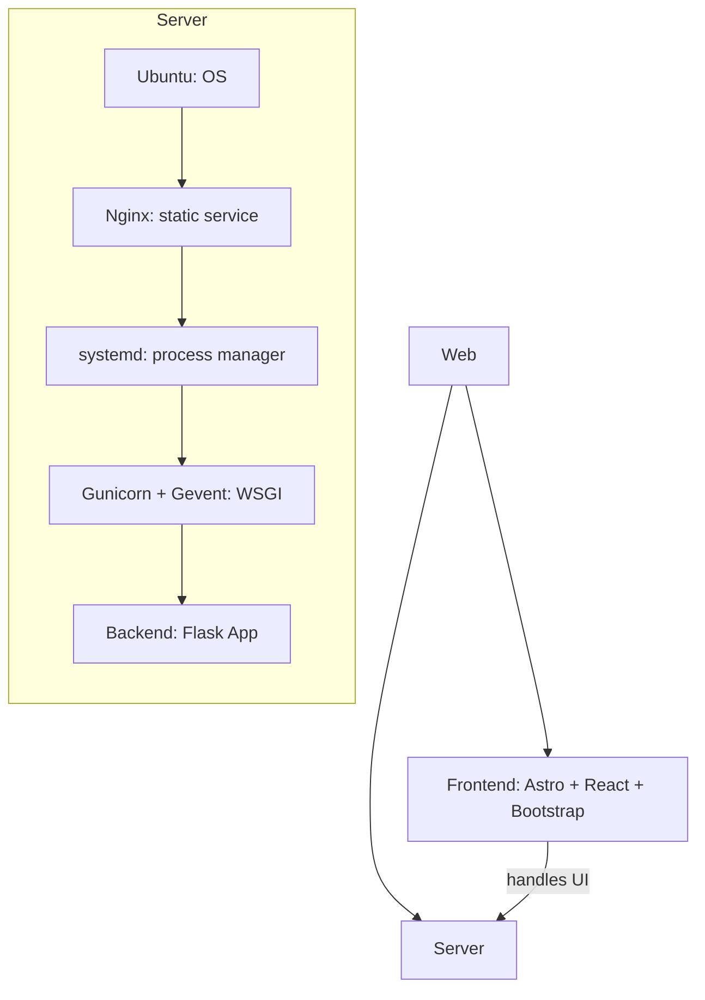
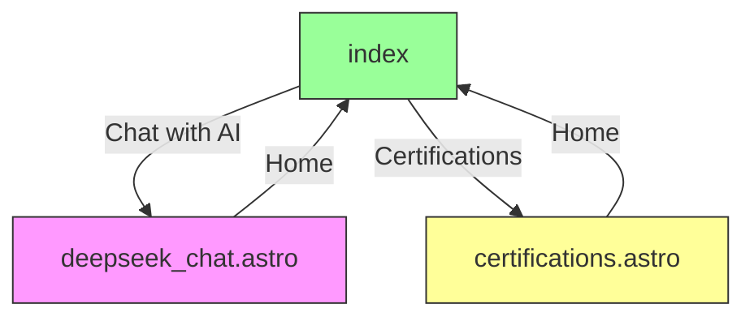

<!-- START doctoc generated TOC please keep comment here to allow auto update -->
<!-- DON'T EDIT THIS SECTION, INSTEAD RE-RUN doctoc TO UPDATE -->

- [Renda Zhang · Lightweight Website](#renda-zhang-%C2%B7-lightweight-website)
  - [Introduction](#introduction)
  - [Tech Stack](#tech-stack)
    - [Project Structure Overview](#project-structure-overview)
    - [Reference Architecture](#reference-architecture)
  - [Deployment & Development](#deployment--development)
    - [Frontend](#frontend)
      - [Local Development & Preview](#local-development--preview)
      - [GitHub Actions Deployment](#github-actions-deployment)
      - [Usage](#usage)
      - [Site Features](#site-features)
      - [Page Features](#page-features)
      - [Routing Logic](#routing-logic)
      - [Page Descriptions](#page-descriptions)
    - [**Backend**](#backend)
    - [**Nginx Server**](#nginx-server)
  - [Documentation](#documentation)
    - [Bug Tracker](#bug-tracker)
    - [Requirements](#requirements)
    - [Native to Astro + React Upgrade](#native-to-astro--react-upgrade)
    - [Asset Naming Validation](#asset-naming-validation)
  - [🤝 Contributing](#-contributing)
  - [🔒 License](#-license)
  - [📬 Contact](#-contact)

<!-- END doctoc generated TOC please keep comment here to allow auto update -->

# Renda Zhang · Lightweight Website

- **Author**: Renda Zhang
- **Last Updated**: July 29, 2025, 20:36 (UTC+8)
- **[点击这里查看 Github 上的中文版](https://github.com/RendaZhang/rendazhang/blob/master/README.md)**

---

## Introduction

This is a **lightweight** website showcasing my technical skills and projects in both English and Chinese.

**Website**: 🌐 [www.rendazhang.com](https://www.rendazhang.com)

The site is SEO/GEO optimized.

> For a more heavy‑weight deployment solution, check out my cloud‑native project: 📁 [Renda Cloud LAB](https://github.com/RendaZhang/renda-cloud-lab)

---

## Tech Stack

| Category              | Technology                                       |
| --------------------- | ------------------------------------------------ |
| Frontend              | **Astro**, **React**, TypeScript, Bootstrap      |
| State Management      | React `useState`, `useContext` (extensible with Zustand, etc.) |
| Build Tool            | Astro built‑in (Vite based)                      |
| Backend               | Flask + OpenAI API                               |
| Deployment            | GitHub Actions + Nginx                           |

### Project Structure Overview

```text
src/
├── assets/
├── styles/
├── scripts/
└── components/
    ├── ui/
    ├── layouts/
    ├── forms/
    ├── chat/
    ├── sections/
    └── providers/
```

### Reference Architecture

ASCII diagram:

```text
Web Application Architecture
============================

Frontend (
   Astro + React + Bootstrap
   - handles UI and interaction
) → CI/CD (
   GitHub Actions for automatic builds and deploy
) → Server (
   Ubuntu (OS)
   ↓
   Nginx (static file service)
   ↓
   systemd service (process management)
   ↓
   Gunicorn + Gevent (WSGI server)
   ↓
   Backend: Flask App (business logic & API)
)
```

Mermaid flowchart:



---

## Deployment & Development

### Frontend

This repository is the frontend project: 📁 [Renda Zhang WEB](https://github.com/RendaZhang/rendazhang)

#### Local Development & Preview

1. Install dependencies and enable pre‑commit:

   ```bash
   npm install
   pre-commit install
   ```

2. Start the local dev server:

   ```bash
   npm run dev
   ```

3. Build and preview production:

   ```bash
   npm run build
   npm run preview
   ```

Visit `http://localhost:4321` in the browser. Use `npm run preview` to verify the built files.

#### GitHub Actions Deployment

Pushing to the `master` branch triggers GitHub Actions:

1. Checkout code and install deps
2. Run `npm run build` to generate static files
3. Upload `dist/` to the server (e.g. `/var/www/html`) via `appleboy/scp-action`
4. Nginx serves the deployed site

Configure server IP, SSH user and private key in repository Secrets. Details: 📄 [GitHub Actions Setup](https://github.com/RendaZhang/rendazhang/blob/master/docs/NATIVE_TO_ASTRO_REACT_UPGRADE.md#%E9%85%8D%E7%BD%AE-github-actions).

#### Usage

After deployment you can access each page directly.

Sample links:

- 🌐 [Home](https://www.rendazhang.com/)
- 🌐 [Chat with AI](https://www.rendazhang.com/deepseek_chat/)
- 🌐 [Certifications](https://www.rendazhang.com/certifications/)
- 🌐 [Rendered Tech Docs](https://www.rendazhang.com/docs/)

#### Site Features

- Chat online with AI
- Floating chat widget on the homepage
- Responsive layout (mobile & desktop)
- Lazy‑loaded images
- Certification showcase
- Resume display & download (English & Chinese, PDF)
- Project showcase
- Contact form
- Theme switcher (light / dark)
- Language switcher (Chinese / English)
- Documentation pages (`docs/`)
- Links to content platforms

#### Page Features

Key responsibilities of each page (generated from `.astro` files):

- `index.astro`: Personal info, education, skills, blog and work experience, with ChatWidget by default.
- `certifications.astro`: Certificate list.
- `deepseek_chat.astro`: AI chat interface.

Other pages:

- `404.html`, `50x.html`: Error message pages.

#### Routing Logic

- `index.astro` links to AI Chat and Certifications.
- Sub‑pages include a return button to the home page.
- The homepage uses anchor navigation for Skills, Experience, etc., and links to the blog.

Mermaid Flow:



#### Page Descriptions

- `index.astro`: Multi-section homepage with side menu: "Hero", "About", "Education", "Blog", "Skills", "Experience", "Contact". ChatWidget floats by default with icons linking to WeChat Official Account, Zhihu, Toutiao, CSDN and Medium.
- `certifications.astro`: Grid cards showing certificates with Credly links.
- `deepseek_chat.astro`: Chat view rendering AI Markdown, copy one‑click, history persists after refresh.
- `404.html / 50x.html`: Simple text pages.

### **Backend**

> For backend deployment please see 📁 [Python Cloud Chat](https://github.com/RendaZhang/python-cloud-chat)

### **Nginx Server**

> After build, static files are automatically uploaded to `/var/www/html` on the server and served by Nginx.

> More config details are in 📁 [Nginx Conf](https://github.com/RendaZhang/nginx-conf)

> For a heavy‑weight server solution, refer to 📁 [Renda Cloud LAB](https://github.com/RendaZhang/renda-cloud-lab)

---

## Documentation

### Bug Tracker

Frontend bug records: 📄 [Frontend Bug DB](https://github.com/RendaZhang/rendazhang/blob/master/docs/TROUBLESHOOTING.md#%E5%89%8D%E7%AB%AF-bug-%E8%B7%9F%E8%B8%AA%E6%95%B0%E6%8D%AE%E5%BA%93)

### Requirements

Project requirements list: 📄 [Requirements](https://github.com/RendaZhang/rendazhang/blob/master/docs/REQUIREMENTS.md#%E9%A1%B9%E7%9B%AE%E9%9C%80%E6%B1%82%E6%B8%85%E5%8D%95)

### Native to Astro + React Upgrade

The frontend has migrated to **Astro** + **React**, using a layered design and **GitHub Actions** to build and deploy to Nginx automatically.

For details see 📄 [Upgrade Plan](https://github.com/RendaZhang/rendazhang/blob/master/docs/NATIVE_TO_ASTRO_REACT_UPGRADE.md#%E6%97%A7%E7%89%88%E5%8E%9F%E7%94%9F%E5%89%8D%E7%AB%AF%E5%88%B0-astro--react-%E6%96%B0%E5%89%8D%E7%AB%AF%E7%9A%84%E6%B8%90%E8%BF%9B%E5%8D%87%E7%BA%A7%E8%AE%A1%E5%88%92)

Environment setup: 📄 [Environment Setup](https://github.com/RendaZhang/rendazhang/blob/master/docs/NATIVE_TO_ASTRO_REACT_UPGRADE.md#%E9%98%B6%E6%AE%B5-1%E7%8E%AF%E5%A2%83%E5%87%86%E5%A4%87%E4%B8%8E-astro-%E9%A1%B9%E7%9B%AE%E5%88%9D%E5%A7%8B%E5%8C%96)

### Asset Naming Validation

Run `npm run validate-assets` to check naming for images and music files. See 📄 [静态资源命名验证脚本](https://github.com/RendaZhang/rendazhang/blob/master/docs/ASSET_VALIDATION.md#%E9%9D%99%E6%80%81%E8%B5%84%E6%BA%90%E5%91%BD%E5%90%8D%E9%AA%8C%E8%AF%81%E8%84%9A%E6%9C%AC)

---

## 🤝 Contributing

- Fork & clone this repo.
- Activate your virtual environment:
   ```bash
   # If you haven't created one: python -m venv venv
   source venv/bin/activate
   ```
- Install dependencies and enable **pre-commit**:
   ```bash
   pip install pre-commit
   pre-commit install
   ```
- Before each commit the hooks will:
  - Copy the root README and README_EN to the `public/` directory.
  - Update Doctoc for README and docs (if Doctoc is installed).
  - Run the asset naming validation script to ensure files in `public/images` and
    `src/assets` follow conventions.
- You can also run manually:
   ```bash
   # cp README.md public/README.md && cp README_EN.md public/README_EN.md && git add public/README.md public/README_EN.md
   pre-commit run --all-files
   ```

> ✅ All commits must pass pre-commit checks; CI will block non-compliant PRs.

---

## 🔒 License

Released under the **MIT License**. Feel free to use and modify, but keep the original license notice.

---

## 📬 Contact

* Maintainer: Renda Zhang
* 📧 Email: [952402967@qq.com](mailto:952402967@qq.com)

> ⏰ **Maintainer**: @Renda — If this project helps you, please star it!
