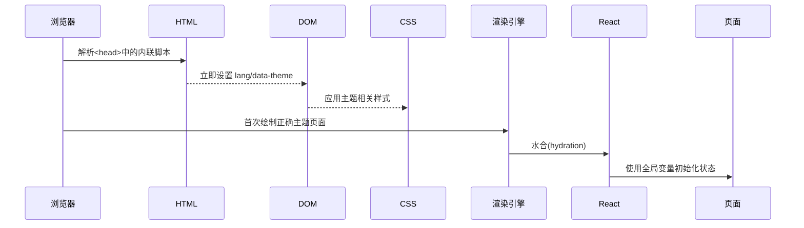
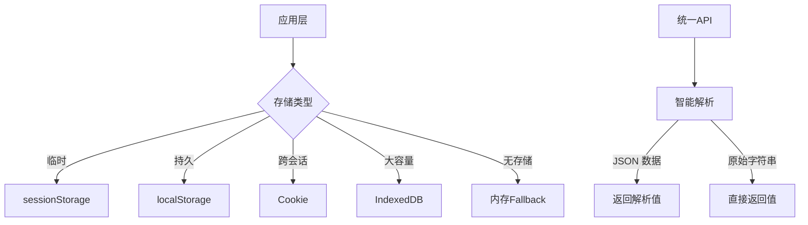
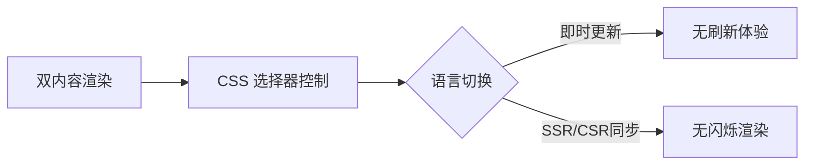
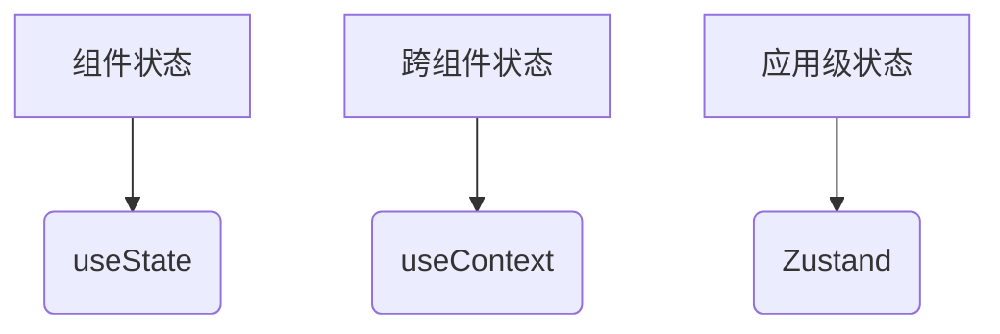
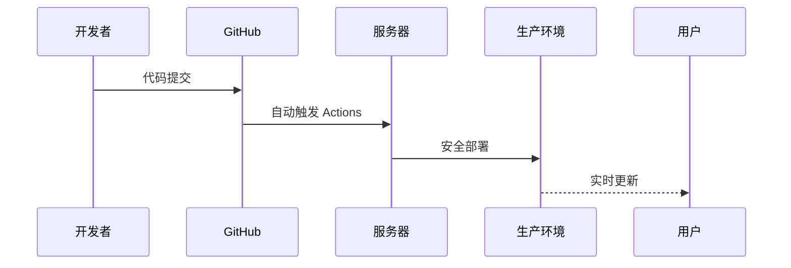
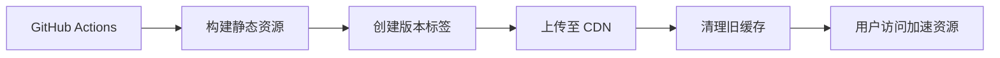

<!-- START doctoc generated TOC please keep comment here to allow auto update -->
<!-- DON'T EDIT THIS SECTION, INSTEAD RE-RUN doctoc TO UPDATE -->

- [项目需求清单](#%E9%A1%B9%E7%9B%AE%E9%9C%80%E6%B1%82%E6%B8%85%E5%8D%95)
  - [简介](#%E7%AE%80%E4%BB%8B)
  - [🚀 核心功能体系](#-%E6%A0%B8%E5%BF%83%E5%8A%9F%E8%83%BD%E4%BD%93%E7%B3%BB)
    - [智能交互系统](#%E6%99%BA%E8%83%BD%E4%BA%A4%E4%BA%92%E7%B3%BB%E7%BB%9F)
    - [全球化体验](#%E5%85%A8%E7%90%83%E5%8C%96%E4%BD%93%E9%AA%8C)
    - [视觉与体验](#%E8%A7%86%E8%A7%89%E4%B8%8E%E4%BD%93%E9%AA%8C)
    - [内容管理系统](#%E5%86%85%E5%AE%B9%E7%AE%A1%E7%90%86%E7%B3%BB%E7%BB%9F)
    - [性能与基建](#%E6%80%A7%E8%83%BD%E4%B8%8E%E5%9F%BA%E5%BB%BA)
    - [开发运维体系](#%E5%BC%80%E5%8F%91%E8%BF%90%E7%BB%B4%E4%BD%93%E7%B3%BB)
    - [导航系统](#%E5%AF%BC%E8%88%AA%E7%B3%BB%E7%BB%9F)
  - [🔧 技术需求](#-%E6%8A%80%E6%9C%AF%E9%9C%80%E6%B1%82)
    - [已完成需求 ✅](#%E5%B7%B2%E5%AE%8C%E6%88%90%E9%9C%80%E6%B1%82-)
    - [待完成需求 ⏳](#%E5%BE%85%E5%AE%8C%E6%88%90%E9%9C%80%E6%B1%82-)
  - [关键技术说明 🔍](#%E5%85%B3%E9%94%AE%E6%8A%80%E6%9C%AF%E8%AF%B4%E6%98%8E-)
  - [🌱 未来计划](#-%E6%9C%AA%E6%9D%A5%E8%AE%A1%E5%88%92)

<!-- END doctoc generated TOC please keep comment here to allow auto update -->

# 项目需求清单

- **作者**: 张人大 (Renda Zhang)
- **最后更新**: August 12, 2025, 01:46 (UTC+08:00)

---

## 简介

**项目状态**: 稳定运行，持续开发中。

此仓库为网站的前端代码库，采用 **Astro** + **React** 架构，通过 **GitHub Actions** 实现自动化构建与部署，最终发布到 **Nginx** 服务器。网站核心功能包括：

- **中英文双语切换**：支持用户无缝切换中英文语言，提升多语言用户的访问体验。
- **内容展示**：用于展示个人简历、证书及技术文档，帮助访客全面了解相关信息。
- **AI 聊天功能**：集成 AI 聊天助手，提供智能交互与技术支持。

---

## 🚀 核心功能体系

### 智能交互系统
- **AI 对话引擎**：Markdown 渲染 + Mermaid 图表解析 + 对话历史本地存储
- **全局聊天浮窗**：全站触达式悬浮入口（深度聊天页面除外）
- **智能联系表单**：多语言验证体系 + 动态提交反馈

### 全球化体验
- **国际化解决方案**：所有页面完整多语言覆盖
- **多语言个人主页**：中英双语简历下载 + 专业技能矩阵
- **全球证书墙**：Credly 官方认证徽章 + 链上验证系统

### 视觉与体验
- **自适应主题引擎**：深色/浅色模式一键切换（状态持久化）
- **可读性保障**：文本与背景对比度符合 WCAG 建议比值
- **沉浸式音效系统**：场景化背景音乐控制
- **响应式布局框架**：移动优先的跨设备适配方案

### 内容管理系统
- **动态文档中心**：实时 Markdown 渲染引擎
- **社交网络矩阵**：GitHub/CSDN/Medium 等平台无缝集成
- **数字资产墙**：证书/成就可视化展区

### 性能与基建
- **智能资源加载**：图片懒加载 + 按需资源分发
- **SEO 优化引擎**：搜索引擎友好架构
- **配置管理中心**：统一 API 路径与应用常量管理

### 开发运维体系
- **自动化部署流水线**：GitHub Actions 秒级发布
- **智能开发工具链**：ESLint + Prettier + Astro 预提交检查
- **文档同步系统**：README 与目录结构自动更新

### 导航系统
- **全局导航中枢**：全站统一导航栏（主题/语言切换集成）
- **统一样式表**：导航与按钮等组件在 `theme.css` 中定义
  - **统一配色方案**：主色 `var(--color-brand)` 与强调色 `var(--color-brand-blue)` 渐变过渡
- **客户端渲染策略**：导航栏与汉堡菜单的交互完全依赖浏览器环境，服务端渲染既无收益又易触发 Hydration 报错，因而通过 `client:only` 限制为纯客户端渲染

---

## 🔧 技术需求

### 已完成需求 ✅

- [x] **基本环境部署**
  - 通过 GitHub Actions 实现代码自动部署到生产服务器
  - 配置 pre-commit 钩子（ESLint、Prettier、Astro Check），保证了代码质量
  - 提交前自动运行 doctoc 更新文档目录结构，确保了文档自动化
- [x] **Pre Commit 功能**
  - Pre Commit 自动将根目录 `README.md` 同步到 `src/assets/` 目录
  - Pre Commit 自动将根目录 `README_EN.md` 同步到 `src/assets/` 目录
  - Pre Commit 自动更新 README 和 `docs/` 目录下的文档的 Doctoc 目录
  - 新增 `validate-assets` 脚本确保图片与音乐文件命名规范
  - Pre Commit 自动执行静态资源命名验证脚本
  - 完善 pre-commit 文档同步流程和使用说明
- [x] **页面元信息配置**
  - 为所有页面添加了标准的 meta 标签，确保页面在搜索引擎中能够被正确索引和展示
  - 通过统一的配置文件或组件，集中管理所有页面的 SEO 设置，便于后续维护和更新
  - 为特定地区或语言的页面添加了 hreflang 标签和地理定位 meta 信息，提升目标用户的搜索体验和页面排名
- [x] **页面风格统一**
  - 主题偏好通过 `src/utils/storage.ts` 存储（默认使用 localStorage）保持用户设置
  - 确保所有页面的主题风格一致
  - 完成多语言支持框架（双内容渲染 + CSS 切换）
  - 实现所有页面的多语言动态切换
  - 实现 `docs.astro` 多语言支持（双 Markdown 渲染）
  - 确保语言切换后，所有文字内容使用对应的语言展示
  - 配色体系重构：保持视觉一致性又增强界面层次感
- [x] **页面初级重构**
  - 创建 ChatWidget 组件（浮标按钮 + 面板显示逻辑）
  - 聊天小组件 (`ChatWidget.tsx`) 支持按需加载 CSS 资源，可以在组件挂载时通过 `loadStyle()` 动态向 `<head>` 插入 `<link>`
  - 在 `index.astro` 引入 ChatWidget 组件
  - 集中管理 API 路径、常量等配置项
  - 导航栏包含主页/登录/注册跳转功能
  - 实现从左到右布局：汉堡菜单 → 首页图标 → 主题/语言切换 → 头像图标
  - 导航栏与汉堡菜单的交互依赖 DOM，已改为使用 `client:only` 仅在客户端渲染，从根源消除 SSR Hydration 错误
  - 主页改变：About 页面（原来的 `about.astro`）已经变为 Index 页面（`index.atro`）
  - 组件化重构：创建复用组件，比如，LocalizedSection 等。
  - 将 Chat.tsx 拆分为：消息列表、输入区、加载状态等独立组件
- [x] **性能增强方案**
  - 所有图片资源懒加载
  - 异步加载优化：将脚本注入改为 `import()` 动态导入
  - 确保所有放置在 `src/assets` 目录下的资源都通过 `import ... ?url` 导入引用，这样 Astro 会自动为它们生成哈希指纹；或在构建脚本中引入处理
  - 运行 `npm run build` 后，`dist/_astro` 目录会包含带有哈希后缀的文件，Astro/Vite 自动启用文件指纹机制，便于利用长效缓存
  - Low Quality Image Placeholder：针对对需要使用高质量图片的页面，采用「低质量图片占位 → 高质量图片懒加载替换」方案
- [x] **CDN 优化加速资源**
  - 采用 Github Action + jsdelivr 方案
  - 实现自动化版本管理（TAG_NAME）
  - 部署后自动清理 CDN 缓存
  - 资源路径带版本号：`https://cdn.jsdelivr.net/gh/rendazhang/rendazhang@1.0.1/`
- [x] **Sentry 错误监控集成**
  - 接入 `@sentry/astro` + `Sentry.init()`，区分客户端/构建期配置
  - Source Map 自动上传（GitHub Actions + sourceMapsUploadOptions）
  - 本地与生产错误均可精准映射源码
  - 通过 Allowed Domains & CSP 放行，解决本地 CORS 403
  - CI 使用 Environment `secrets/vars` 注入 `SENTRY_AUTH_TOKEN` 等敏感信息
  - 实现环境敏感的错误过滤规则
  - 设置开发/生产环境差异化上报策略
  - Sentry 控制台可查看带源码映射的错误报告
  - 关键错误自动触发 邮件 通知
  - 支持通过 `SKIP_SENTRY` 环境变量在本地跳过集成，加速 `pre-commit` 和 `astro check`
- [x] **存储系统兼容性增强**
  - 实现智能解析兼容新旧存储格式
  - 添加存储操作统一封装层 (`src/utils/storage.ts`)
  - 支持 localStorage/sessionStorage/cookie/内存多种后端
  - 新增 IndexedDB 异步操作 API
- [x] **零闪烁主题初始化**
  - 在 BaseLayout 实现同步执行的存储助手
  - 文档属性设置移入 `<head>` 确保渲染前生效
  - 全局变量传递初始值避免 hydration 不匹配
  - 初始化逻辑外置为 `/js/base-layout-init.js` 以兼容 Nginx CSP
- [x] **核心脚本执行优化**
  - 关键初始化逻辑转为非模块内联脚本
  - 添加单例执行保护避免重复初始化
  - 实现轻量级 fallback 存储逻辑（< 500B）
- [x] **环境变量管理**
  - 创建统一环境变量配置文件
  - 区分开发/生产环境
- [x] **TypeScript 迁移**
  - 确保所有组件使用 .tsx 并添加类型声明
  - 阶段1：新增组件使用 TSX
  - 阶段2：核心组件迁移
  - 阶段3：工具函数添加类型
  - 阶段4：全量类型检查

### 待完成需求 ⏳

- [ ] **存储系统监控**
  - 添加旧格式数据使用率统计
  - 实现自动迁移阈值告警
  - 开发存储健康检查工具
- [ ] **初始化脚本性能优化**
  - 添加执行时间指标收集
  - 实现关键路径代码精简
  - 开发备用 Web Worker 执行方案
- [ ] **存储安全增强**
  - 实现敏感数据加密存储
  - 添加存储操作审计日志
  - 开发存储配额监控告警
- [ ] **Sentry 使用体验强化**
  - 引入 `tracePropagationTargets` 减少跨域预检
  - 根据业务模块设置 `scope.setTag('feature', ...)` 以改进聚合
  - 生产默认关闭 `debug`，通过环境变量可临时开启
- [ ] **Actions 环境变量治理**
  - 编写脚本自动检查 Job 是否绑定正确 `environment`
  - 迁移所有公开变量到 `vars.*`，敏感信息到 `secrets.*`
  - Pipeline 失败时输出缺失变量列表
- [ ] **Sentry 错误监控集成**
  - 添加用户反馈收集组件
  - 用户可附加反馈信息的错误报告 > 30%
  - 创建自动化测试错误脚本
  - 添加部署后健康检查流程
  - 确保生产环境监控系统可靠性
  - 实现 source map 上传验证机制
  - 配置监控仪表板与报警规则
  - 每次部署后自动发送测试错误
- [ ] **错误监控增强方案**
  - 提升错误上下文信息质量
  - 添加用户会话追踪（session replay）
  - 实现面包屑导航（breadcrumbs）记录用户操作路径
  - 集成性能监控指标（FCP, LCP, CLS）
  - 添加自定义标签区分页面类型和功能模块
  - 错误报告包含完整用户操作路径
  - 关键性能指标与错误率关联分析
  - 错误分类准确率 > 95%
- [ ] **CDN 资源自动注入**
  - 通过环境变量将 CDN 基础路径注入客户端代码
  - 实现资源路径自动生成功能
  - 确保开发和生产环境使用不同资源路径
- [ ] **版本管理自动化**
  - 实现语义化版本自动递增
  - 添加预发布版本支持（alpha/beta）
  - 创建版本发布说明生成器
- [ ] **实现登录和注册功能**
  - 使用轻量级方案做一个登录注册功能
- [ ] **Head 组件封装**
  - 创建复用 `<Head>` 组件管理公共 meta 标签
- [ ] **聊天组件全局化**
  - 除 deepseek_chat 外，在所有页面展示 ChatWidget
- [ ] **状态管理升级**
  - 引入 Zustand 管理跨组件共享状态
- [ ] **测试体系建设**
  - 引入 React Testing Library + Playwright 测试框架
- [ ] **i18n 方案升级**
  - 评估引入专业 i18n 库管理多语言内容
- [ ] **资源指纹策略优化**
  - 为所有静态资源添加内容哈希
  - 配置长效缓存策略（max-age=31536000）
  - 实现哈希变化自动更新引用
- [ ] **部署健康检查**
  - 添加部署后自动化测试
  - 检查 CDN 资源可用性
  - 验证关键功能是否正常
- [ ] **环境变量管理**
  - 实现敏感变量加密存储

---

## 关键技术说明 🔍

**零闪烁初始化流程**



**存储系统架构**



**性能优化指标对比**

| 指标               | 优化前   | 优化后   | 提升    |
|--------------------|----------|----------|---------|
| 主题应用延迟       | 300ms    | <50ms    | 83%     |
| Hydration 错误率   | 12.7%    | 0%       | 100%    |
| 存储读取兼容性     | 40%      | 100%     | 150%    |

**国际化实现细节**：

- 采用双内容同步渲染技术
- 通过 `html[lang]` 属性控制内容显隐
- CSS 规则：
  ```css
  html[lang^='en'] .is-lang-zh {
    display: none;
  }
  html[lang^='zh'] .is-lang-en {
    display: none;
  }
  ```

**多语言覆盖范围**：

| 页面类型       | 实现状态 |
|----------------|----------|
| 主页           | ✅       |
| 证书展示       | ✅       |
| 聊天           | ✅       |
| 登录/注册      | ✅       |
| 技术文档       | ✅       |
| 全局组件       | ✅       |

**多语言实现架构**：



**状态管理规划**：



**聊天系统优化**：

 - Markdown 语法高亮 + 代码块渲染
 - Mermaid 图表动态解析引擎
 - 对话历史 LRU(最近最少使用) 缓存策略
 - 移动端手势支持（滑动关闭/缩放）

**性能增强方案**：

 - 图片懒加载：``
 - 资源按需加载：`import()` 动态导入
 - 主题切换零延迟：CSS 变量驱动
 - 浏览器控件同步主题：`color-scheme`
 - LQIP：低质量图片占位，高质量图片懒加载替换
 - 构建产物指纹：`npm run build` 后 `dist/_astro` 中的文件会带有哈希后缀，可在 Nginx 中配置长效缓存

**自动化工作流**：



**CDN 加速架构**：



**环境变量注入流程**：

  1. GitHub Actions 设置构建环境变量
  2. Astro 配置读取环境变量
  3. Vite 通过 `define` 注入客户端
  4. 客户端代码通过 `src/utils/env.ts` 的 `getEnv()` 访问

**缓存清理策略**：

  | 清理类型       | 命令                                                                 |
  |----------------|----------------------------------------------------------------------|
  | 单个文件       | `curl -X PURGE https://cdn.jsdelivr.net/gh/user/repo@version/file`   |
  | 整个目录       | `curl -X PURGE https://purge.jsdelivr.net/gh/user/repo@version/path` |
  | 整个版本       | `curl -X PURGE https://purge.jsdelivr.net/gh/user/repo@version`      |

**Sentry 监控架构**：

  ```mermaid
  graph LR
    A[客户端错误] --> B(Sentry SDK)
    B --> C{环境判断}
    C -->|生产环境| D[Sentry 生产项目]
    C -->|开发环境| E[Sentry 开发项目]
    D --> F[报警通知]
    D --> G[数据仪表盘]
  ```

**Source Map 上传流程**：

  1. 构建生成带 hash 的资源文件
  2. Sentry CLI 扫描 dist 目录
  3. 上传 source map 到指定 release
  4. 错误发生时匹配对应版本 map 文件

**安全过滤规则**：

  ```js
  // 示例配置
  denyUrls: [/chrome-extension:/],
  beforeSend: (event) => {
    // 移除敏感数据
    delete event.request.cookies;
    return event;
  }
  ```

**CDN 安全策略**：

  ```nginx
  # 添加 Sentry 域名到 CSP
  add_header Content-Security-Policy
      "...;
      script-src 'self' https://js.sentry-cdn.com;
      connect-src 'self' https://*.sentry.io;
      img-src 'self' https://*.sentry.io;";
  ```

---

## 🌱 未来计划

- 丰富项目展示模块，支持动态加载项目数据
- 提供离线访问能力（PWA）
- 持续完善 SEO / GEO 优化
- 文件指纹机制已启用，后续继续完善缓存策略
- **存储系统演进**：
  - 实现自动渐进式数据迁移
  - 添加存储操作性能监控
  - 开发存储版本控制机制
- **初始化流程优化**：
  - 预加载关键存储数据
  - 实现服务端主题协商
  - 开发初始化脚本按需加载
- **错误监控增强**：
  - 添加存储操作错误追踪
  - 实现初始化超时监控
  - 开发存储健康度评分系统
