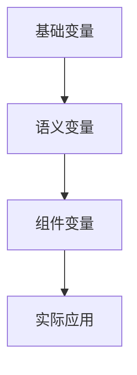
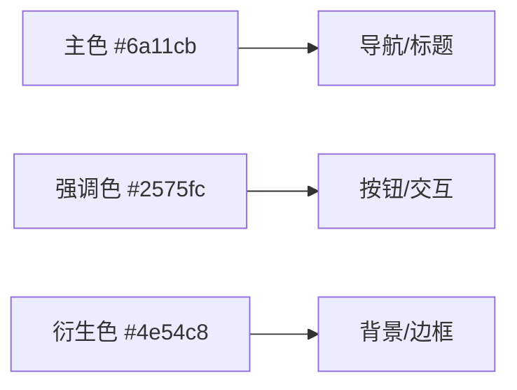

<!-- START doctoc generated TOC please keep comment here to allow auto update -->
<!-- DON'T EDIT THIS SECTION, INSTEAD RE-RUN doctoc TO UPDATE -->

- [样式说明](#%E6%A0%B7%E5%BC%8F%E8%AF%B4%E6%98%8E)
  - [简介](#%E7%AE%80%E4%BB%8B)
  - [当前架构](#%E5%BD%93%E5%89%8D%E6%9E%B6%E6%9E%84)
  - [目录结构](#%E7%9B%AE%E5%BD%95%E7%BB%93%E6%9E%84)
    - [命名规则与目录约定](#%E5%91%BD%E5%90%8D%E8%A7%84%E5%88%99%E4%B8%8E%E7%9B%AE%E5%BD%95%E7%BA%A6%E5%AE%9A)
  - [CSS / 浏览器基线（2024/2025）](#css--%E6%B5%8F%E8%A7%88%E5%99%A8%E5%9F%BA%E7%BA%BF20242025)
    - [必备特性](#%E5%BF%85%E5%A4%87%E7%89%B9%E6%80%A7)
    - [渐进增强](#%E6%B8%90%E8%BF%9B%E5%A2%9E%E5%BC%BA)
  - [PostCSS 集成](#postcss-%E9%9B%86%E6%88%90)
  - [配色方案](#%E9%85%8D%E8%89%B2%E6%96%B9%E6%A1%88)
    - [色彩阶梯与彩度限制](#%E8%89%B2%E5%BD%A9%E9%98%B6%E6%A2%AF%E4%B8%8E%E5%BD%A9%E5%BA%A6%E9%99%90%E5%88%B6)
  - [排版与间距](#%E6%8E%92%E7%89%88%E4%B8%8E%E9%97%B4%E8%B7%9D)
    - [示例](#%E7%A4%BA%E4%BE%8B)
      - [✅ Do](#-do)
      - [❌ Don't](#-dont)
  - [Token 用法示例](#token-%E7%94%A8%E6%B3%95%E7%A4%BA%E4%BE%8B)
  - [组件示意](#%E7%BB%84%E4%BB%B6%E7%A4%BA%E6%84%8F)
  - [交互态与可访问性](#%E4%BA%A4%E4%BA%92%E6%80%81%E4%B8%8E%E5%8F%AF%E8%AE%BF%E9%97%AE%E6%80%A7)
  - [样式 Lint 与预提交](#%E6%A0%B7%E5%BC%8F-lint-%E4%B8%8E%E9%A2%84%E6%8F%90%E4%BA%A4)
  - [扩展与约定](#%E6%89%A9%E5%B1%95%E4%B8%8E%E7%BA%A6%E5%AE%9A)

<!-- END doctoc generated TOC please keep comment here to allow auto update -->

# 样式说明

- **作者**: 张人大 (Renda Zhang)
- **最后更新**: August 10, 2025, 04:32 (UTC+08:00)

---

## 简介

本指南概述了项目当前的样式体系、构建工具链、配色方案以及未来可扩展的方向。

---

## 当前架构

项目的样式位于 `src/styles/` 目录，按职责划分为以下几个部分：

- `core/`：定义全局颜色、间距、渐变等基础变量。
- `utilities/`：提供布局、工具类等复用样式。
- `components/`：存放各页面或组件的独立样式文件。
- `theme.css`：作为入口文件，统一导入上述基础与工具样式并声明全局 CSS 变量，并在内部定义 `@layer reset, tokens, base, components, utilities;` 来管理层叠顺序。

各目录与层级的对应关系如下：

- `reset`：浏览器重置与基础清理样式。
- `tokens`：`core/` 中的设计令牌及派生变量。
- `base`：基础排版和语言辅助等全局元素样式（如 `layout.css`）。
- `components`：组件级样式文件。
- `utilities`：工具类与布局系统，栅格工具类基于容器查询实现响应式列宽。
- `overrides`：已弃用的特殊覆盖层，暗色模式通过 Token 与媒体查询处理。

这种分层结构使得核心设计令牌与业务样式解耦，便于维护和扩展。

---

## 目录结构

```
src/
└── styles/
    ├── core/
    ├── utilities/
    ├── components/
    └── theme.css
```

### 命名规则与目录约定

- 组件类以 `c-` 前缀命名，例如 `c-btn-primary`、`c-form-control`。
- 工具类以 `u-` 前缀命名，用于通用辅助样式，如 `u-text-error`。
- 状态类以 `is-` 前缀表示临时状态，例如 `is-open`、`is-active`、`is-dark-mode`、`is-lang-zh`。
- 布局主容器统一使用 `c-main-content`，语言切换使用 `is-lang-zh`、`is-lang-en`。
- JavaScript 钩子使用 `js-` 前缀，仅供脚本选择器使用。

组件样式按照以下目录结构组织，每个组件占用独立文件夹并提供入口文件：

```
src/styles/components/
├── button/
│   └── button.css
├── form/
│   └── form.css
└── navigation/
    └── navigation.css
```

---

## CSS / 浏览器基线（2024/2025）

本项目以 [Web Platform Baseline 2024](https://web.dev/baseline/2024/) 为基础，确保主要功能在现代浏览器中可用，并将随 [Baseline 2025](https://web.dev/baseline/2025/) 持续迭代。

### 必备特性
- [容器查询](https://developer.mozilla.org/docs/Web/CSS/CSS_container_queries) — [Can I Use](https://caniuse.com/css-container-queries)
- [CSS Cascade Layers `@layer`](https://developer.mozilla.org/docs/Web/CSS/@layer) — [Can I Use](https://caniuse.com/css-cascade-layers)
- [CSS Nesting](https://developer.mozilla.org/docs/Web/CSS/CSS_Nesting_Rules) — [Can I Use](https://caniuse.com/css-nesting)

### 渐进增强
- [Subgrid](https://developer.mozilla.org/docs/Web/CSS/CSS_Grid_Layout/Subgrid) — [Can I Use](https://caniuse.com/css-subgrid)
- [`:has()` 选择器](https://developer.mozilla.org/docs/Web/CSS/:has) — [Can I Use](https://caniuse.com/css-has)

---

## PostCSS 集成

为了在编译阶段合并样式，本项目新增了 PostCSS 配置并启用了 [`postcss-import`](https://github.com/postcss/postcss-import) 插件：

- `postcss.config.cjs` 仅包含 `require('postcss-import')`，在构建时解析 `@import` 语句。
- 在 `package.json` 中将 `postcss` 与 `postcss-import` 声明为开发依赖，确保编译流程可用。

构建时，`theme.css` 中的 `@import` 会被内联为单一样式表，消除了运行时的额外请求，有利于提升页面加载性能。

---

## 配色方案

本项目的核心色彩以 OKLCH 设计令牌形式维护，并通过 `color-mix(in srgb, …)` 生成向下兼容的 sRGB 回退；在支持 OKLCH 的浏览器中，通过 `@supports (color: oklch(0% 0 0))` 覆盖为原生 OKLCH 值，以确保不同渲染环境下感知一致。

**统一管理**：
- 浏览器控件适配主题（`color-scheme`）
- 公共组件样式统一由 `theme.css` 管理
- Markdown 深色模式拥有独立的颜色 Token，可在 `src/styles/core/tokens.css` 中统一维护。
- 叠加层和阴影相关的颜色通过 `--color-base-black` 与 `--color-base-white` Token 设置，便于调整透明度并适配主题切换。

**样式架构分层**：
- `src/styles/core/`: 定义基础设计 Token，包括颜色、间距和渐变等变量
- `src/styles/components/`: 组件级样式（如 `about.css`、`chat_widget.css` 等）
- `src/styles/utilities/`: 布局与通用工具类，内含 `.debug` 调试轮廓
- `src/styles/theme.css`: 样式入口文件，自动引入 `core/` 和 `utilities/`

**变量依赖图**：


**色彩情感评估**：
- 深紫色：传达专业、创新
- 活力蓝：象征科技、信任
- 组合效果：专业中不失活力，适合技术型产品

**对比度保障**：
| 组合         | 对比度   | 适用性    |
|--------------|---------|-----------|
| 主色 + 白文本 | 7.2 : 1 | ✅ 完美   |
| 强调色 + 深灰 | 5.1 : 1 | ✅ 良好   |
| 主色 + 强调色 | 2.8 : 1 | ⚠️ 仅装饰 |

> 对比度门槛：正文文本 ≥ 4.5:1，UI 文本与图标 ≥ 3:1。

**主色**：
- 深紫罗兰色 `#6a11cb`
- 作为 **核心渐变色** 的起始色，具有强烈的视觉识别度
- 可以应用到 导航栏、核心按钮、重要标题等地方
- 辅助色值：
  - #5a0eb7 (悬停状态)
  - #7a24df (激活状态)

**强调色**：
- 活力蓝色 `#2575fc`
- 与 **主色** 形成完美渐变过渡，提供视觉焦点
- 可以应用到 交互元素、悬浮按钮、进度指示器
- 辅助色值：
  - #1c68e8 (悬停状态)
  - #3e86ff (激活状态)

**核心渐变色** 由深紫 `#6a11cb` 到活力蓝 `#2575fc` 过渡，配合 **衍生色** 增强层次。

**主次关系**：


**配色测试**：
1. 可访问性验证：使用 [WebAIM Contrast Checker](https://webaim.org/resources/contrastchecker/) 测试文本可读性
2. 视觉层次测试：
   ```
   /* 调试用灰度模式 */
   .grayscale-mode {
     filter: grayscale(100%);
   }
   ```

### 色彩阶梯与彩度限制

- 核心色彩使用 OKLCH 定义，并通过 `color-mix(in srgb, …)` 生成 sRGB 回退，示例：`--color-brand: oklch(45.89% 0.2417 295.61)`。
- 对比度以明度 `L` 为基准，暗背景建议 ≥40%，亮背景建议 ≤90%，确保暗/亮模式下视觉一致。
- 彩度 `C` 控制在 `0.25` 以下，以避免高饱和度导致的设备差异。
- 标准色阶示例：品牌色 45%、强调色 60%、辅助色 70%，可在此基础上按需扩展。

---

## 排版与间距

项目使用基于 `clamp()` 的流式字号和 4/8 间距栅格。在 `src/styles/core/tokens.css` 中定义了 `--font-size-0`…`--font-size-7`、`--line-height-0`…`--line-height-7` 与 `--space-1`…`--space-10` 变量，以及 `--duration-fast`、`--duration-normal`、`--duration-slow` 动效变量，组件和基础样式通过这些 Token 保持一致。标准段落间距推荐使用 `margin-block-end: var(--space-4);`，最大行宽由 `--measure` 控制（默认 `65ch`）。

### 示例

```css
h1 {
  font-size: var(--font-size-5);
  margin-block-end: var(--space-4);
}

.c-btn-chat {
  padding: var(--space-3) var(--space-6);
}
```

#### ✅ Do

- 使用 `var(--font-size-n)` 和 `var(--space-n)` 引用全局刻度。
- 保持段落宽度不超过 `var(--measure)`（约 65ch）。

#### ❌ Don't

- 直接使用 `px` 指定字号或间距。
- 在同一页面混用不同单位导致排版不一致。

---

## Token 用法示例

```css
.c-card {
  padding: var(--space-4);
  border-radius: var(--radius-s);
  border: var(--border-1);
  background: var(--color-surface);
}
```

- 文本、颜色、间距等均应通过 Token 引用，避免硬编码。
- 边框请使用 `--border-0` 至 `--border-3` 变量映射不同色阶。

---

## 组件示意

统一的组件示例展示了 Token 的实际应用：

```html
<button class="c-btn-primary">Primary</button>
```

---

## 交互态与可访问性

- 新增设计 Token：`--radius-xs`、`--radius-s`、`--radius-m`、`--radius-l`、`--border-0`…`--border-3`、`--shadow-elevation-1`…`--shadow-elevation-3`、`--shadow-login` 以及 `--focus-ring`。组件应优先引用这些变量以保持圆角、边框和阴影的一致性。
- 所有可聚焦元素在 `:focus-visible` 时使用 `box-shadow: var(--focus-ring)`，并根据需要叠加自身的阴影以确保键盘导航可见。
- 交互态矩阵：

| 状态          | 说明                                   |
|---------------|----------------------------------------|
| `:hover`      | 轻微提亮或提升阴影                     |
| `:active`     | 按压回落，移除提升效果                 |
| `:focus-visible` | `box-shadow: var(--focus-ring)` 高亮焦点 |
| `:disabled`   | `opacity: 0.6; cursor: not-allowed;`   |

- 对比度要求：正文文本≥4.5:1，UI 文本与图标≥3:1，确保视觉可达性。
- 导航、表单、聊天等组件已统一采用 `--radius-*`、`--shadow-elevation-*` 与
  `--focus-ring` Token，确保交互态一致且可访问。
- 动画默认使用 `--easing-standard`、`--easing-entrance`、`--easing-exit` 统一缓动曲线，并在 `@media (prefers-reduced-motion: reduce)` 环境下将 `--duration-*` 变量降至 `0.01ms`，禁用多余动画。

---

## 样式 Lint 与预提交

项目使用 Stylelint 保证样式一致性，规则禁止 `!important` 并限制嵌套深度不超过 3 层。该检查通过 pre-commit 与 `lint-staged` 自动运行。

---

## 扩展与约定

当前样式体系已经覆盖基础变量、工具类与组件样式。后续可以根据需要加入设计令牌、响应式策略或多主题支持等内容，不断完善本指南。

- 新增样式文件应按上述目录分类放置，并使用 `@layer` 与 `@import ... layer(name)` 将其引入，遵循 `reset → tokens → base → components → utilities` 的层级顺序。
- 所有 `@import` 语句需置于文件顶部（除 `@layer` 声明外），以避免 PostCSS 报 `@import must precede all other statements` 警告。
- 如需使用其他 PostCSS 插件，可在 `postcss.config.cjs` 中统一配置。
- 欢迎补充更多的架构说明、最佳实践或样式约定到本文件。
- 深色模式样式已统一通过设计 Token 管理（如 `--shadow-login`），组件内部不再使用零散的 `@media (prefers-color-scheme)`。
- 栅格工具类改用容器查询实现，如 `.grid-col-sm-6` 会依据容器宽度而非视口断点调整布局。
- 响应式工具类已迁移至容器查询或组件级布局模式，避免依赖视口断点。
