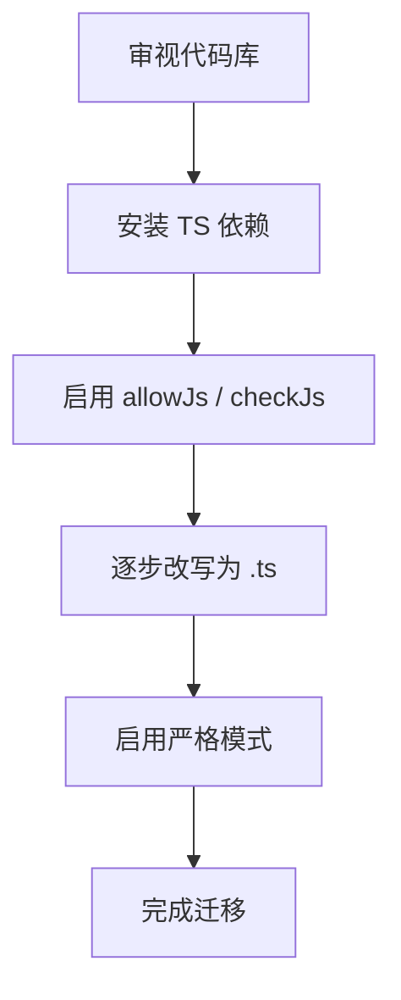

<!-- START doctoc generated TOC please keep comment here to allow auto update -->
<!-- DON'T EDIT THIS SECTION, INSTEAD RE-RUN doctoc TO UPDATE -->
**Table of Contents**  *generated with [DocToc](https://github.com/thlorenz/doctoc)*

- [JS ➜ TS 全量迁移实战指南](#js-%E2%9E%9C-ts-%E5%85%A8%E9%87%8F%E8%BF%81%E7%A7%BB%E5%AE%9E%E6%88%98%E6%8C%87%E5%8D%97)
  - [为何写这份指南](#%E4%B8%BA%E4%BD%95%E5%86%99%E8%BF%99%E4%BB%BD%E6%8C%87%E5%8D%97)
  - [迁移前准备](#%E8%BF%81%E7%A7%BB%E5%89%8D%E5%87%86%E5%A4%87)
  - [配置 TypeScript](#%E9%85%8D%E7%BD%AE-typescript)
  - [逐步迁移策略](#%E9%80%90%E6%AD%A5%E8%BF%81%E7%A7%BB%E7%AD%96%E7%95%A5)
  - [常见报错与解决方案](#%E5%B8%B8%E8%A7%81%E6%8A%A5%E9%94%99%E4%B8%8E%E8%A7%A3%E5%86%B3%E6%96%B9%E6%A1%88)
  - [自动化保障](#%E8%87%AA%E5%8A%A8%E5%8C%96%E4%BF%9D%E9%9A%9C)
  - [迁移后优化](#%E8%BF%81%E7%A7%BB%E5%90%8E%E4%BC%98%E5%8C%96)
  - [经验教训 & 建议](#%E7%BB%8F%E9%AA%8C%E6%95%99%E8%AE%AD--%E5%BB%BA%E8%AE%AE)
  - [参考资料](#%E5%8F%82%E8%80%83%E8%B5%84%E6%96%99)

<!-- END doctoc generated TOC please keep comment here to allow auto update -->

# JS ➜ TS 全量迁移实战指南

- **作者**: 张人大 (Renda Zhang)
- **最后更新**: August 07, 2025, 12:01 (UTC+08:00)

---

## 为何写这份指南

本指南总结了团队将大型 JavaScript 代码库迁移到 TypeScript 的实战经验。无论是提升可维护性、改善 IDE 体验，还是加强类型安全，下面提供了一套可复现的迁移路径。



**关键检查点**

- [ ] 了解团队迁移动机与预期收益
- [ ] 确认现有代码库规模与技术债

---

## 迁移前准备

在正式迁移前，需要评估代码现状并搭建最小可用的 TypeScript 环境。

```bash
npm i -D typescript tsx @types/node
npx tsc --init
```

<details>
<summary>示例 tsconfig.json</summary>

```json
{
  "compilerOptions": {
    "target": "ES2020",
    "module": "ESNext",
    "strict": true,
    "esModuleInterop": true
  }
}
```

</details>

<details>
<summary>package.json 常用脚本</summary>

```json
{
  "scripts": {
    "typecheck": "tsc --noEmit",
    "lint": "eslint .",
    "build": "tsx src/index.ts"
  }
}
```

</details>

**关键检查点**

- [ ] Node 20 与 TS 5.4 已安装
- [ ] tsconfig.json 已初始化
- [ ] 基础 lint/format 规则已生效
- [ ] package.json 中已添加 typecheck、lint 等脚本

---

## 配置 TypeScript

通过逐步调整配置，使 TS 能在不阻断开发的情况下融入项目。

```diff
/* tsconfig.json */
{
-  "allowJs": false,
-  "checkJs": false,
-  "noEmit": false
+  "allowJs": true,
+  "checkJs": true,
+  "noEmit": true
   ...
}
```

<details>
<summary>常见编译选项说明</summary>

| 选项 | 作用 |
| --- | --- |
| `baseUrl` | 允许使用绝对路径导入，配合 `paths` 简化引用 |
| `paths` | 自定义模块别名，如 `@/utils/*` |
| `skipLibCheck` | 跳过库文件的类型检查，加快编译速度 |

</details>

**关键检查点**

- [ ] allowJs 与 checkJs 允许在 JS 文件中进行类型检查
- [ ] noEmit 防止生成多余的 JS 输出
- [ ] ESLint 已切换到 @typescript-eslint/parser
- [ ] 重要编译选项已有清晰说明

---

## 逐步迁移策略

选择影响面较小的模块先行试水，逐步扩展至核心业务。

```diff
- const greet = (name) => console.log('Hi', name)
+function greet(name: string): void {
+  console.log('Hi', name)
+}
```

1. **从周边到核心**：先迁移工具函数、脚手架等低风险模块，再逐步推进到核心业务。
2. **使用 `// @ts-check`**：在未重命名为 `.ts` 前，通过注释启用类型检查。
3. **分阶段启用严格模式**：每合并一批模块，增加一项 `tsconfig` 严格校验。

**关键检查点**

- [ ] 先迁移可独立运行的组件或工具函数
- [ ] 每次迁移后运行 typecheck 与 lint
- [ ] 保留重要变更的文档记录
- [ ] 迁移进度有可视化追踪

---

## 常见报错与解决方案

| TS Error | 原因 | 解决方案 |
| --- | --- | --- |
| TS2307 | 模块路径错误 | 检查路径或配置 `baseUrl` |
| TS7006 | 隐式 `any` | 显式声明类型或启用 `noImplicitAny` |
| TS2345 | 参数类型不匹配 | 调整参数类型或重载函数 |
| TS7016 | 缺少类型声明 | 安装 `@types/*` 或手写声明文件 |
| TS2416 | 方法签名不兼容 | 调整子类方法或使用泛型约束 |

**关键检查点**

- [ ] 定期整理错误列表，形成排查手册
- [ ] 遇到无法解决的错误及时回滚
- [ ] 错误解决方案已在团队内共享

---

## 自动化保障

借助脚本与 CI，保证迁移过程中代码质量的稳定。

```bash
npm run lint && npm run typecheck && npm test
```

<details>
<summary>pre-commit 示例</summary>

```yaml
repos:
  - repo: https://github.com/pre-commit/mirrors-eslint
    rev: v9.4.0
    hooks:
      - id: eslint
  - repo: https://github.com/pre-commit/mirrors-prettier
    rev: v3.1.0
    hooks:
      - id: prettier
```

</details>

**关键检查点**

- [ ] CI 中包含 lint、typecheck、test 步骤
- [ ] 引入 pre-commit 钩子防止低质量代码进入仓库
- [ ] 迁移状态由 CI 仪表板可视化

---

## 迁移后优化

迁移完成后，可进一步开启更严格的校验并清理遗留代码。

```diff
/* tsconfig.json */
{
  "compilerOptions": {
    "noImplicitAny": true,
    "strictNullChecks": true,
    "moduleResolution": "bundler"
  }
}
```

**关键检查点**

- [ ] 移除 `@ts-nocheck` 等临时代码
- [ ] 启用 `strict`、`noImplicitAny` 等严格选项
- [ ] 删除已不再使用的 JS 文件
- [ ] 重新生成并审查构建产物

---

## 经验教训 & 建议

1. **避免一次性重写**：分批迁移更易控制风险，也便于回滚。
2. **优先解决类型声明缺失**：第三方库缺少 `d.ts` 是最常见阻碍，可考虑贡献声明或使用社区维护版本。
3. **保持沟通**：制定统一的 commit 信息与 review 规范，确保团队对迁移范围与目标一致。

**关键检查点**

- [ ] 记录团队共识与约定
- [ ] 定期回顾迁移流程并优化
- [ ] 经验教训形成文档沉淀

---

## 参考资料

- [TypeScript 官方文档](https://www.typescriptlang.org/)
- [tsconfig 选项说明](https://www.typescriptlang.org/tsconfig)
- [ESLint TypeScript 插件](https://typescript-eslint.io/)
- [TypeScript Deep Dive](https://basarat.gitbook.io/typescript/)
- [Migrating from JS to TS](https://www.typescriptlang.org/docs/handbook/migrating-from-javascript.html)

**关键检查点**

- [ ] 阅读并收藏常用文档
- [ ] 与社区保持同步，关注版本更新
- [ ] 推荐资料已内化为团队最佳实践
