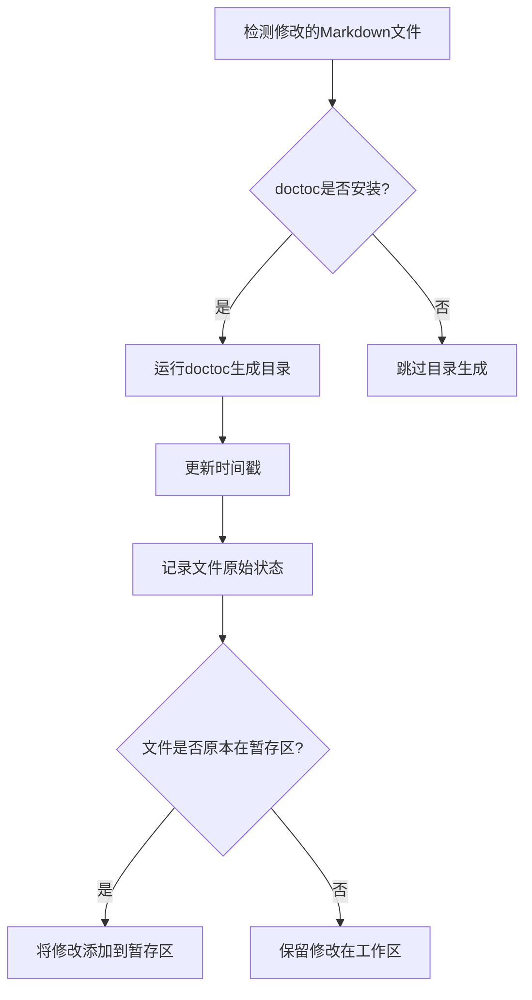
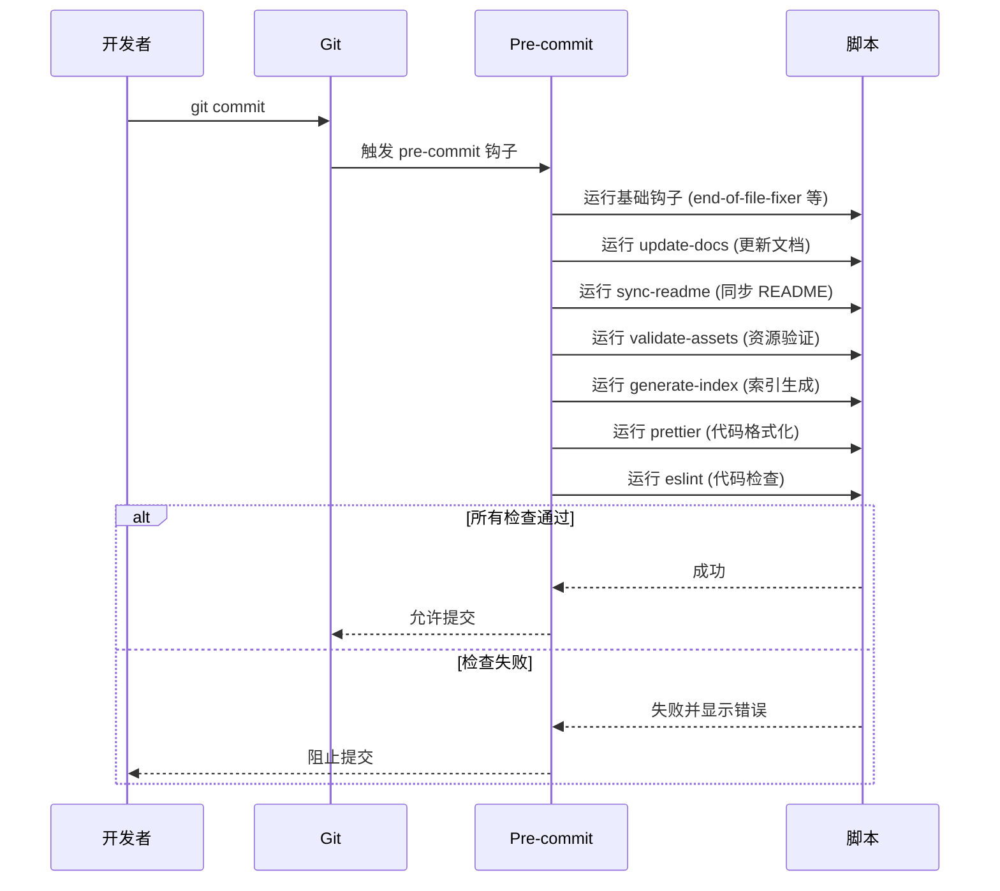

<!-- START doctoc generated TOC please keep comment here to allow auto update -->
<!-- DON'T EDIT THIS SECTION, INSTEAD RE-RUN doctoc TO UPDATE -->

- [预提交钩子综合指南](#%E9%A2%84%E6%8F%90%E4%BA%A4%E9%92%A9%E5%AD%90%E7%BB%BC%E5%90%88%E6%8C%87%E5%8D%97)
  - [简介](#%E7%AE%80%E4%BB%8B)
  - [钩子概览](#%E9%92%A9%E5%AD%90%E6%A6%82%E8%A7%88)
    - [基础钩子](#%E5%9F%BA%E7%A1%80%E9%92%A9%E5%AD%90)
    - [文档更新钩子](#%E6%96%87%E6%A1%A3%E6%9B%B4%E6%96%B0%E9%92%A9%E5%AD%90)
    - [同步钩子](#%E5%90%8C%E6%AD%A5%E9%92%A9%E5%AD%90)
    - [验证钩子](#%E9%AA%8C%E8%AF%81%E9%92%A9%E5%AD%90)
    - [索引生成钩子](#%E7%B4%A2%E5%BC%95%E7%94%9F%E6%88%90%E9%92%A9%E5%AD%90)
    - [代码质量钩子](#%E4%BB%A3%E7%A0%81%E8%B4%A8%E9%87%8F%E9%92%A9%E5%AD%90)
  - [详细钩子说明](#%E8%AF%A6%E7%BB%86%E9%92%A9%E5%AD%90%E8%AF%B4%E6%98%8E)
    - [更新文档钩子 (update-docs)](#%E6%9B%B4%E6%96%B0%E6%96%87%E6%A1%A3%E9%92%A9%E5%AD%90-update-docs)
    - [同步 README 钩子 (sync-readme)](#%E5%90%8C%E6%AD%A5-readme-%E9%92%A9%E5%AD%90-sync-readme)
    - [静态资源命名验证钩子 (validate-assets)](#%E9%9D%99%E6%80%81%E8%B5%84%E6%BA%90%E5%91%BD%E5%90%8D%E9%AA%8C%E8%AF%81%E9%92%A9%E5%AD%90-validate-assets)
    - [索引文件生成钩子 (generate-index)](#%E7%B4%A2%E5%BC%95%E6%96%87%E4%BB%B6%E7%94%9F%E6%88%90%E9%92%A9%E5%AD%90-generate-index)
  - [工作流程](#%E5%B7%A5%E4%BD%9C%E6%B5%81%E7%A8%8B)
  - [维护与扩展](#%E7%BB%B4%E6%8A%A4%E4%B8%8E%E6%89%A9%E5%B1%95)
    - [添加新钩子](#%E6%B7%BB%E5%8A%A0%E6%96%B0%E9%92%A9%E5%AD%90)
    - [调试钩子](#%E8%B0%83%E8%AF%95%E9%92%A9%E5%AD%90)
  - [最佳实践](#%E6%9C%80%E4%BD%B3%E5%AE%9E%E8%B7%B5)
  - [故障排除](#%E6%95%85%E9%9A%9C%E6%8E%92%E9%99%A4)
  - [附录：完整配置](#%E9%99%84%E5%BD%95%E5%AE%8C%E6%95%B4%E9%85%8D%E7%BD%AE)

<!-- END doctoc generated TOC please keep comment here to allow auto update -->

# 预提交钩子综合指南

- **负责人**: 张人大（Renda Zhang）
- **最后更新**: August 07, 2025, 11:20 (UTC+08:00)

---

## 简介

本文档详细介绍了项目中使用的预提交钩子 (pre-commit hooks) 系统。这些钩子在代码提交前自动执行一系列检查和优化任务，确保代码质量和项目规范的一致性。

**主要功能**：
- 自动修复基础格式问题
- 更新文档目录和最后更新时间
- 同步 README 文件
- 验证静态资源命名规范
- 自动根据目录中的 TS 文件生成相应的 `index.ts`
- 执行代码格式化和静态检查

**优势**：
- 统一团队开发规范
- 减少人工检查工作量
- 自动化重复性任务
- 提高代码质量和一致性

---

## 钩子概览

### 基础钩子

| 钩子 ID                  | 功能                         | 文件类型排除                     |
|-------------------------|------------------------------|----------------------------------|
| `end-of-file-fixer`     | 确保文件末尾有且仅有一个换行符 | 图片、字体、音视频等二进制文件   |
| `trailing-whitespace`   | 删除行尾的空白字符           | 同上                             |
| `check-yaml`            | 验证YAML文件格式             | -                                |
| `check-added-large-files`| 检查是否添加了过大的文件     | `scripts/images/hero-original.jpg` |
| `check-json`            | 验证 JSON 文件格式             | -                                |
| `check-case-conflict`   | 检查文件名大小写冲突         | -                                |

### 文档更新钩子

| 钩子ID         | 功能                                 | 触发文件                         |
|----------------|--------------------------------------|----------------------------------|
| `update-docs`  | 更新文档目录和最后更新时间           | `README.md`, `README_EN.md`, `docs/` 下的 Markdown 文件 |

### 同步钩子

| 钩子ID         | 功能                     | 运行时机       |
|----------------|--------------------------|----------------|
| `sync-readme`  | 同步 README 到 assets 目录   | 每次提交       |

### 验证钩子

| 钩子ID             | 功能                     | 运行时机       |
|--------------------|--------------------------|----------------|
| `validate-assets`  | 验证静态资源命名规范     | 每次提交       |

### 索引生成钩子

| 钩子ID             | 功能                     | 运行时机       |
|--------------------|--------------------------|----------------|
| `generate-index`   | 按目录内的 TS 文件生成 `index.ts`，无对应文件则跳过 | 每次提交       |

### 代码质量钩子

| 钩子ID         | 功能                     | 文件类型                     |
|----------------|--------------------------|------------------------------|
| `prettier`     | 使用 Prettier 格式化代码   | JS, JSX, Astro, CSS       |
| `eslint`       | 使用 ESLint 检查和修复代码 | JS, JSX, Astro, Markdown    |

---

## 详细钩子说明

### 更新文档钩子 (update-docs)

**功能**：
1. 使用 `doctoc` 自动生成/更新 Markdown 文档的目录 (TOC)
2. 更新文档中的"最后更新"时间戳
3. 仅处理实际修改过的文件
4. 智能处理文件状态：
   - 只对原本在暂存区（且工作区无修改）的文件执行 `git add`
   - 保留工作区的修改不变
   - 正确处理混合状态的文件

**执行流程**：


**智能状态处理**：
1. **文件只在暂存区有修改**：
   - 更新时间戳后自动添加到暂存区
2. **文件只在工作区有修改**：
   - 更新时间戳后保留在工作区
3. **文件在暂存区和工作区都有修改**：
   - 更新时间戳后保留在工作区，不干扰部分提交
4. **新添加的文件**：
   - 更新时间戳后保留在工作区

**相关文件**：
- `scripts/update_docs.sh` - 主执行脚本
- `scripts/update_last_updated.py` - 时间戳更新脚本

### 同步 README 钩子 (sync-readme)

**功能**：
- 将根目录的 README 文件同步到 `src/assets/` 目录
- 自动将同步后的文件添加到暂存区

**执行流程**：
```bash
# 同步 README.md
cp README.md src/assets/README.md
git add src/assets/README.md

# 同步 README_EN.md
cp README_EN.md src/assets/README_EN.md
git add src/assets/README_EN.md
```

**相关文件**：
- `scripts/sync_readme.py` - 同步脚本

### 静态资源命名验证钩子 (validate-assets)

**功能**：
- 验证`src/assets/`目录下的文件命名是否符合规范
- 脚本会遍历该目录并验证文件名。
- 如果发现问题，会列出不符合规范的文件并以非零状态码退出。
- 命名规则：
  - **音乐文件**：`[用途]-[歌手]-[歌曲名]-[版本或描述].mp3`
  - **图片文件**：`[用途]-[属性]-[质量]-[形状]-[尺寸].jpg|png`

> 更多规则请根据实际需要在脚本中扩展

**执行命令**：
```bash
npm run validate-assets
```

**错误输出示例**：
```
Invalid file names detected:
Images: hero-high-square-400x400.jpg
Assets: bgmusic-artist-song.mp3
```

> 若输出如上所示，请修改文件名后重新运行脚本。

**相关文件**：
- `scripts/validate_assets.ts` - 验证脚本

### 索引文件生成钩子 (generate-index)

**功能**：
- 使用 Node.js 的 `fs/promises` 与 `path` 递归扫描 `src` 目录
- 根据目录内的源文件生成或更新对应的 `index.ts`
- 若目录仅包含现成的 `index.ts` 且无其他模块，将保留该索引文件而不会删除
- 自动同步具名与默认导出
- 忽略所有 `.d.ts` 类型声明文件（如 `env.d.ts`）
- 生成器会覆盖现有索引文件（当存在其他模块时）或创建新文件，确保目录导出完整
- 默认导出会使用原始文件名作为导出别名，从而保持大小写一致。例如：
  ```ts
  // src/hooks/useChatHistory.ts
  export default function useChatHistory() {}
  // 生成的 src/hooks/index.ts 片段
  export { default as useChatHistory } from './useChatHistory';
  ```

**执行命令**：
```bash
npm run generate-index
```

**示例输出**：
```ts
// src/hooks/index.ts
export { default as useChatHistory } from './useChatHistory';
export { default as useAuth } from './useAuth';
```


**维护建议**：
- 新增或移动模块后可手动运行脚本确认导出正确。
- 如需支持更多文件类型或自定义规则，可修改 `scripts/generateIndex.ts`。
- 确保本地环境 Node.js 版本符合项目要求（建议 v18+）。

**相关文件**：
- `scripts/generateIndex.ts`  - 生成脚本

---

## 工作流程



---

## 维护与扩展

### 添加新钩子

1. 在`.pre-commit-config.yaml`中添加新配置：
```yaml
- repo: local
  hooks:
    - id: new-hook
      name: New Hook Description
      entry: path/to/script.sh
      language: script
      files: \.ext$
```

2. 创建执行脚本（如 `scripts/new_hook.sh`）

3. 安装更新：
```bash
pre-commit install
pre-commit autoupdate
```

### 调试钩子

1. 运行单个钩子：
```bash
pre-commit run [hook-id] --all-files
```

2. 详细输出模式：
```bash
pre-commit run [hook-id] --all-files -v
```

3. 跳过钩子（临时）：
```bash
git commit --no-verify -m "跳过钩子检查"
```

---

## 最佳实践

1. **定期更新钩子版本**：
   ```bash
   pre-commit autoupdate
   ```

2. **本地测试**：提交前手动运行所有钩子：
   ```bash
   pre-commit run --all-files
   ```

3. **性能优化**：
   - 限制钩子的文件匹配范围
   - 避免在钩子中执行耗时操作
   - 使用增量处理（如 update-docs 只处理修改的文件）

4. **错误处理**：
   - 提供清晰的错误信息
   - 包含修复建议
   - 使用非零退出码表示失败

5. **文档同步**：
   - 更新此文档时，确保 README 中的相关部分也更新
   - 使用 sync-readme 钩子保持README同步

6. **类型校验**：如需类型校验，可在 CI 或手动执行 `npm run astro check`

---

## 故障排除

- `pre-commit` 框架会在执行钩子之前将工作区的未暂存修改临时 stash，并在钩子结束后再还原。
- 如果钩子修改了工作区文件而没有重新将其加入暂存区，则还原后会出现工作区与暂存区不一致的情况，
- 导致 `pre-commit` 提示 "files were modified by this hook" 并标记失败（Failed）；
- 这是正常的预期行为。
- 为了避免该问题，一般钩子会对所有修改的文件执行 `git add` 操作，使得修改直接应用到暂存区。
- 这样子，再次运行钩子后，就不会出现 Failed 标记了。

> 注意：进行 `pre-commit` 的钩子相关的脚本代码测试前，
> 记得检查钩子相关的代码改动以及 `pre-commit` 相关的改动是否已经在暂存区或者本地仓库；
> 如果不在的话，需要先执行 `git add` 添加到暂存区才能让这些新调整的行为生效。
> 防止出现工作区的跟脚本相关的修改被 stash 后，脚本新调整的预期行为的缺失现象。

|    问题现象    | 可能原因 | 解决方案  |
|----------------|----------|----------|
|    钩子未运行   | pre-commit 未安装 | 运行 `pre-commit install` |
| 文件修改未检测到 | 文件在排除列表中 | 检查 `.pre-commit-config.yaml` 中的 `exclude` 模式 |
| "最后更新"时间未改变 | 文件未被 doctoc 修改 | 手动修改文件内容触发更新 |
| 资源验证失败 | 命名不符合规范 | 根据命名规范重命名文件 |
| 锁文件残留 | 脚本异常退出 | 手动删除 `.git/update-docs.lock` |

**调试命令**：
```bash
# 检查 pre-commit 版本
pre-commit --version

# 列出所有钩子
pre-commit run --all-files --show-diff-on-failure

# 详细日志
PRE_COMMIT_LOG=debug pre-commit run --all-files
```

---

## 附录：完整配置

> 完整配置请查看项目根目录的 `.pre-commit-config.yaml`
