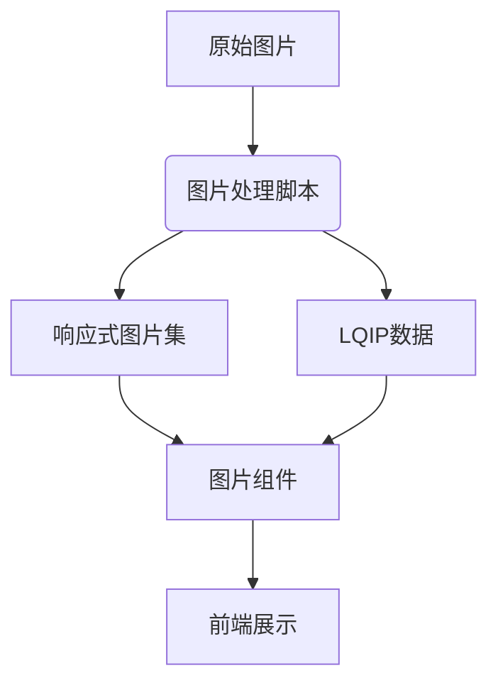
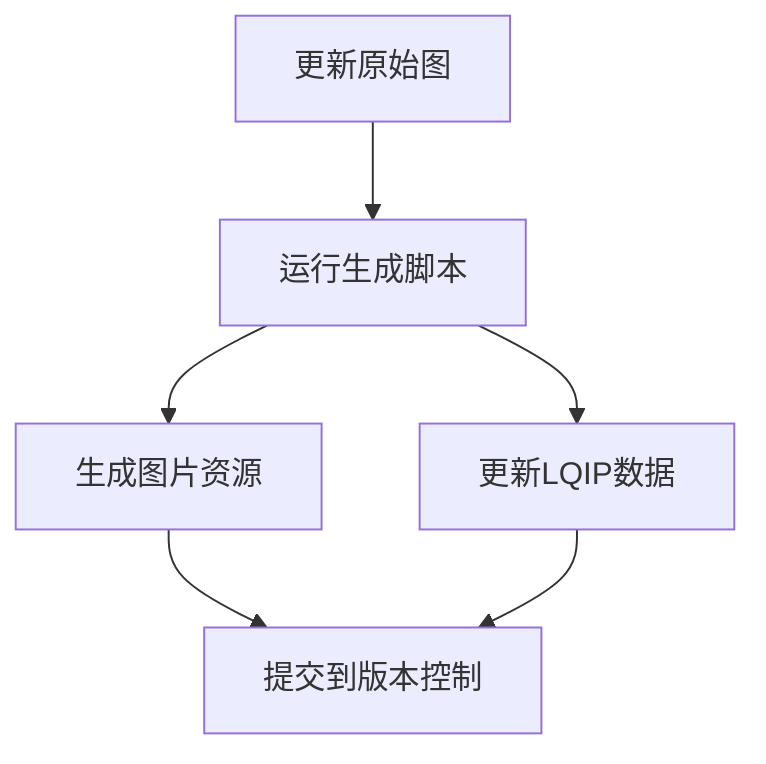
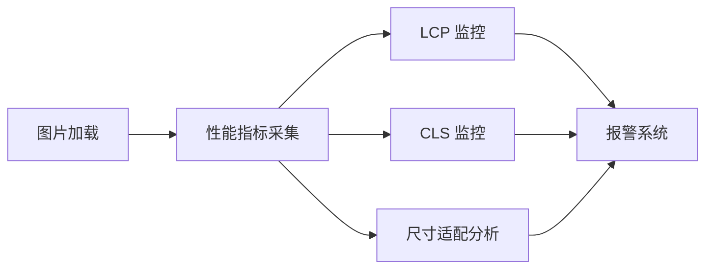

<!-- START doctoc generated TOC please keep comment here to allow auto update -->
<!-- DON'T EDIT THIS SECTION, INSTEAD RE-RUN doctoc TO UPDATE -->
**Table of Contents**  *generated with [DocToc](https://github.com/thlorenz/doctoc)*

- [通用响应式图片处理系统维护文档](#%E9%80%9A%E7%94%A8%E5%93%8D%E5%BA%94%E5%BC%8F%E5%9B%BE%E7%89%87%E5%A4%84%E7%90%86%E7%B3%BB%E7%BB%9F%E7%BB%B4%E6%8A%A4%E6%96%87%E6%A1%A3)
  - [概述](#%E6%A6%82%E8%BF%B0)
  - [系统架构](#%E7%B3%BB%E7%BB%9F%E6%9E%B6%E6%9E%84)
    - [核心组件](#%E6%A0%B8%E5%BF%83%E7%BB%84%E4%BB%B6)
    - [文件结构](#%E6%96%87%E4%BB%B6%E7%BB%93%E6%9E%84)
  - [核心脚本使用指南](#%E6%A0%B8%E5%BF%83%E8%84%9A%E6%9C%AC%E4%BD%BF%E7%94%A8%E6%8C%87%E5%8D%97)
    - [入口脚本](#%E5%85%A5%E5%8F%A3%E8%84%9A%E6%9C%AC)
    - [配置参数](#%E9%85%8D%E7%BD%AE%E5%8F%82%E6%95%B0)
    - [添加新处理器](#%E6%B7%BB%E5%8A%A0%E6%96%B0%E5%A4%84%E7%90%86%E5%99%A8)
  - [图片类型维护记录](#%E5%9B%BE%E7%89%87%E7%B1%BB%E5%9E%8B%E7%BB%B4%E6%8A%A4%E8%AE%B0%E5%BD%95)
    - [Hero 图配置（当前实现）](#hero-%E5%9B%BE%E9%85%8D%E7%BD%AE%E5%BD%93%E5%89%8D%E5%AE%9E%E7%8E%B0)
    - [维护流程](#%E7%BB%B4%E6%8A%A4%E6%B5%81%E7%A8%8B)
  - [通用图片组件](#%E9%80%9A%E7%94%A8%E5%9B%BE%E7%89%87%E7%BB%84%E4%BB%B6)
    - [基础组件](#%E5%9F%BA%E7%A1%80%E7%BB%84%E4%BB%B6)
    - [专用组件示例](#%E4%B8%93%E7%94%A8%E7%BB%84%E4%BB%B6%E7%A4%BA%E4%BE%8B)
  - [扩展新图片类型指南](#%E6%89%A9%E5%B1%95%E6%96%B0%E5%9B%BE%E7%89%87%E7%B1%BB%E5%9E%8B%E6%8C%87%E5%8D%97)
    - [步骤 1：创建处理器](#%E6%AD%A5%E9%AA%A4-1%E5%88%9B%E5%BB%BA%E5%A4%84%E7%90%86%E5%99%A8)
    - [步骤 2：创建数据文件模板](#%E6%AD%A5%E9%AA%A4-2%E5%88%9B%E5%BB%BA%E6%95%B0%E6%8D%AE%E6%96%87%E4%BB%B6%E6%A8%A1%E6%9D%BF)
    - [步骤 3：在前端使用](#%E6%AD%A5%E9%AA%A4-3%E5%9C%A8%E5%89%8D%E7%AB%AF%E4%BD%BF%E7%94%A8)
  - [维护最佳实践](#%E7%BB%B4%E6%8A%A4%E6%9C%80%E4%BD%B3%E5%AE%9E%E8%B7%B5)
    - [版本管理策略](#%E7%89%88%E6%9C%AC%E7%AE%A1%E7%90%86%E7%AD%96%E7%95%A5)
    - [性能监控](#%E6%80%A7%E8%83%BD%E7%9B%91%E6%8E%A7)
  - [故障排除指南](#%E6%95%85%E9%9A%9C%E6%8E%92%E9%99%A4%E6%8C%87%E5%8D%97)
    - [常见问题解决方案](#%E5%B8%B8%E8%A7%81%E9%97%AE%E9%A2%98%E8%A7%A3%E5%86%B3%E6%96%B9%E6%A1%88)
    - [调试命令](#%E8%B0%83%E8%AF%95%E5%91%BD%E4%BB%A4)
  - [扩展路线](#%E6%89%A9%E5%B1%95%E8%B7%AF%E7%BA%BF)
    - [高级特性规划](#%E9%AB%98%E7%BA%A7%E7%89%B9%E6%80%A7%E8%A7%84%E5%88%92)

<!-- END doctoc generated TOC please keep comment here to allow auto update -->

# 通用响应式图片处理系统维护文档

- **负责人**: 张人大（Renda Zhang）
- **最后更新**: August 07, 2025, 09:53 (UTC+08:00)

---

## 概述

本文档记录了项目中图片处理系统的完整实现和维护指南，包含核心脚本、组件设计和扩展方案。
系统基于 Sharp 库实现了自动化图片处理流水线，支持响应式图片生成、LQIP 技术和无缝过渡效果。

**系统优势**：
- 一次配置，长期复用
- 支持任意图片类型（Hero 图、内容图、相册等）
- 灵活的扩展机制
- 高性能图片加载体验


**文档版本**：2.1

**更新日志**：
- v1.0：初始Hero图系统
- v2.0：通用化重构，支持多类型图片
- v2.1：添加处理器插件系统

> **维护提示**：定期检查 Sharp 库版本，确保使用最新图像处理能力。每季度审查尺寸策略，适配新设备标准。

---

## 系统架构

### 核心组件



### 文件结构

```
project-root/
├── scripts/
│   ├── image-processing/       # 图片处理核心模块
│   │   ├── processors/         # 处理器插件
│   │   │   ├── hero-processor.ts
│   │   │   └── gallery-processor.ts
│   │   ├── utils.ts            # 通用工具函数
│   │   └── image-generator.ts  # 核心生成逻辑
│   └── generate-hero.ts      # 入口脚本
├── public/
│   └── assets/
│       ├── heroes/             # Hero 图输出
│       ├── gallery/            # 相册图输出
│       └── content/            # 内容图输出
├── src/
│   ├── components/
│   │   └── ui/
│   │       ├── ResponsiveImage.tsx # 通用图片组件
│   │       └── HeroImage.tsx       # Hero 专用组件
│   ├── data/
│   │   ├── image-hero.ts       # Hero 图数据
│   │   └── image-gallery.ts    # 相册图数据
│   └── styles/
│       └── responsive-image.css # 通用图片样式
```

---

## 核心脚本使用指南

### 入口脚本

`scripts/generate-hero.ts`

```bash
# 生成 Hero 图及其 LQIP 数据
npx tsx scripts/generate-hero.ts

# 或通过 npm 脚本
npm run generate-hero
```

### 配置参数

当前脚本使用固定配置：从 `scripts/images/hero-original.jpg` 生成多尺寸图片到 `src/assets/heroes`，并在 `src/data/mainHero.ts` 写入 LQIP 数据。

生成的数据文件示例：

```ts
export const MAIN_HERO = {
  base64: '...',
  aspectRatio: 1.5
} as const;
```

### 添加新处理器

1. 创建处理器文件 `scripts/image-processing/processors/new-type-processor.ts`

```ts
// new-type-processor.ts
export default {
  name: 'new-type',

  defaultConfig: {
    widths: [1200, 800, 400],
    lqip: { width: 16, quality: 10 }
  },

  async generate({ inputPath, outputDir, config }) {
    // 自定义生成逻辑
    // 返回生成结果
  }
};
```

1. 注册处理器 `scripts/image-processing/image-generator.ts`

```ts
// 添加引用
import newTypeProcessor from './processors/new-type-processor';

// 注册处理器
const processors = {
  hero: heroProcessor,
  gallery: galleryProcessor,
  'new-type': newTypeProcessor // 新增
};
```

---

## 图片类型维护记录

### Hero 图配置（当前实现）

| 参数 | 值 | 说明 |
|------|----|------|
| 处理器 | `hero` | 专用处理器 |
| 原始图位置 | `scripts/images/hero-original.jpg` | 原始高清图 |
| 输出目录 | `public/assets/heroes` | 生成图位置 |
| 尺寸 | `[3840, 2560, 1920, 1280, 1000, 800, 400]` | 响应式尺寸 |
| LQIP | `width:20, quality:15` | 低质量占位 |
| 数据文件 | `src/data/image-hero.ts` | LQIP数据 |
| 组件 | `src/components/ui/HeroImage.tsx` | 专用组件 |

### 维护流程



**操作命令**：

```bash
# 更新Hero图
npx scripts/generate-hero.ts --type=hero

# 添加新Hero图
cp new-hero.jpg scripts/images/
npx scripts/generate-hero.ts --type=hero --input-dir=scripts/images/new-hero.jpg
```

---

## 通用图片组件

### 基础组件

`ResponsiveImage.tsx`

```tsx
import { useState } from 'react';

export default function ResponsiveImage({
  imageType,      // 图片类型标识
  imageName,      // 图片名称
  imageData,      // LQIP数据
  imageMap,       // 路径映射
  widths,         // 可用尺寸
  alt = 'Image',
  className = '',
  ...props
}) {
  const [loaded, setLoaded] = useState(false);

  // 动态生成srcSet
  const srcSet = widths
    .map(w => `${imageMap[`${imageType}-${imageName}-${w}w.webp`]} ${w}w`)
    .join(', ');

  return (
    <div className={`responsive-image ${className}`}
         style={{ aspectRatio: imageData.aspectRatio }}>
      {/* LQIP占位图 */}
      

      {/* 响应式图片 */}
      <picture>
        <source srcSet={srcSet} type="image/webp" />
         setLoaded(true)}
             className={`main-image ${loaded ? 'loaded' : ''}`}
             alt={alt} />
      </picture>
    </div>
  )
}
```

### 专用组件示例

`HeroImage.tsx`

```tsx
import ResponsiveImage from './ResponsiveImage';

export default function HeroImage({ children, ...props }) {
  return (
    <ResponsiveImage
      imageType="hero"
      {...props}
      className="hero-image">
      <div className="hero-content">
        {children}
      </div>
    </ResponsiveImage>
  )
}
```

---

## 扩展新图片类型指南

### 步骤 1：创建处理器

```ts
// gallery-processor.ts
import sharp from 'sharp';
import path from 'path';
import fs from 'fs';

export default {
  name: 'gallery',

  defaultConfig: {
    widths: [1200, 800, 400],
    lqip: { width: 16, quality: 10 }
  },

  generate: async function({ inputPath, outputDir, config }) {
    const results = [];

    // 处理目录中所有图片
    const files = fs.readdirSync(inputPath);

    for (const file of files) {
      const imageName = path.basename(file, path.extname(file));
      const outputFiles = [];

      // 生成响应式图片
      for (const width of config.widths) {
        const outputFile = path.join(outputDir, `gallery-${imageName}-${width}w.webp`);
        await sharp(path.join(inputPath, file))
          .resize(width)
          .webp({ quality: config.quality })
          .toFile(outputFile);
        outputFiles.push(outputFile);
      }

      // 生成 LQIP
      const lqipBuffer = await sharp(path.join(inputPath, file))
        .resize(config.lqip.width)
        .jpeg({ quality: config.lqip.quality })
        .toBuffer();

      results.push({
        imageName,
        lqipBase64: lqipBuffer.toString('base64'),
        aspectRatio: (await sharp(path.join(inputPath, file)).metadata().height /
                    (await sharp(path.join(inputPath, file)).metadata().width
      });
    }

    return results;
  }
}
```

### 步骤 2：创建数据文件模板

```ts
// scripts/templates/gallery-data-template.ts
export default (results: any[]) => `
// 自动生成的图库数据
export const galleryData = {
  ${results.map(item => `
  ${item.imageName}: {
    base64: '${item.lqipBase64}',
    aspectRatio: ${item.aspectRatio}
  }`).join(',\n')}
};
`;
```

### 步骤 3：在前端使用

```tsx
import { ResponsiveImage } from '@/components/ui';
import { galleryData } from '@/data/image-gallery';

function GalleryItem({ imageName }) {
  return (
    <ResponsiveImage
      imageType="gallery"
      imageName={imageName}
      imageData={galleryData[imageName]}
      widths={[1200, 800, 400]}
      className="gallery-item"
    />
  )
}
```

---

## 维护最佳实践

### 版本管理策略

1. **原始图管理**：
   - 保留所有原始高分辨率图片
   - 存储在 `scripts/images/` 目录下
   - 按类型分类：`/hero`, `/gallery`, `/content`

2. **生成资源**：
   - 不纳入版本控制（添加到 `.gitignore`）
   - 通过 CI/CD 自动生成：
   ```yaml
   # .github/workflows/images.yml
   name: Generate Images
   on:
     push:
       paths:
         - 'scripts/images/**'
   jobs:
     generate:
       runs-on: ubuntu-latest
       steps:
         - uses: actions/checkout@v3
         - run: npm install
         - run: npx scripts/generate-hero.ts --all
         - uses: actions/upload-artifact@v3
           with:
             name: generated-images
             path: public/assets
   ```

### 性能监控



**关键指标**：
- **LCP 达标率**：> 95% < 2.5s
- **CLS 异常**：< 0.1
- **尺寸适配准确率**：> 98%

---

## 故障排除指南

### 常见问题解决方案

| 问题现象 | 可能原因 | 解决方案 |
|----------|----------|----------|
| 图片未更新 | 缓存问题 | 添加版本戳：`image.jpg?v=20250801` |
| LQIP不显示 | Base64格式错误 | 检查数据文件中的引号格式 |
| 桌面端加载移动图 | sizes属性配置错误 | 使用Chrome DevTools响应式测试 |
| 过渡效果卡顿 | 大尺寸图片 | 优化尺寸配置，减少最大尺寸 |

### 调试命令

```bash
# 检查图片信息
npx sharp inspect public/assets/heroes/hero-main-1920w.webp

# 尺寸适配测试
npx responsively-app
```

---

## 扩展路线

### 高级特性规划

1. **智能裁剪**：
   ```ts
   // 在处理器中添加
   .resize(width, height, {
     position: 'attention', // 基于 AI 焦点
     strategy: 'attention'
   })
   ```

2. **CDN 集成**：
   ```ts
   // 生成后自动上传
   import uploadToCDN from './cdn-uploader';
   await uploadToCDN(outputFile);
   ```

3. **动态图片优化**：
   ```tsx
   <ResponsiveImage
     dynamicSizes={[
       { viewport: 1200, size: '100vw' },
       { viewport: 768, size: '50vw' }
     ]}
   />
   ```
