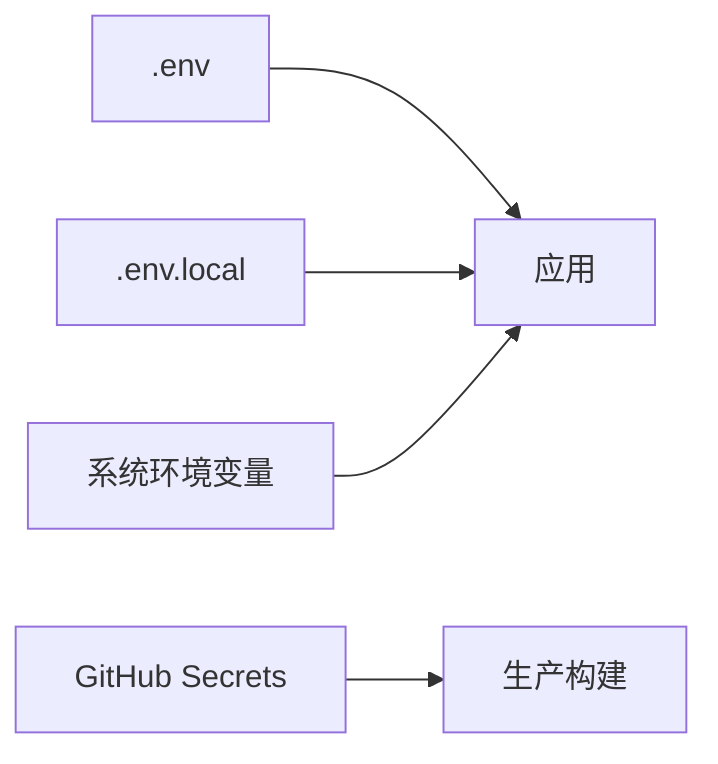

<!-- START doctoc generated TOC please keep comment here to allow auto update -->
<!-- DON'T EDIT THIS SECTION, INSTEAD RE-RUN doctoc TO UPDATE -->
**Table of Contents**  *generated with [DocToc](https://github.com/thlorenz/doctoc)*

- [Sentry Error Tracking Integration](#sentry-error-tracking-integration)
  - [环境配置指南](#%E7%8E%AF%E5%A2%83%E9%85%8D%E7%BD%AE%E6%8C%87%E5%8D%97)
    - [文件结构与用途](#%E6%96%87%E4%BB%B6%E7%BB%93%E6%9E%84%E4%B8%8E%E7%94%A8%E9%80%94)
    - [环境变量说明](#%E7%8E%AF%E5%A2%83%E5%8F%98%E9%87%8F%E8%AF%B4%E6%98%8E)
      - [`.env` 示例 (公开可提交)](#env-%E7%A4%BA%E4%BE%8B-%E5%85%AC%E5%BC%80%E5%8F%AF%E6%8F%90%E4%BA%A4)
      - [`.env.local` 示例 (本地私有)](#envlocal-%E7%A4%BA%E4%BE%8B-%E6%9C%AC%E5%9C%B0%E7%A7%81%E6%9C%89)
    - [环境变量加载优先级](#%E7%8E%AF%E5%A2%83%E5%8F%98%E9%87%8F%E5%8A%A0%E8%BD%BD%E4%BC%98%E5%85%88%E7%BA%A7)
  - [Sentry 初始化配置](#sentry-%E5%88%9D%E5%A7%8B%E5%8C%96%E9%85%8D%E7%BD%AE)
    - [`astro.config.mjs` 关键配置](#astroconfigmjs-%E5%85%B3%E9%94%AE%E9%85%8D%E7%BD%AE)
    - [`sentry.client.config.js` 浏览器端配置](#sentryclientconfigjs-%E6%B5%8F%E8%A7%88%E5%99%A8%E7%AB%AF%E9%85%8D%E7%BD%AE)
  - [错误过滤与安全策略](#%E9%94%99%E8%AF%AF%E8%BF%87%E6%BB%A4%E4%B8%8E%E5%AE%89%E5%85%A8%E7%AD%96%E7%95%A5)
    - [安全过滤规则](#%E5%AE%89%E5%85%A8%E8%BF%87%E6%BB%A4%E8%A7%84%E5%88%99)
    - [推荐增强过滤](#%E6%8E%A8%E8%8D%90%E5%A2%9E%E5%BC%BA%E8%BF%87%E6%BB%A4)
  - [生产环境部署](#%E7%94%9F%E4%BA%A7%E7%8E%AF%E5%A2%83%E9%83%A8%E7%BD%B2)
    - [GitHub Actions 关键配置](#github-actions-%E5%85%B3%E9%94%AE%E9%85%8D%E7%BD%AE)
    - [版本发布最佳实践](#%E7%89%88%E6%9C%AC%E5%8F%91%E5%B8%83%E6%9C%80%E4%BD%B3%E5%AE%9E%E8%B7%B5)
  - [本地开发调试](#%E6%9C%AC%E5%9C%B0%E5%BC%80%E5%8F%91%E8%B0%83%E8%AF%95)
    - [调试配置建议](#%E8%B0%83%E8%AF%95%E9%85%8D%E7%BD%AE%E5%BB%BA%E8%AE%AE)
    - [调试技巧](#%E8%B0%83%E8%AF%95%E6%8A%80%E5%B7%A7)
  - [最佳实践](#%E6%9C%80%E4%BD%B3%E5%AE%9E%E8%B7%B5)
    - [错误监控策略](#%E9%94%99%E8%AF%AF%E7%9B%91%E6%8E%A7%E7%AD%96%E7%95%A5)
    - [版本管理策略](#%E7%89%88%E6%9C%AC%E7%AE%A1%E7%90%86%E7%AD%96%E7%95%A5)
  - [故障排查](#%E6%95%85%E9%9A%9C%E6%8E%92%E6%9F%A5)
    - [常见问题解决方案](#%E5%B8%B8%E8%A7%81%E9%97%AE%E9%A2%98%E8%A7%A3%E5%86%B3%E6%96%B9%E6%A1%88)
    - [调试命令](#%E8%B0%83%E8%AF%95%E5%91%BD%E4%BB%A4)
    - [日志分析要点](#%E6%97%A5%E5%BF%97%E5%88%86%E6%9E%90%E8%A6%81%E7%82%B9)

<!-- END doctoc generated TOC please keep comment here to allow auto update -->

# Sentry Error Tracking Integration

- **作者**: 张人大 (Renda Zhang)
- **最后更新**: August 05, 2025, 04:04 (UTC+08:00)

---

## 环境配置指南

### 文件结构与用途

| 文件      |    用途      | 是否提交到仓库 |
|-----------|-------------|----------------|
| `.env`    | 存储公共环境变量 (CDN 路径、API 地址等)  | ✅ 是    |
| `.env.local` | 存储敏感环境变量 (Sentry Token、DSN 等) | ❌ 否   |
| `astro.config.mjs` | Astro 主配置文件，集成 Sentry 插件 | ✅ 是    |
| `sentry.client.config.js` | Sentry 浏览器端初始化配置 | ✅ 是   |

### 环境变量说明

#### `.env` 示例 (公开可提交)

```env
# 公共配置（与仓库同步）
PUBLIC_API_BASE_URL="/cloudchat"
PUBLIC_CDN_BASE="https://cdn.jsdelivr.net/gh/rendazhang/rendazhang@1.0.1/"
PUBLIC_SENTRY_DSN="https://public-key@o4509770577543168.ingest.us.sentry.io/4509770780377088"
PUBLIC_SITE_BASE_URL="https://www.rendazhang.com"
PUBLIC_TAG_NAME="v1.0.1"
NODE_ENV="production"
```

#### `.env.local` 示例 (本地私有)

```env
# 敏感配置（不提交到仓库）
SENTRY_AUTH_TOKEN="sntrys_xxx"
SENTRY_DSN="https://private-key@xxx.ingest.us.sentry.io/xxx"
SENTRY_PROJECT="renda-website"
SENTRY_ORG="renda-nh"
PUBLIC_NODE_ENV="development"  # 本地调试覆盖为 development
```

### 环境变量加载优先级



> **重要提示**：本地开发时，`.env.local` 会覆盖 `.env` 中的同名变量，便于调试配置

---

## Sentry 初始化配置

### `astro.config.mjs` 关键配置

```javascript
import sentry from '@sentry/astro';
import { loadEnv } from 'vite';

// 根据 NODE_ENV 加载环境变量
const env = loadEnv(process.env.NODE_ENV ?? 'production', process.cwd(), '');

export default defineConfig({
  integrations: [
    sentry({
      clientInitPath: './src/sentry.client.config.js',
      sourceMapsUploadOptions: {
        authToken: env.SENTRY_AUTH_TOKEN,       // 从 .env.local 获取
        org: env.SENTRY_ORG,                   // Sentry 组织名
        project: env.SENTRY_PROJECT,            // Sentry 项目名
        release: env.PUBLIC_TAG_NAME,           // 版本标签
        setCommits: {
          auto: true                           // 自动关联 Git 提交
        }
      }
    })
  ],
  vite: {
    build: { sourcemap: true },  // 必须启用 sourcemap
    define: {
      // 注入客户端可访问的环境变量
      'import.meta.env.PUBLIC_SENTRY_DSN': JSON.stringify(env.PUBLIC_SENTRY_DSN),
      'import.meta.env.PUBLIC_TAG_NAME': JSON.stringify(env.PUBLIC_TAG_NAME),
      'import.meta.env.PUBLIC_NODE_ENV': JSON.stringify(env.PUBLIC_NODE_ENV)
    }
  }
});
```

### `sentry.client.config.js` 浏览器端配置

```javascript
import * as Sentry from '@sentry/astro';

Sentry.init({
  dsn: import.meta.env.PUBLIC_SENTRY_DSN,
  release: import.meta.env.PUBLIC_TAG_NAME,
  environment: import.meta.env.PUBLIC_NODE_ENV || 'production',

  // 采样率配置
  tracesSampleRate: 0.2,
  replaysSessionSampleRate: 0.1,
  replaysOnErrorSampleRate: 0.5,

  // 安全与隐私控制
  sendDefaultPii: false, // 禁用敏感个人信息收集

  // 开发环境配置
  debug: import.meta.env.PUBLIC_NODE_ENV === 'development',

  // 错误过滤钩子
  beforeSend(event, hint) {
    return filterSentryEvents(event, hint);
  }
});

// 错误过滤逻辑
function filterSentryEvents(event, hint) {
  const { request } = event;
  const originalException = hint.originalException;

  // 1. 浏览器扩展错误过滤
  const isExtensionError = /chrome-extension:|moz-extension:/.test(
    originalException?.stack || ''
  );

  // 2. 敏感路径过滤
  const sensitivePaths = ['password', 'token', 'auth', 'credit-card'];
  const hasSensitivePath = sensitivePaths.some(path =>
    request?.url?.includes(path)
  );

  // 3. 开发环境特殊处理
  if (import.meta.env.PUBLIC_NODE_ENV !== 'production') {
    console.debug('[Sentry] Filtered event:', event);
    if (isExtensionError || hasSensitivePath) return null;
  }

  // 4. 生产环境过滤
  return (isExtensionError || hasSensitivePath) ? null : event;
}
```

---

## 错误过滤与安全策略

### 安全过滤规则

| 过滤类型      | 检测规则    | 处理方式       |
|--------------|------------|----------------|
| 浏览器扩展错误  | `stacktrace` 包含 `chrome-extension:` 或 `moz-extension:`  | 丢弃事件   |
| 敏感路径    | URL 包含 `password`, `token`, `auth`, `credit-card` 等关键词   | 丢弃事件  |
| 开发环境错误    | `PUBLIC_NODE_ENV=development`  | 控制台日志记录 |

### 推荐增强过滤

```javascript
// 在 beforeSend 中添加
denyUrls: [
  /localhost/,
  /127\.0\.0\.1/,
  /testing\.domain\.com/
],
ignoreErrors: [
  'ResizeObserver loop limit exceeded',
  /AuthenticationError/i
]
```

---

## 生产环境部署

### GitHub Actions 关键配置

```yaml
- name: Build Astro Project
  env:
    # 注入 Sentry 所需变量
    SENTRY_AUTH_TOKEN: ${{ secrets.SENTRY_AUTH_TOKEN }}
    SENTRY_ORG: ${{ secrets.SENTRY_ORG }}
    SENTRY_PROJECT: ${{ secrets.SENTRY_PROJECT }}
    # 注入公共变量
    PUBLIC_SENTRY_DSN: ${{ vars.PUBLIC_SENTRY_DSN }}
    PUBLIC_TAG_NAME: ${{ env.TAG_NAME }}
  run: npm run build
```

### 版本发布最佳实践

1. **版本命名**：使用语义化版本 `v<major>.<minor>.<patch>`
2. **Git 标签**：每个发布创建对应 Git 标签
3. **Source Map 关联**：确保 `release` 值与构建版本一致
4. **部署验证**：添加 Sentry 健康检查脚本

```bash
# 部署后验证脚本
curl -X POST https://sentry.io/api/0/organizations/renda-nh/releases/ \
  -H "Authorization: Bearer $SENTRY_AUTH_TOKEN" \
  -H "Content-Type: application/json" \
  -d '{
    "version": "'$TAG_NAME'",
    "projects": ["renda-website"],
    "refs": [{
      "repository": "rendazhang/rendazhang",
      "commit": "'$GITHUB_SHA'"
    }]
  }'
```

---

## 本地开发调试

### 调试配置建议

1. **启用调试模式**：
   ```javascript
   // sentry.client.config.js
   debug: true // 显示初始化日志
   ```

2. **模拟错误测试**：
   ```javascript
   // 在组件中手动触发错误
   function testSentry() {
     try {
       throw new Error('Sentry integration test error');
     } catch (e) {
       Sentry.captureException(e, {
         tags: { type: 'integration-test' }
       });
     }
   }
   ```

3. **开发环境过滤**：
   ```javascript
   // 本地只记录不上报
   if (import.meta.env.DEV) {
     Sentry.init({
       beforeSend: () => null, // 丢弃所有事件
       debug: true
     });
   }
   ```

### 调试技巧

1. 查看浏览器控制台的 `@sentry/astro` 日志
2. 使用 `Sentry.captureMessage("Debug message")` 跟踪流程
3. 在 Sentry 仪表板设置 `Environment=development` 过滤器

---

## 最佳实践

### 错误监控策略

1. **关键错误实时报警**：
   ```javascript
   // 严重错误发送通知
   Sentry.init({
     integrations: [
       new Sentry.Integrations.Breadcrumbs({ console: false }),
       new Sentry.Integrations.LinkedErrors(),
       new Sentry.Integrations.HttpContext()
     ]
   });
   ```

2. **性能监控集成**：
   ```javascript
   tracesSampleRate: 0.2, // 20% 的性能数据采样
   _experiments: {
     metrics: { enabled: true } // 启用实验性指标
   }
   ```

3. **用户反馈收集**：
   ```jsx
   // React 组件中添加反馈按钮
   <button onClick={() => Sentry.showReportDialog()}>
     报告问题
   </button>
   ```

### 版本管理策略

| 场景               | 推荐方案                          |
|--------------------|-----------------------------------|
| 常规发布           | `v1.2.3`                          |
| 预发布版本         | `v1.2.3-rc.1`                     |
| 开发测试版本       | `dev-<commit-sha>`                |
| 紧急热修复         | `hotfix-<issue-id>`               |

---

## 故障排查

### 常见问题解决方案

| 问题现象 | 可能原因    | 解决方案       |
|----------|------------|-----------------|
| Source map 无法匹配   | 版本不一致  | 确保 `release` 值一致 |
| 403 上传错误   | 无效的 Auth Token | 检查 Token 权限/有效期  |
| 开发环境错误上报 | 未禁用开发上报 | 添加环境检测逻辑 |
| 缺少堆栈信息  | Source map 未上传  | 检查构建日志上传记录  |
| 敏感数据泄露  | `sendDefaultPii=true`  | 设为 `false` + 自定义过滤  |

### 调试命令

```bash
# 检查 Source map 上传
SENTRY_LOG_LEVEL=debug npm run build

# 验证发布版本
sentry-cli releases -o renda-nh -p renda-website list

# 手动上传 Source map
sentry-cli sourcemaps inject ./dist
sentry-cli sourcemaps upload ./dist \
  --org renda-nh \
  --project renda-website \
  --release v1.0.1
```

### 日志分析要点

1. 检查 `Sentry Logger` 输出是否显示初始化成功
2. 确认 `sourceMapsUpload` 日志显示上传文件列表
3. 验证 `release` 值在构建和运行时一致

> 提示：遇到上传问题可临时设置 `debug: true` 获取详细日志：
> ```js
> // astro.config.mjs
> sourceMapsUploadOptions: {
>   debug: true,
>   // ...
> }
> ```
