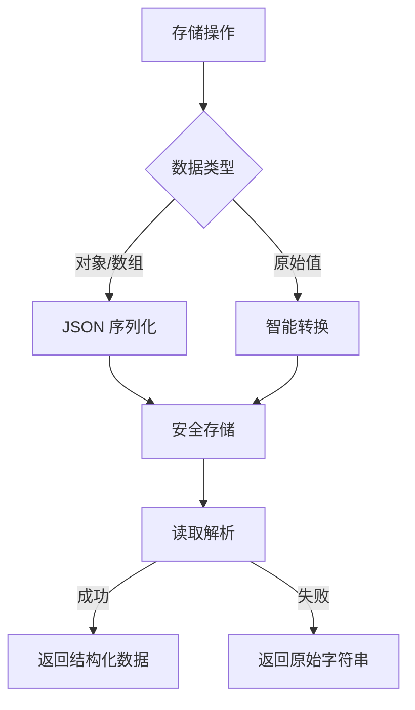

<!-- START doctoc generated TOC please keep comment here to allow auto update -->
<!-- DON'T EDIT THIS SECTION, INSTEAD RE-RUN doctoc TO UPDATE -->

- [存储工具函数](#%E5%AD%98%E5%82%A8%E5%B7%A5%E5%85%B7%E5%87%BD%E6%95%B0)
  - [简介](#%E7%AE%80%E4%BB%8B)
  - [核心特性](#%E6%A0%B8%E5%BF%83%E7%89%B9%E6%80%A7)
  - [API](#api)
    - [`get(key, type?)`](#getkey-type)
    - [`set(key, value, type?, options?)`](#setkey-value-type-options)
    - [`remove(key, type?)`](#removekey-type)
    - [IndexedDB 异步方法](#indexeddb-%E5%BC%82%E6%AD%A5%E6%96%B9%E6%B3%95)
  - [智能解析机制](#%E6%99%BA%E8%83%BD%E8%A7%A3%E6%9E%90%E6%9C%BA%E5%88%B6)
  - [使用示例](#%E4%BD%BF%E7%94%A8%E7%A4%BA%E4%BE%8B)
    - [基础使用](#%E5%9F%BA%E7%A1%80%E4%BD%BF%E7%94%A8)
    - [安全删除](#%E5%AE%89%E5%85%A8%E5%88%A0%E9%99%A4)
    - [IndexedDB 操作](#indexeddb-%E6%93%8D%E4%BD%9C)
  - [最佳实践](#%E6%9C%80%E4%BD%B3%E5%AE%9E%E8%B7%B5)
  - [注意事项](#%E6%B3%A8%E6%84%8F%E4%BA%8B%E9%A1%B9)

<!-- END doctoc generated TOC please keep comment here to allow auto update -->

# 存储工具函数

- **作者**: 张人大 (Renda Zhang)
- **最后更新**: August 06, 2025, 19:59 (UTC+08:00)

---

## 简介

`src/utils/storage.ts` 提供统一的存储操作接口，封装多种存储后端的读写逻辑，具有以下特点：

1. **多后端支持**：
   - `localStorage` & `sessionStorage`
   - Cookies
   - 内存存储（无存储环境回退）
   - IndexedDB（异步大容量存储）

2. **智能数据兼容**：
   - 无缝兼容新旧数据格式（原始字符串 ↔ JSON）
   - 自动处理数据类型转换

3. **健壮性保障**：
   - 存储不可用时优雅降级
   - 统一错误处理 + Sentry 监控集成

---

## 核心特性



---

## API

### `get(key, type?)`

读取指定 key 的值，支持智能格式解析：

```javascript
// 读取新版JSON数据
storage.get('user_settings') // { theme: 'dark', lang: 'en' }

// 读取旧版字符串数据
storage.get('legacy_key') // "raw_string_value"
```

### `set(key, value, type?, options?)`

写入时自动标准化数据格式：

```javascript
// 自动序列化
storage.set('user', { name: "张三", id: 123 })

// Cookie专属选项
storage.set('session_id', 'abc123', 'cookie', { days: 7 })
```

### `remove(key, type?)`

安全删除存储数据：

```javascript
storage.remove('temp_data', 'session')
```

### IndexedDB 异步方法

| 方法                | 描述                     | 示例 |
|---------------------|--------------------------|------|
| `getIndexedDB`      | 异步读取大容量数据       | `storage.getIndexedDB('user_data', 'appDB', 'keyval')` |
| `setIndexedDB`      | 异步存储结构化数据       | `storage.setIndexedDB('logs', data, 'appDB', 'records')` |
| `removeIndexedDB`   | 异步删除数据             | `storage.removeIndexedDB('temp_record', 'appDB', 'records')` |

---

## 智能解析机制

```javascript
// 核心解析逻辑
function smartParse(value) {
  if (value === null) return null;

  try {
    return JSON.parse(value);  // 尝试解析新版JSON格式
  } catch (e) {
    return value; // 返回旧版原始字符串
  }
}
```

**新旧数据兼容示例**：

| 存储格式          | 读取结果       | 类型推断 |
|-------------------|---------------|----------|
| `"\"dark\""`     | `"dark"`      | 字符串   |
| `"true"`         | `true`        | 布尔值   |
| `"42"`           | `42`          | 数字     |
| `"[1,2,3]"`      | `[1,2,3]`     | 数组     |
| `"raw string"`   | `"raw string"`| 字符串   |

---

## 使用示例

### 基础使用

```javascript
import storage from '@/utils/storage';

// 设置主题
storage.set('theme', { mode: 'dark', contrast: 'high' });

// 读取主题（自动解析）
const theme = storage.get('theme'); // { mode: 'dark', contrast: 'high' }
```

### 安全删除

```javascript
// 删除会话数据
storage.remove('session_token', 'session');
```

### IndexedDB 操作

```javascript
// 存储大容量数据
const analyticsData = { /* 大型数据集 */ };
await storage.setIndexedDB('analytics', analyticsData, 'metricsDB', 'records');

// 读取数据
const data = await storage.getIndexedDB('analytics', 'metricsDB', 'records');
```

---

## 最佳实践

1. **键名管理**：
   ```javascript
   // src/constants/settings.js
   export const THEME_STORAGE_KEY = 'preferred_theme';
   export const LANG_STORAGE_KEY = 'preferred_lang';
   export const REGISTER_DRAFT_KEY = 'register_draft';
   ```

2. **错误处理**：
   ```javascript
   try {
     const theme = storage.get(THEME_STORAGE_KEY);
   } catch (e) {
     console.error('Storage read failed', e);
     Sentry.captureException(e);
   }
   ```

3. **降级策略**：
   ```javascript
   const lang = storage.get(LANG_STORAGE_KEY) || navigator.language;
   ```

---

## 注意事项

1. **环境适配**：
   - 在非浏览器环境（如SSR）自动使用内存存储
   - Cookie操作仅在浏览器环境有效

2. **数据迁移**：
   ```javascript
   // 检查并迁移旧格式数据
   const legacyValue = localStorage.getItem('old_key');
   if (typeof legacyValue === 'string') {
     storage.set('new_key', legacyValue);
     localStorage.removeItem('old_key');
   }
   ```

3. **性能考量**：
   - IndexedDB 适合 >1MB 数据存储
   - 高频小数据推荐使用 localStorage
   - 敏感会话数据使用 sessionStorage

4. **同步初始化**：
   ```javascript
   // BaseLayout 内联脚本示例
   window.__storageHelper = {
     get: (key) => {
       const value = localStorage.getItem(key);
       try { return JSON.parse(value) } catch { return value }
     }
   };
   ```
