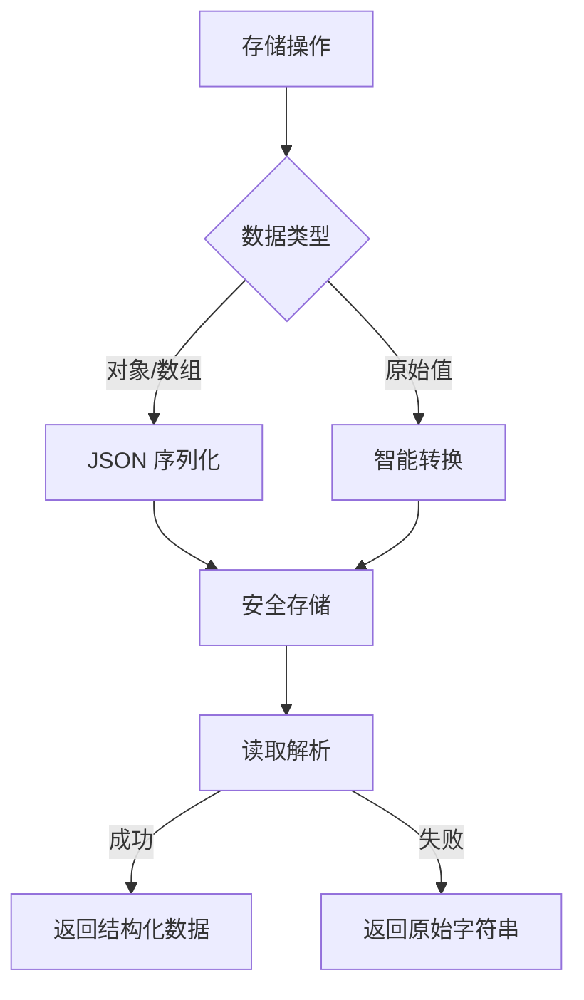

<!-- START doctoc generated TOC please keep comment here to allow auto update -->
<!-- DON'T EDIT THIS SECTION, INSTEAD RE-RUN doctoc TO UPDATE -->

- [工具函数参考文档](#%E5%B7%A5%E5%85%B7%E5%87%BD%E6%95%B0%E5%8F%82%E8%80%83%E6%96%87%E6%A1%A3)
  - [简介](#%E7%AE%80%E4%BB%8B)
  - [环境变量工具](#%E7%8E%AF%E5%A2%83%E5%8F%98%E9%87%8F%E5%B7%A5%E5%85%B7)
    - [API](#api)
      - [`getEnv(key)`](#getenvkey)
      - [`isProduction()`](#isproduction)
      - [`getCdnUrl(path)`](#getcdnurlpath)
    - [使用示例](#%E4%BD%BF%E7%94%A8%E7%A4%BA%E4%BE%8B)
    - [注意事项](#%E6%B3%A8%E6%84%8F%E4%BA%8B%E9%A1%B9)
    - [性能优化与设计原理](#%E6%80%A7%E8%83%BD%E4%BC%98%E5%8C%96%E4%B8%8E%E8%AE%BE%E8%AE%A1%E5%8E%9F%E7%90%86)
      - [Node.js 运行时](#nodejs-%E8%BF%90%E8%A1%8C%E6%97%B6)
      - [浏览器运行时](#%E6%B5%8F%E8%A7%88%E5%99%A8%E8%BF%90%E8%A1%8C%E6%97%B6)
      - [场景化建议](#%E5%9C%BA%E6%99%AF%E5%8C%96%E5%BB%BA%E8%AE%AE)
      - [小结](#%E5%B0%8F%E7%BB%93)
  - [语言工具](#%E8%AF%AD%E8%A8%80%E5%B7%A5%E5%85%B7)
    - [API](#api-1)
      - [`getCurrentLang()`](#getcurrentlang)
    - [使用示例](#%E4%BD%BF%E7%94%A8%E7%A4%BA%E4%BE%8B-1)
    - [注意事项](#%E6%B3%A8%E6%84%8F%E4%BA%8B%E9%A1%B9-1)
  - [存储工具](#%E5%AD%98%E5%82%A8%E5%B7%A5%E5%85%B7)
    - [核心特性](#%E6%A0%B8%E5%BF%83%E7%89%B9%E6%80%A7)
    - [API](#api-2)
      - [`get(key, type?)`](#getkey-type)
      - [`set(key, value, type?, options?)`](#setkey-value-type-options)
      - [`remove(key, type?)`](#removekey-type)
      - [IndexedDB 异步方法](#indexeddb-%E5%BC%82%E6%AD%A5%E6%96%B9%E6%B3%95)
    - [智能解析机制](#%E6%99%BA%E8%83%BD%E8%A7%A3%E6%9E%90%E6%9C%BA%E5%88%B6)
    - [使用示例](#%E4%BD%BF%E7%94%A8%E7%A4%BA%E4%BE%8B-2)
      - [基础使用](#%E5%9F%BA%E7%A1%80%E4%BD%BF%E7%94%A8)
      - [安全删除](#%E5%AE%89%E5%85%A8%E5%88%A0%E9%99%A4)
      - [IndexedDB 操作](#indexeddb-%E6%93%8D%E4%BD%9C)
    - [最佳实践](#%E6%9C%80%E4%BD%B3%E5%AE%9E%E8%B7%B5)
    - [注意事项](#%E6%B3%A8%E6%84%8F%E4%BA%8B%E9%A1%B9-2)

<!-- END doctoc generated TOC please keep comment here to allow auto update -->

# 工具函数参考文档

- **作者**: 张人大 (Renda Zhang)
- **最后更新**: August 07, 2025, 16:46 (UTC+08:00)

---

## 简介

`src/utils/env.ts`、`src/utils/langUtils.ts` 与 `src/utils/storage.ts` 提供了环境变量、语言检测以及多后端存储的统一访问层。

所有环境变量请通过 `env` 模块读取，语言相关逻辑统一使用 `langUtils`，而 `storage` 模块封装了浏览器与降级存储方案。

---

## 环境变量工具

### API

#### `getEnv(key)`

根据提供的 `key` 返回对应环境变量值，支持自动判断运行环境并处理 `PUBLIC_` 前缀。带 `PUBLIC_` 前缀的变量会自动与去除前缀的键互通，无需在 `envKeyMap` 显式映射；仅在需要自定义别名时再修改 `envKeyMap`。

#### `isProduction()`

当 `NODE_ENV` 为 `'production'` 时返回 `true`。

#### `getCdnUrl(path)`

基于 `CDN_BASE` 构建资源的完整 CDN 地址。

### 使用示例

```js
import { getEnv, isProduction, getCdnUrl } from './src/utils/env';

const baseUrl = getEnv('API_BASE_URL'); // ↔ PUBLIC_API_BASE_URL
const featureFlag = getEnv('PUBLIC_FEATURE_X'); // ↔ FEATURE_X，无需在 envKeyMap 中映射
if (!isProduction()) {
  console.log('Current API:', baseUrl, featureFlag);
}

const logo = getCdnUrl('/images/logo.png');
```

### 注意事项

- 所有新代码应通过 `getEnv` 访问环境变量。
- 当 `getEnv` 对以 `PUBLIC_` 开头且未在 `envKeyMap` 中声明的键执行回退查找时，请确保该变量确实适合公开，避免误将服务端敏感值传递到客户端。

### 性能优化与设计原理

#### Node.js 运行时

- `process.env` 并非普通 JS 对象，而是通过 Node 的 C++ 层 `getenv` 暴露的代理。
- **每次访问** 都会触发一次同步的原生调用，再把结果传回 JS 层。
- 单次读取仅需微秒级，但在高频路径（如 HTTP 请求处理、渲染循环）中会累积到可观的 **P95/P99 延迟**。
- **最佳实践**：在应用启动阶段一次性读取并缓存所有需要的环境变量，业务代码只访问缓存；热路径绝不要直接读 `process.env`。

#### 浏览器运行时

- Vite 等打包工具会在 **构建阶段** 将 `import.meta.env.FOO` 替换为字面量并参与 tree-shaking，生产环境几乎 **零运行时成本**。
- 开发模式下 `import.meta.env` 只是普通对象，访问成本≈读取 `window.foo`。
- 仅在使用 **动态键**（如 `import.meta.env[key]`）时，整个对象才会被打包进 bundle，稍微增加体积，但 CPU 开销仍可忽略。
- 建议把常用配置（如 `IS_PROD`、`API_BASE_URL`）导出为常量，让 bundler 在构建期完成死代码消除。

#### 场景化建议

| 场景 | 是否需要优化 | 推荐做法  |
|------|------------|-----------|
| CLI / Build 脚本 | 不需要 | IO/网络调用占主导，环境变量成本可忽略 |
| SSR 首屏渲染 | 视情况而定 | 若仅入口读取数次，可忽略；否则入口处缓存 |
| 高并发 API 服务 | 必须优化 | 启动期缓存，热路径只用常量 |
| 浏览器业务逻辑 | 基本不需优化 | 依赖编译期常量或普通对象属性即可 |

#### 小结

- **服务器端**：`process.env` 跨语言边界调用，需缓存后使用。
- **客户端**：大多数情况下已在编译期被替换；动态读取影响极小。
- **通用原则**：在应用启动阶段统一读取并校验环境变量，再把结果挂到配置对象或导出的常量中，后续代码仅依赖纯 JS 常量，既安全又高效。

---

## 语言工具

### API

#### `getCurrentLang()`

返回当前页面语言，执行顺序如下：

1. `document.documentElement.lang`
2. `storage.get(LANG_STORAGE_KEY)`
3. `'zh-CN'`

### 使用示例

```ts
import { getCurrentLang } from '@/utils/langUtils';

const lang = getCurrentLang();
console.log(lang); // 'zh-CN'
```

### 注意事项

- 依赖 `storage` 工具，在不支持 `localStorage` 的环境中也能读取语言设置。
- 如需扩展更多语言相关逻辑，可在此文件中继续封装。

---

## 存储工具

### 核心特性



### API

#### `get(key, type?)`

读取指定 key 的值，支持智能格式解析：

```javascript
// 读取新版JSON数据
storage.get('user_settings') // { theme: 'dark', lang: 'en' }

// 读取旧版字符串数据
storage.get('legacy_key') // "raw_string_value"
```

#### `set(key, value, type?, options?)`

写入时自动标准化数据格式：

```javascript
// 自动序列化
storage.set('user', { name: "张三", id: 123 })

// Cookie专属选项
storage.set('session_id', 'abc123', 'cookie', { days: 7 })
```

#### `remove(key, type?)`

安全删除存储数据：

```javascript
storage.remove('temp_data', 'session')
```

#### IndexedDB 异步方法

| 方法                | 描述                     | 示例 |
|---------------------|--------------------------|------|
| `getIndexedDB`      | 异步读取大容量数据       | `storage.getIndexedDB('user_data', 'appDB', 'keyval')` |
| `setIndexedDB`      | 异步存储结构化数据       | `storage.setIndexedDB('logs', data, 'appDB', 'records')` |
| `removeIndexedDB`   | 异步删除数据             | `storage.removeIndexedDB('temp_record', 'appDB', 'records')` |

### 智能解析机制

```javascript
// 核心解析逻辑
function smartParse(value) {
  if (value === null) return null;

  try {
    return JSON.parse(value);  // 尝试解析新版JSON格式
  } catch (e) {
    return value; // 返回旧版原始字符串
  }
}
```

**新旧数据兼容示例**：

| 存储格式          | 读取结果       | 类型推断 |
|-------------------|---------------|----------|
| `"\"dark\""`     | `"dark"`      | 字符串   |
| `"true"`         | `true`        | 布尔值   |
| `"42"`           | `42`          | 数字     |
| `"[1,2,3]"`      | `[1,2,3]`     | 数组     |
| `"raw string"`   | `"raw string"`| 字符串   |

### 使用示例

#### 基础使用

```javascript
import storage from '@/utils/storage';

// 设置主题
storage.set('theme', { mode: 'dark', contrast: 'high' });

// 读取主题（自动解析）
const theme = storage.get('theme'); // { mode: 'dark', contrast: 'high' }
```

#### 安全删除

```javascript
// 删除会话数据
storage.remove('session_token', 'session');
```

#### IndexedDB 操作

```javascript
// 存储大容量数据
const analyticsData = { /* 大型数据集 */ };
await storage.setIndexedDB('analytics', analyticsData, 'metricsDB', 'records');

// 读取数据
const data = await storage.getIndexedDB('analytics', 'metricsDB', 'records');
```

### 最佳实践

1. **键名管理**：
   ```ts
   // src/constants/settings.ts
   export const THEME_STORAGE_KEY = 'preferred_theme';
   export const LANG_STORAGE_KEY = 'preferred_lang';
   export const REGISTER_DRAFT_KEY = 'register_draft';
   ```

2. **错误处理**：
   ```javascript
   try {
     const theme = storage.get(THEME_STORAGE_KEY);
   } catch (e) {
     console.error('Storage read failed', e);
     Sentry.captureException(e);
   }
   ```

3. **降级策略**：
   ```javascript
   const lang = storage.get(LANG_STORAGE_KEY) || navigator.language;
   ```

### 注意事项

1. **环境适配**：
   - 在非浏览器环境（如SSR）自动使用内存存储
   - Cookie操作仅在浏览器环境有效

2. **数据迁移**：
   ```javascript
   // 检查并迁移旧格式数据
   const legacyValue = localStorage.getItem('old_key');
   if (typeof legacyValue === 'string') {
     storage.set('new_key', legacyValue);
     localStorage.removeItem('old_key');
   }
   ```

3. **性能考量**：
   - IndexedDB 适合 >1MB 数据存储
   - 高频小数据推荐使用 localStorage
   - 敏感会话数据使用 sessionStorage

4. **同步初始化**：
   ```javascript
   // BaseLayout 内联脚本示例
   window.__storageHelper = {
     get: (key) => {
       const value = localStorage.getItem(key);
       try { return JSON.parse(value) } catch { return value }
     }
   };
   ```
