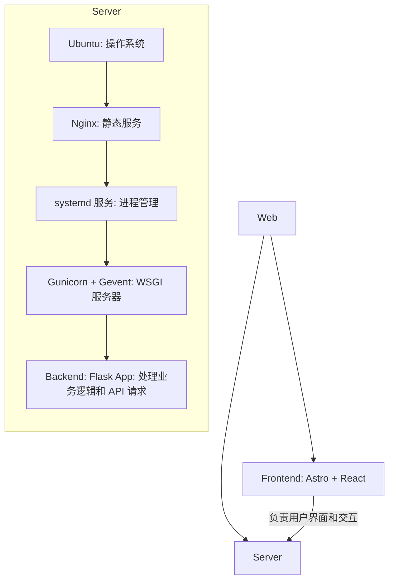
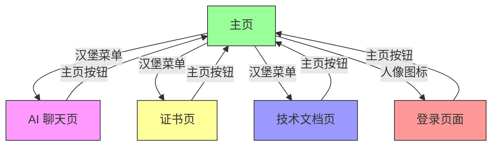

<!-- START doctoc generated TOC please keep comment here to allow auto update -->
<!-- DON'T EDIT THIS SECTION, INSTEAD RE-RUN doctoc TO UPDATE -->

- [张人大 · 轻量级网站](#%E5%BC%A0%E4%BA%BA%E5%A4%A7-%C2%B7-%E8%BD%BB%E9%87%8F%E7%BA%A7%E7%BD%91%E7%AB%99)
  - [简介](#%E7%AE%80%E4%BB%8B)
  - [技术栈](#%E6%8A%80%E6%9C%AF%E6%A0%88)
    - [目录结构概览](#%E7%9B%AE%E5%BD%95%E7%BB%93%E6%9E%84%E6%A6%82%E8%A7%88)
    - [参考架构](#%E5%8F%82%E8%80%83%E6%9E%B6%E6%9E%84)
  - [部署与开发](#%E9%83%A8%E7%BD%B2%E4%B8%8E%E5%BC%80%E5%8F%91)
    - [前端](#%E5%89%8D%E7%AB%AF)
      - [本地开发和预览](#%E6%9C%AC%E5%9C%B0%E5%BC%80%E5%8F%91%E5%92%8C%E9%A2%84%E8%A7%88)
      - [GitHub Actions 自动部署](#github-actions-%E8%87%AA%E5%8A%A8%E9%83%A8%E7%BD%B2)
      - [使用说明](#%E4%BD%BF%E7%94%A8%E8%AF%B4%E6%98%8E)
      - [网站功能](#%E7%BD%91%E7%AB%99%E5%8A%9F%E8%83%BD)
      - [页面功能](#%E9%A1%B5%E9%9D%A2%E5%8A%9F%E8%83%BD)
      - [页面跳转逻辑](#%E9%A1%B5%E9%9D%A2%E8%B7%B3%E8%BD%AC%E9%80%BB%E8%BE%91)
      - [页面内容介绍](#%E9%A1%B5%E9%9D%A2%E5%86%85%E5%AE%B9%E4%BB%8B%E7%BB%8D)
    - [**后端**](#%E5%90%8E%E7%AB%AF)
    - [**Nginx 服务器**](#nginx-%E6%9C%8D%E5%8A%A1%E5%99%A8)
  - [文档说明](#%E6%96%87%E6%A1%A3%E8%AF%B4%E6%98%8E)
    - [BUG 记录](#bug-%E8%AE%B0%E5%BD%95)
    - [开发需求](#%E5%BC%80%E5%8F%91%E9%9C%80%E6%B1%82)
    - [原生到 Astro + React 升级](#%E5%8E%9F%E7%94%9F%E5%88%B0-astro--react-%E5%8D%87%E7%BA%A7)
    - [静态资源命名验证](#%E9%9D%99%E6%80%81%E8%B5%84%E6%BA%90%E5%91%BD%E5%90%8D%E9%AA%8C%E8%AF%81)
  - [🤝 贡献指南](#-%E8%B4%A1%E7%8C%AE%E6%8C%87%E5%8D%97)
  - [🔒 开源许可证](#-%E5%BC%80%E6%BA%90%E8%AE%B8%E5%8F%AF%E8%AF%81)
  - [📬 联系方式](#-%E8%81%94%E7%B3%BB%E6%96%B9%E5%BC%8F)

<!-- END doctoc generated TOC please keep comment here to allow auto update -->

# 张人大 · 轻量级网站

- **作者**: 张人大
- **最后更新**: July 30, 2025, 16:27 (UTC+8)
- **[Click here to view the English Version in Github](https://github.com/RendaZhang/rendazhang/blob/master/README_EN.md)**

---

## 简介

这是我个人维护的 **轻量级** 网站，旨在作为我的技术能力的在线展示平台。

**网站链接**: 🌐 [www.rendazhang.com](https://www.rendazhang.com)

本网站已进行 SEO / GEO 优化。

> 如果您需要更重量级的服务器解决方案，可以参考我的云原生项目：📁 [Renda Cloud LAB](https://github.com/RendaZhang/renda-cloud-lab)。该项目提供了基于云原生的完整架构设计，适用于大规模和高可用性场景。

---

## 技术栈

| 分类     | 技术                                               |
| -------- | -------------------------------------------------- |
| 前端      | **Astro**, **React**, TypeScript                  |
| 状态管理  | React `useState`、`useContext`（可扩展 Zustand 等） |
| 构建工具  | Astro 内置 (基于 Vite)                              |
| 后端     | Flask + OpenAI API                                  |
| 部署     | GitHub Actions + Nginx                              |

### 目录结构概览

```text
src/
├── assets/
├── styles/
├── scripts/
└── components/
    ├── ui/
    ├── layouts/
    ├── forms/
    ├── chat/
    ├── sections/
    └── providers/
```

### 参考架构

ASCII 图示：

```text
Web Application Architecture
============================

Frontend (
   Astro + React
   - 负责用户界面和交互
) → CI/CD (
   GitHub Actions 自动构建部署
) → Server (
   Ubuntu (操作系统)
   ↓
   Nginx (静态文件服务)
   ↓
   systemd 服务 (进程管理)
   ↓
   Gunicorn + Gevent (WSGI 服务器)
   ↓
   Backend: Flask App (处理业务逻辑和 API 请求)
)
```

Mermaid Flow 图示：



---

## 部署与开发

### 前端

本仓库就是前端项目：📁 [Renda Zhang WEB](https://github.com/RendaZhang/rendazhang)

#### 本地开发和预览

1. 安装依赖并启用 pre-commit：

   ```bash
   npm install
   pip install pre-commit
   pre-commit install
   ```

2. 运行本地开发服务器：

   ```bash
   npm run dev
   ```

3. 构建并预览生产版本：

   ```bash
   npm run build
   npm run preview
   ```

浏览器访问 `http://localhost:4321` 查看效果。构建后的静态文件可使用 `npm run preview` 验证。

#### GitHub Actions 自动部署

Push 到 `master` 分支会触发 GitHub Actions：

1. 检出代码并安装依赖
2. 执行 `npm run build` 生成静态文件
3. 通过 `appleboy/scp-action` 将 `dist/` 内容上传到服务器指定目录（如 `/var/www/html`）
4. 部署完成后即可通过 Nginx 提供服务

需要在仓库 Secrets 中配置服务器 IP、SSH 用户和私钥等信息。详情见 📄 [配置 GitHub Actions](https://github.com/RendaZhang/rendazhang/blob/master/docs/NATIVE_TO_ASTRO_REACT_UPGRADE.md#%E9%85%8D%E7%BD%AE-github-actions)。

#### 使用说明

部署完成后可直接访问各模块页面。

如下是我的网站的每个页面的链接：

- 🌐 [主页](https://www.rendazhang.com/)
- 🌐 [AI 聊天页面](https://www.rendazhang.com/deepseek_chat/)
- 🌐 [证书页面](https://www.rendazhang.com/certifications/)
- 🌐 [基于本文档渲染后的技术文档页面](https://www.rendazhang.com/docs/)
- 🌐 [登录页面](https://www.rendazhang.com/login/)
- 🌐 [注册页面](https://www.rendazhang.com/register/)

#### 网站功能

关于网站的核心功能体系，请参考以下文档链接：📄 [核心功能体系](https://github.com/RendaZhang/rendazhang/blob/master/docs/REQUIREMENTS.md#-%E6%A0%B8%E5%BF%83%E5%8A%9F%E8%83%BD%E4%BD%93%E7%B3%BB)。该文档详细描述了网站的核心功能模块，包括功能设计和技术实现，是开发与维护的重要参考。

- 与 AI 在线对话
- 浮动 AI 聊天窗口
- 自适应布局 (移动端和桌面端)
- 图片懒加载
- 证书展示
- 简历展示和下载
- 项目展示
- 联系表单
- 主题切换（浅色 / 深色）
- 语言切换（中文 / 英文）
- 技术文档渲染展示页 (docs/)
- 内容平台链接
- 登录与注册表单

#### 页面功能

各页面核心职责如下（均由 `.astro` 文件生成）：

- `index.astro`：个人介绍页，展示个人信息、教育、技能、博客及工作经验，并预置 ChatWidget 浮标。
- `certifications.astro`：证书列表页。
- `deepseek_chat.astro`：AI 聊天界面。
- `docs.astro`：技术文档页面。
- `login.astro`：登录页。
- `register.astro`：注册页。

其他页面：

- `404.html`，`50x.html`：错误提示页面。

#### 页面跳转逻辑

1. **返回主页**
   - 所有页面均包含导航栏中的“主页”按钮，点击后可返回主页。

2. **导航栏菜单跳转**
   - 通过点击导航栏的“汉堡菜单”按钮，用户可选择跳转到以下四个页面：
     - 首页
     - AI 聊天页
     - 证书页
     - 技术文档页

3. **登录页面跳转**
   - 通过点击导航栏的“人像图标”按钮，用户可跳转到登录页面。

Mermaid Flow 图示：



#### 页面内容介绍

- `index.astro`：多 Section 主页，包含 "Hero"、"自我介绍"、"教育"、"博客"、"技能与能力"、"经历"、"联系我吧" 等模块，并默认悬挂 `ChatWidget` 浮标。
- `certifications.astro`：栅格卡片形式展示证书，并嵌入 Credly 验证链接。
- `deepseek_chat.astro`：由聊天记录区域与输入框组成的对话界面，支持流式输出并实时渲染 AI 返回的 Markdown 内容，提供一键复制原始内容的功能，并在页面刷新后自动保留历史记录，同时加载 `github.min.css` 和 `github-markdown-light.min.css` 以保持代码高亮与排版一致。
- `docs.astro`：技术文档页面，使用同样的两份 GitHub 样式表配合 highlight.js 渲染 Markdown 与代码。
- `login.astro`：登录表单页。
- `register.astro`：注册表单页。
- `404.html / 50x.html`：用于处理页面不存在（404）和服务器内部错误（50x）的定制化错误提示页面，提供清晰的错误信息、友好的用户引导和返回主页的链接，以提升用户体验。

### **后端**

> 后端部署的具体步骤和配置，请参考以下项目：📁 [Python Cloud Chat](https://github.com/RendaZhang/python-cloud-chat)。该项目提供了完整的后端实现和部署指南，帮助您快速搭建和运行后端服务。

### **Nginx 服务器**

> 前端项目通过 GitHub Actions 自动化构建后，会直接推送到服务器的 `/var/www/html` 目录，并由 Nginx 提供静态资源服务。

> 关于 Nginx 的详细配置和操作说明，请查看以下仓库：📁 [Nginx Conf](https://github.com/RendaZhang/nginx-conf)。该仓库包含了常用的 Nginx 配置文件和使用示例，方便您快速上手。

> 如果您需要更重量级的服务器解决方案，可以参考我的云原生项目：📁 [Renda Cloud LAB](https://github.com/RendaZhang/renda-cloud-lab)。该项目提供了基于云原生的完整架构设计，适用于大规模和高可用性场景。

---

## 文档说明

### BUG 记录

> 前端开发过程中遇到的 BUG 及其解决方案，请参考以下文档：📄 [前端 BUG 跟踪数据库](https://github.com/RendaZhang/rendazhang/blob/master/docs/TROUBLESHOOTING.md#%E5%89%8D%E7%AB%AF-bug-%E8%B7%9F%E8%B8%AA%E6%95%B0%E6%8D%AE%E5%BA%93)。该文档详细记录了 BUG 的描述、复现步骤、解决方案以及相关开发者的处理记录，帮助您快速定位和解决问题。

### 开发需求

> 项目的功能需求、优先级以及开发计划，请参考以下文档：📄 [项目需求清单](https://github.com/RendaZhang/rendazhang/blob/master/docs/REQUIREMENTS.md#%E9%A1%B9%E7%9B%AE%E9%9C%80%E6%B1%82%E6%B8%85%E5%8D%95)。该文档列出了当前版本的所有需求，并提供了需求的详细描述和开发状态，方便您了解项目进展和规划开发任务。

### 原生到 Astro + React 升级

前端目前采用 **Astro** + **React** 的架构，基于分层设计理念，通过 **GitHub Actions** 实现自动化构建，并将构建产物部署到服务器 Nginx 的指定目录下。

具体的从原生前端升级的操作步骤，请参考以下文档内容：📄 [升级计划](https://github.com/RendaZhang/rendazhang/blob/master/docs/NATIVE_TO_ASTRO_REACT_UPGRADE.md#%E6%97%A7%E7%89%88%E5%8E%9F%E7%94%9F%E5%89%8D%E7%AB%AF%E5%88%B0-astro--react-%E6%96%B0%E5%89%8D%E7%AB%AF%E7%9A%84%E6%B8%90%E8%BF%9B%E5%8D%87%E7%BA%A7%E8%AE%A1%E5%88%92)。该文档详细描述了从旧版原生前端逐步迁移到基于 Astro 和 React 的新前端架构的完整计划与实施步骤。

开发环境准备的具体步骤，请参考以下文档内容：📄 [环境准备](https://github.com/RendaZhang/rendazhang/blob/master/docs/NATIVE_TO_ASTRO_REACT_UPGRADE.md#%E9%98%B6%E6%AE%B5-1%E7%8E%AF%E5%A2%83%E5%87%86%E5%A4%87%E4%B8%8E-astro-%E9%A1%B9%E7%9B%AE%E5%88%9D%E5%A7%8B%E5%8C%96)。该文档详细说明了如何完成开发环境的配置以及 Astro 项目的初始化工作，确保您能够顺利开始后续的开发任务。

### 静态资源命名验证

执行 `npm run validate-assets` 检查图片与音乐文件命名。

文档详见：📄 [静态资源命名验证脚本](https://github.com/RendaZhang/rendazhang/blob/master/docs/ASSET_VALIDATION.md#%E9%9D%99%E6%80%81%E8%B5%84%E6%BA%90%E5%91%BD%E5%90%8D%E9%AA%8C%E8%AF%81%E8%84%9A%E6%9C%AC)

---

## 🤝 贡献指南

- Fork 并克隆这个仓库。
- 进入虚拟环境：
   ```bash
   # 如果还没安装虚拟环境，执行命令：python -m venv venv
   source venv/bin/activate
   ```
- 安装依赖并启用 **pre-commit**:
   ```bash
   pip install pre-commit
   pre-commit install
   ```
- 在每次提交前，钩子会自动运行，并执行操作：
  - 将根目录的 README 与 README_EN 同步到 `public/` 目录下。
  - README 和 docs 下的文档会自动更新 Doctoc 目录（若本地未安装则跳过）。
  - 执行静态资源命名验证脚本，确保 `public/images` 与 `src/assets` 命名规范。
- 你也可以手动触发：
   ```bash
   pre-commit run --all-files
   ```

> ✅ 所有提交必须通过 pre-commit 检查；CI 会阻止不符合规范的 PR。

---

## 🔒 开源许可证

本项目以 **MIT 许可证** 发布，你可以自由使用与修改。请在分发时保留原始许可证声明。

---

## 📬 联系方式

* 联系人：张人大（Renda Zhang）
* 📧 邮箱：[952402967@qq.com](mailto:952402967@qq.com)

> ⏰ **维护者**：@张人大 — 如果本项目对你有帮助，请不要忘了点亮 ⭐️ Star 支持我们！
