```mermaid
flowchart TD
    A[Web] --> B[Frontend: Astro + React + Bootstrap]
    A --> C[Server]
    B -->|负责用户界面和交互| C

    subgraph Server
        direction TB
        D[Ubuntu: 操作系统] --> E[Nginx: 静态服务]
        E --> F[systemd 服务: 进程管理]
        F --> G[Gunicorn + Gevent: WSGI 服务器]
        G --> H[Backend: Flask App: 处理业务逻辑和 API 请求]
    end
```

<!-- START doctoc generated TOC please keep comment here to allow auto update -->
<!-- DON'T EDIT THIS SECTION, INSTEAD RE-RUN doctoc TO UPDATE -->

- [张人大 (Renda Zhang) · 轻量级网站](#%E5%BC%A0%E4%BA%BA%E5%A4%A7-renda-zhang-%C2%B7-%E8%BD%BB%E9%87%8F%E7%BA%A7%E7%BD%91%E7%AB%99)
  - [简介](#%E7%AE%80%E4%BB%8B)
  - [技术栈](#%E6%8A%80%E6%9C%AF%E6%A0%88)
    - [参考架构](#%E5%8F%82%E8%80%83%E6%9E%B6%E6%9E%84)
  - [部署与开发](#%E9%83%A8%E7%BD%B2%E4%B8%8E%E5%BC%80%E5%8F%91)
    - [前端](#%E5%89%8D%E7%AB%AF)
      - [本地开发和预览](#%E6%9C%AC%E5%9C%B0%E5%BC%80%E5%8F%91%E5%92%8C%E9%A2%84%E8%A7%88)
      - [GitHub Actions 自动部署](#github-actions-%E8%87%AA%E5%8A%A8%E9%83%A8%E7%BD%B2)
      - [使用说明](#%E4%BD%BF%E7%94%A8%E8%AF%B4%E6%98%8E)
      - [网站功能](#%E7%BD%91%E7%AB%99%E5%8A%9F%E8%83%BD)
      - [页面功能](#%E9%A1%B5%E9%9D%A2%E5%8A%9F%E8%83%BD)
      - [页面跳转逻辑](#%E9%A1%B5%E9%9D%A2%E8%B7%B3%E8%BD%AC%E9%80%BB%E8%BE%91)
      - [页面内容介绍](#%E9%A1%B5%E9%9D%A2%E5%86%85%E5%AE%B9%E4%BB%8B%E7%BB%8D)
    - [**后端**](#%E5%90%8E%E7%AB%AF)
    - [**Nginx 服务器**](#nginx-%E6%9C%8D%E5%8A%A1%E5%99%A8)
  - [文档说明](#%E6%96%87%E6%A1%A3%E8%AF%B4%E6%98%8E)
    - [BUG 记录](#bug-%E8%AE%B0%E5%BD%95)
    - [开发需求](#%E5%BC%80%E5%8F%91%E9%9C%80%E6%B1%82)
    - [原生到 Astro + React 升级](#%E5%8E%9F%E7%94%9F%E5%88%B0-astro--react-%E5%8D%87%E7%BA%A7)
  - [🤝 贡献指南](#-%E8%B4%A1%E7%8C%AE%E6%8C%87%E5%8D%97)
  - [🔒 License](#-license)
  - [📬 联系方式](#-%E8%81%94%E7%B3%BB%E6%96%B9%E5%BC%8F)

<!-- END doctoc generated TOC please keep comment here to allow auto update -->

# 张人大 (Renda Zhang) · 轻量级网站

- **作者**: 张人大 (Renda Zhang)
- **最后更新**: July 18, 2025, 18:20 (UTC+8)

---

## 简介

这是我个人维护的中英文双语技术展示的 **轻量级** 网站，旨在作为我的简历、作品集和技术能力的在线展示平台。

**网站链接**: 🌐 [www.rendazhang.com](https://www.rendazhang.com)

本网站已进行 SEO / GEO 优化：站点地图、robots.txt、地理 meta 标签等等。

> 如果需要使用重量级的方案部署网站相关的资源，可以参考我的云原生项目：📁 [Renda Cloud LAB](https://github.com/RendaZhang/renda-cloud-lab)

---

## 技术栈

| 分类                  | 技术                                               |
| --------------------- | -------------------------------------------------- |
| 前端 Frontend         | **Astro**, **React**, TypeScript, Bootstrap        |
| 状态管理 State        | React `useState`、`useContext`（可扩展 Zustand 等） |
| 构建工具 Build        | Astro 内置 (基于 Vite)                              |
| 后端 Backend          | Flask + OpenAI API                                  |
| 部署 Deploy           | GitHub Actions + Nginx                              |

### 参考架构

ASCII 图示：

```text
Web Application Architecture
============================

Frontend (
   Astro + React + Bootstrap
   - 负责用户界面和交互
) → CI/CD (
   GitHub Actions 自动构建部署
) → Server (
   Ubuntu (操作系统)
   ↓
   Nginx (静态文件服务)
   ↓
   systemd 服务 (进程管理)
   ↓
   Gunicorn + Gevent (WSGI 服务器)
   ↓
   Backend: Flask App (处理业务逻辑和 API 请求)
)
```

Mermaid Flow 图示：



---

## 部署与开发

### 前端

本仓库就是前端项目：📁 [Renda Zhang WEB](https://github.com/RendaZhang/rendazhang)

#### 本地开发和预览

1. 安装依赖并启用 pre-commit：

   ```bash
   npm install
   pip install -r requirements-dev.txt
   pre-commit install
   ```

2. 运行本地开发服务器：

   ```bash
   npm run dev
   ```

3. 构建并预览生产版本：

   ```bash
   npm run build
   npm run preview
   ```

浏览器访问 `http://localhost:4321` 查看效果。构建后的静态文件可使用 `npm run preview` 验证。

#### GitHub Actions 自动部署

Push 到 `master` 分支会触发 GitHub Actions：

1. 检出代码并安装依赖
2. 执行 `npm run build` 生成静态文件
3. 通过 `appleboy/scp-action` 将 `dist/` 内容上传到服务器指定目录（如 `/var/www/html`）
4. 部署完成后即可通过 Nginx 提供服务

需要在仓库 Secrets 中配置服务器 IP、SSH 用户和私钥等信息。详情见 📄 [配置 GitHub Actions](https://github.com/RendaZhang/rendazhang/blob/master/docs/NATIVE_TO_ASTRO_REACT_UPGRADE.md#%E9%85%8D%E7%BD%AE-github-actions)。

#### 使用说明

部署完成后可直接访问各模块页面。

如下是我的网站的每个页面的链接：

- 🌐 [About Me in Chinese / 中文介绍页](https://www.rendazhang.com/about.zh/)
- 🌐 [About Me in English / 英文介绍页](https://www.rendazhang.com/about.en/)
- 🌐 [Chat with AI / 与 AI 聊天](https://www.rendazhang.com/deepseek_chat/)
- 🌐 [Certifications / 证书](https://www.rendazhang.com/certifications/)
- 🌐 [渲染后的技术文档页面（基于本文档）](https://www.rendazhang.com/docs/)

#### 网站功能

- 与 AI 在线对话
- 自适应布局 (移动端和桌面端)
- 图片懒加载
- 证书展示
- 简历展示和下载 (English & 中文，PDF 格式)
- 项目展示
- 联系表单
- 背景音乐播放开关
- 技术文档展示页 (docs/)
- 内容平台链接

#### 页面功能

各页面核心职责如下（均由 `.astro` 文件生成）：

- `index.astro`：入口页，提供语言选择及快捷导航。
- `about.zh.astro`：中文版主页，展示个人信息、技能与联系方式。
- `about.en.astro`：英文版主页，内容与中文版对应。
- `certifications.astro`：证书列表页。
- `deepseek_chat.astro`：AI 聊天界面，新增 SEO 元信息提升搜索表现。

其他页面：

- `404.html`，`50x.html`：错误提示页面。

#### 页面跳转逻辑

- `index.astro` 链接到中英文主页、AI Chat 和证书页。
- 各子页面均包含返回入口页的按钮。
- 中英文主页内部通过锚点导航跳转到 About、Skills 等板块，并提供聊天或证书链接。

Mermaid Flow 图示：



```mermaid
flowchart TD
    A[index 主页] -->|关于我| B[about.zh.astro 中文主页]
    A -->|About Me| C[about.en.astro 英文主页]
    A -->|Chat with AI| D[deepseek_chat.astro 聊天页]
    A -->|证书| E[certifications.astro 证书页]
    B -->|返回首页| A
    B -->|证书| E
    C -->|返回首页| A
    C -->|证书| E
    C -->|Chat with AI| D
    D -->|返回首页| A
    E -->|返回首页| A

    style A fill:#9f9,stroke:#333
    style B fill:#f9f,stroke:#333
    style C fill:#f9f,stroke:#333
    style D fill:#ff9,stroke:#333
    style E fill:#99f,stroke:#333
```

#### 页面内容介绍

- `index.astro`：简洁布局，包括语言选择区、AI 聊天入口、证书入口和技术文档链接，并展示五个指向微信公众号、知乎、今日头条、CSDN 与 Medium 的内容平台图标。
- `about.zh.astro`、`about.en.astro`：带侧边菜单的多 Section 页面，包含 "Hero"、"About"、"Skills"、"Resume/Experience"、"Blog/Projects"、"Contact" 等模块。
- `certifications.astro`：栅格卡片形式展示证书，并嵌入 Credly 验证链接。
- `deepseek_chat.astro`：聊天记录区域与输入框组成的对话界面，可渲染 AI 返回的 Markdown，支持一键复制原始内容，并会在刷新后保留历史。
- `404.html / 50x.html`：简单文本提示页面。

### **后端**

> 具体部署请参考后端项目：📁 [Python Cloud Chat](https://github.com/RendaZhang/python-cloud-chat)

### **Nginx 服务器**

> 前端通过 GitHub Actions 构建后自动推送到服务器的 `/var/www/html` 目录，由 Nginx 提供静态服务。

> 其它配置详情和操作请查看 Nginx 仓库：📁 [Nginx Conf](https://github.com/RendaZhang/nginx-conf)

> 如果想使用重量级的服务器解决方案，可以参考我的云原生项目：📁 [Renda Cloud LAB](https://github.com/RendaZhang/renda-cloud-lab)

---

## 文档说明

### BUG 记录

前端相关的开发 BUG 记录：📄 [前端 BUG 跟踪数据库](https://github.com/RendaZhang/rendazhang/blob/master/docs/TROUBLESHOOTING.md#%E5%89%8D%E7%AB%AF-bug-%E8%B7%9F%E8%B8%AA%E6%95%B0%E6%8D%AE%E5%BA%93)

### 开发需求

项目需求请参考文档内容：📄 [项目需求清单](https://github.com/RendaZhang/rendazhang/blob/master/docs/REQUIREMENTS.md#%E9%A1%B9%E7%9B%AE%E9%9C%80%E6%B1%82%E6%B8%85%E5%8D%95)


### 原生到 Astro + React 升级

前端现已迁移至 **Astro** + **React** 架构，采用分层设计，并通过 **GitHub Actions** 自动构建产物并部署到服务器的 Nginx 相关的目录下。

具体操作请参考文档内容：📄 [升级计划](https://github.com/RendaZhang/rendazhang/blob/master/docs/NATIVE_TO_ASTRO_REACT_UPGRADE.md#%E6%97%A7%E7%89%88%E5%8E%9F%E7%94%9F%E5%89%8D%E7%AB%AF%E5%88%B0-astro--react-%E6%96%B0%E5%89%8D%E7%AB%AF%E7%9A%84%E6%B8%90%E8%BF%9B%E5%8D%87%E7%BA%A7%E8%AE%A1%E5%88%92)

开发环境准备可以参考文档内容：📄 [环境准备](https://github.com/RendaZhang/rendazhang/blob/master/docs/NATIVE_TO_ASTRO_REACT_UPGRADE.md#%E9%98%B6%E6%AE%B5-1%E7%8E%AF%E5%A2%83%E5%87%86%E5%A4%87%E4%B8%8E-astro-%E9%A1%B9%E7%9B%AE%E5%88%9D%E5%A7%8B%E5%8C%96)

---

## 🤝 贡献指南

- Fork & clone this repo.
- 进入虚拟环境：
   ```bash
   # 如果还没安装虚拟环境，执行命令：python -m venv venv
   source venv/bin/activate
   ```
- 安装依赖并启用 **pre-commit**:
   ```bash
   pip install pre-commit
   pre-commit install
   ```
- 在每次提交前，钩子会自动运行，并执行操作：
  - 将根目录的 README 同步到 `public/README.md`。
  - README 和 docs 下的文档会自动更新 Doctoc 目录（若本地未安装则跳过）。
- 你也可以手动触发：
   ```bash
   # cp README.md public/README.md && git add public/README.md
   pre-commit run --all-files
   ```

> ✅ 所有提交必须通过 pre-commit 检查；CI 会阻止不符合规范的 PR。

---

## 🔒 License

本项目以 **MIT License** 发布，你可以自由使用与修改。请在分发时保留原始许可证声明。

---

## 📬 联系方式

* 联系人：张人大（Renda Zhang）
* 📧 邮箱：[952402967@qq.com](mailto:952402967@qq.com)

> ⏰ **Maintainer**：@Renda — 如果本项目对你有帮助，请不要忘了点亮 ⭐️ Star 支持我们！
