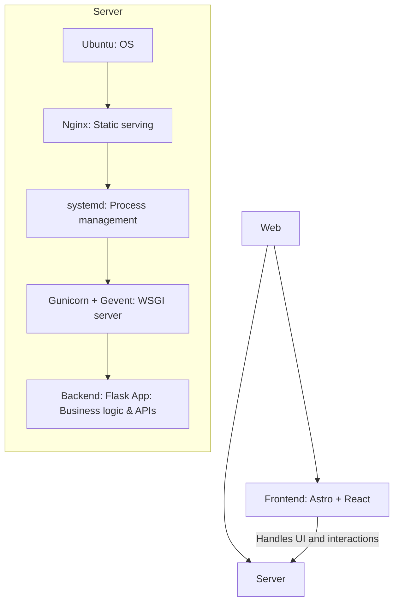
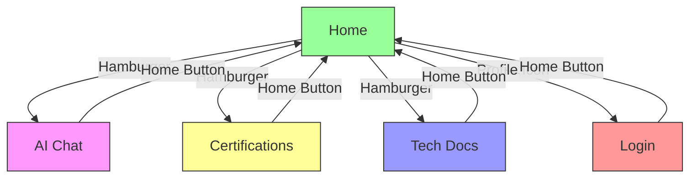

<!-- START doctoc generated TOC please keep comment here to allow auto update -->
<!-- DON'T EDIT THIS SECTION, INSTEAD RE-RUN doctoc TO UPDATE -->

- [Renda Zhang · Lightweight Website](#renda-zhang--lightweight-website)
  - [Introduction](#introduction)
  - [Tech Stack](#tech-stack)
    - [Directory Structure Overview](#directory-structure-overview)
    - [Reference Architecture](#reference-architecture)
  - [Deployment \& Development](#deployment--development)
    - [Frontend](#frontend)
      - [Local Development \& Preview](#local-development--preview)
      - [GitHub Actions Auto-Deployment](#github-actions-auto-deployment)
      - [Usage Guide](#usage-guide)
      - [Website Features](#website-features)
      - [Page Functionality](#page-functionality)
      - [Page Navigation Logic](#page-navigation-logic)
      - [Page Content Overview](#page-content-overview)
    - [**Backend**](#backend)
    - [**Nginx Server**](#nginx-server)
  - [Documentation](#documentation)
    - [BUG Tracking](#bug-tracking)
    - [Development Requirements](#development-requirements)
    - [Native to Astro + React Migration](#native-to-astro--react-migration)
    - [Static Asset Naming Validation](#static-asset-naming-validation)
  - [🤝 Contribution Guidelines](#-contribution-guidelines)
  - [🔒 Open Source License](#-open-source-license)
  - [📬 Contact](#-contact)

<!-- END doctoc generated TOC please keep comment here to allow auto update -->

# Renda Zhang · Lightweight Website

- **Author**: Renda Zhang
- **Last Updated**: July 31, 2025, 00:28 (UTC+8)
- **[点击这里查看 Github 上的中文版](https://github.com/RendaZhang/rendazhang/blob/master/README.md)**

---

## Introduction

This is my personally maintained **lightweight** technical showcase website, serving as an online portfolio of my technical capabilities.

**Live Site**: 🌐 [www.rendazhang.com](https://www.rendazhang.com)

The website is optimized for SEO and GEO.

> If you need a more robust server solution, you can refer to my cloud-native project: 📁 [Renda Cloud LAB](https://github.com/RendaZhang/renda-cloud-lab). This project provides a complete cloud-native architecture design, suitable for large-scale and high-availability scenarios.

---

## Tech Stack

| Category               | Technologies                                      |
| ---------------------- | ------------------------------------------------- |
| Frontend               | **Astro**, **React**, TypeScript                  |
| State Management       | React `useState`, `useContext` (Zustand compatible) |
| Build Tools            | Astro built-in (Vite-based)                       |
| Backend                | Flask + OpenAI API                                |
| Deployment             | GitHub Actions + Nginx                            |

### Directory Structure Overview

```text
src/
├── assets/
├── styles/
├── scripts/
└── components/
    ├── ui/
    ├── layouts/
    ├── forms/
    ├── chat/
    ├── sections/
    └── providers/
```

### Reference Architecture

ASCII Diagram:

```text
Web Application Architecture
============================

Frontend (
   Astro + React
   - Handles UI and interactions
) → CI/CD (
   GitHub Actions auto-build & deploy
) → Server (
   Ubuntu (OS)
   ↓
   Nginx (static file serving)
   ↓
   systemd service (process management)
   ↓
   Gunicorn + Gevent (WSGI server)
   ↓
   Backend: Flask App (business logic & API handling)
)
```

Mermaid Flow Diagram:



---

## Deployment & Development

### Frontend

This repository contains the frontend project: 📁 [Renda Zhang WEB](https://github.com/RendaZhang/rendazhang)

#### Local Development & Preview

1. Install dependencies and enable pre-commit:
    ```bash
    npm install
    pip install pre-commit
    pre-commit install
    ```

2. Start local dev server:
    ```bash
    npm run dev
    ```

3. Build and preview production version:
    ```bash
    npm run build
    npm run preview
    ```
After running `npm run build`, the `dist/_astro` directory will contain fingerprinted files with hash suffixes, allowing browsers to cache them long-term.
Access via `http://localhost:4321`. Verify builds using `npm run preview`.

#### GitHub Actions Auto-Deployment

Pushing to `master` triggers:
1. Code checkout & dependency installation
2. `npm run build` generates static files
3. `appleboy/scp-action` deploys `dist/` to server (e.g., `/var/www/html`)
4. Nginx serves content post-deployment

Configure server IP, SSH user, and private key in Repository Secrets. Details: 📄 [GitHub Actions Setup](https://github.com/RendaZhang/rendazhang/blob/master/docs/NATIVE_TO_ASTRO_REACT_UPGRADE.md#%E9%85%8D%E7%BD%AE-github-actions)

#### Usage Guide

Access all modules post-deployment:

- 🌐 [Homepage](https://www.rendazhang.com/)
- 🌐 [AI Chat](https://www.rendazhang.com/deepseek_chat/)
- 🌐 [Certifications](https://www.rendazhang.com/certifications/)
- 🌐 [Tech Docs](https://www.rendazhang.com/docs/)
- 🌐 [Login](https://www.rendazhang.com/login/)
- 🌐 [Register](https://www.rendazhang.com/register/)

#### Website Features

For details on the core functionality system of the website, please refer to the following documentation link: 📄 [Core Functionality System](https://github.com/RendaZhang/rendazhang/blob/master/docs/REQUIREMENTS.md#-%E6%A0%B8%E5%BF%83%E5%8A%9F%E8%83%BD%E4%BD%93%E7%B3%BB). This document provides a detailed description of the website's core functional modules, including feature design and technical implementation. It serves as an essential reference for development and maintenance.

- Real-time AI chat
- Floating AI chat widget
- Responsive layout (mobile/desktop)
- Image lazy loading
- Certification showcase
- Resume display/download
- Project portfolio
- Contact form
- Theme switching (light/dark)
- Language toggle (Chinese/English)
- Tech documentation rendering (docs/)
- Content platform links
- Login/registration forms

#### Page Functionality

Core responsibilities (generated from `.astro` files):
- `index.astro`: Personal intro with ChatWidget
- `certifications.astro`: Certification gallery
- `deepseek_chat.astro`: AI chat interface
- `docs.astro`: Technical documentation page
- `404.html`, `50x.html`: Error pages
- `login.astro`：Login page
- `register.astro`：Registration page

#### Page Navigation Logic

1. **Return to Homepage**
   All pages have "Home" button in navigation

2. **Menu Navigation**
   Hamburger menu provides access to:
   - Homepage
   - AI Chat
   - Certifications
   - Tech Docs

3. **Login Page Access**
   Profile icon in nav redirects to login



#### Page Content Overview

- `index.astro`: A multi-section homepage containing modules such as "Hero", "About Me", "Education", "Blog", "Skills & Abilities", "Experience", and "Contact Me", with a default floating `ChatWidget` badge.
- `certifications.astro`: Grid-based certification cards with Credly verification
- `deepseek_chat.astro`: A conversational interface consisting of a chat history area and an input box, supporting streaming output and real-time rendering of AI-generated Markdown content. It provides a one-click copy feature for the original content and automatically retains the chat history upon page refresh, and loads both `github.min.css` and `github-markdown-light.min.css` for consistent GitHub-style code highlighting.
- `docs.astro`: Technical documentation page that loads both `github.min.css` and `github-markdown-light.min.css` together with highlight.js for GitHub-style Markdown layout and code highlighting.
- `login.astro`: Login form page.
- `register.astro`: Register form page.
- `404.html/50x.html`: Custom error pages designed to handle Page Not Found (404) and Internal Server Error (50x) scenarios. These pages provide clear error messages, user-friendly guidance, and a link to return to the homepage, enhancing the overall user experience.

### **Backend**

> For detailed steps and configurations on backend deployment, please refer to the following project: 📁 [Python Cloud Chat](https://github.com/RendaZhang/python-cloud-chat). This project provides a complete backend implementation and deployment guide, helping you quickly set up and run backend services.

### **Nginx Server**

> The frontend project is automatically built via GitHub Actions and pushed to the `/var/www/html` directory on the server, where Nginx serves the static resources.

> For detailed Nginx configurations and operational instructions, please check the following repository: 📁 [Nginx Conf](https://github.com/RendaZhang/nginx-conf). This repository includes commonly used Nginx configuration files and examples, making it easy for you to get started.

> To fully leverage the hashed assets under `/_astro`, add a long-term cache rule in Nginx:

```nginx
location /_astro/ {
    access_log off;
    add_header Cache-Control "public, max-age=31536000, immutable";
}
```

> If you need a more robust server solution, you can refer to my cloud-native project: 📁 [Renda Cloud LAB](https://github.com/RendaZhang/renda-cloud-lab). This project provides a complete cloud-native architecture design, suitable for large-scale and high-availability scenarios.

---

## Documentation

### BUG Tracking

> For BUGs encountered during frontend development and their solutions, please refer to the following document: 📄 [Frontend BUG Tracking Database](https://github.com/RendaZhang/rendazhang/blob/master/docs/TROUBLESHOOTING.md#%E5%89%8D%E7%AB%AF-bug-%E8%B7%9F%E8%B8%AA%E6%95%B0%E6%8D%AE%E5%BA%93). This document provides detailed records of BUG descriptions, reproduction steps, solutions, and developer notes, helping you quickly identify and resolve issues.

### Development Requirements

> For project feature requirements, priorities, and development plans, please refer to the following document: 📄 [Project Requirements List](https://github.com/RendaZhang/rendazhang/blob/master/docs/REQUIREMENTS.md#%E9%A1%B9%E7%9B%AE%E9%9C%80%E6%B1%82%E6%B8%85%E5%8D%95). This document lists all requirements for the current version, along with detailed descriptions and development statuses, making it easy for you to track project progress and plan development tasks.

### Native to Astro + React Migration

The front-end currently adopts an architecture based on **Astro** + **React**, following a layered design philosophy. It utilizes **GitHub Actions** for automated builds and deploys the build artifacts to a specified directory on the server's **Nginx**.

For detailed steps on upgrading from native frontend, please refer to the following documentation: 📄 [Upgrade Plan](https://github.com/RendaZhang/rendazhang/blob/master/docs/NATIVE_TO_ASTRO_REACT_UPGRADE.md#%E6%97%A7%E7%89%88%E5%8E%9F%E7%94%9F%E5%89%8D%E7%AB%AF%E5%88%B0-astro--react-%E6%96%B0%E5%89%8D%E7%AB%AF%E7%9A%84%E6%B8%90%E8%BF%9B%E5%8D%87%E7%BA%A7%E8%AE%A1%E5%88%92). This document provides a comprehensive plan and implementation steps for gradually migrating from the old native frontend to a new frontend architecture based on Astro and React.

For detailed steps on setting up the development environment, please refer to the following documentation: 📄 [Environment Preparation](https://github.com/RendaZhang/rendazhang/blob/master/docs/NATIVE_TO_ASTRO_REACT_UPGRADE.md#%E9%98%B6%E6%AE%B5-1%E7%8E%AF%E5%A2%83%E5%87%86%E5%A4%87%E4%B8%8E-astro-%E9%A1%B9%E7%9B%AE%E5%88%9D%E5%A7%8B%E5%8C%96). This document provides a comprehensive guide on configuring the development environment and initializing an Astro project, ensuring you can smoothly proceed with subsequent development tasks.

### Static Asset Naming Validation

Run `npm run validate-assets` for image/music file validation.

Details: 📄 [Asset Validation Script](https://github.com/RendaZhang/rendazhang/blob/master/docs/ASSET_VALIDATION.md#%E9%9D%99%E6%80%81%E8%B5%84%E6%BA%90%E5%91%BD%E5%90%8D%E9%AA%8C%E8%AF%81%E8%84%9A%E6%9C%AC)

---

## 🤝 Contribution Guidelines

- Fork and clone repository
- Enter virtual environment:
  ```bash
  python -m venv venv  # If not created
  source venv/bin/activate
  ```
- Install pre-commit:
  ```bash
  pip install pre-commit
  pre-commit install
  ```
- Pre-commit hooks automatically:
  - Sync root README/README_EN to `public/`
  - Update Doctoc TOC for docs
  - Validate naming inside `src/assets`
- Manual trigger:
  ```bash
  pre-commit run --all-files
  ```

> ✅ All commits must pass pre-commit checks; CI blocks non-compliant PRs

---

## 🔒 Open Source License

Released under **MIT License** - free for use and modification. Retain original license notices when redistributing.

---

## 📬 Contact

* Contact: Renda Zhang
* 📧 Email: [952402967@qq.com](mailto:952402967@qq.com)

> ⏰ **Maintainer**: @RendaZhang — If this project helps you, please give it a ⭐️!
