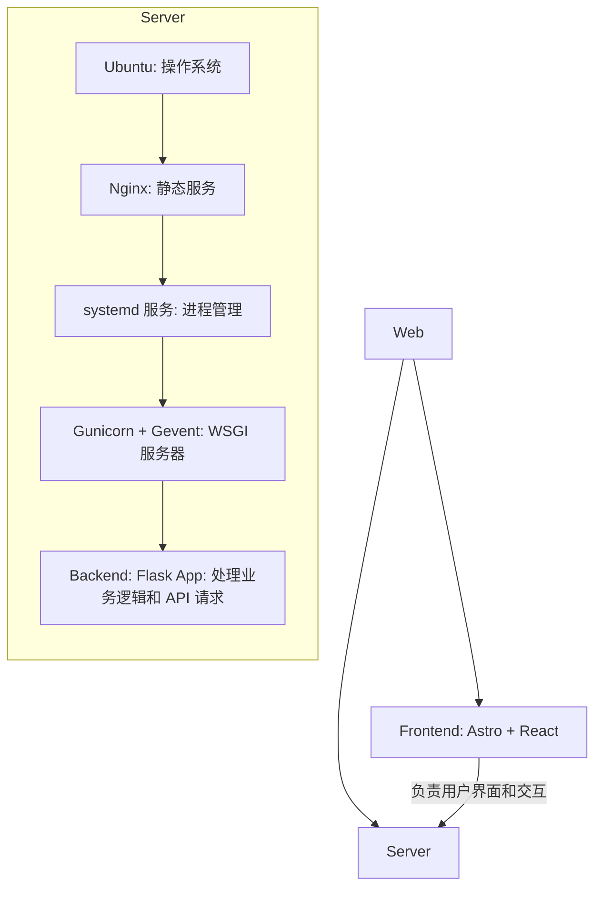
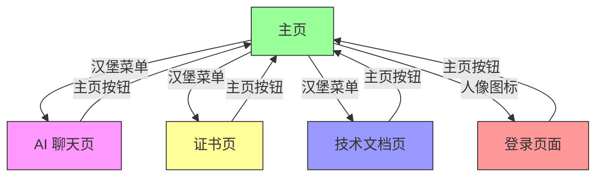

<!-- START doctoc generated TOC please keep comment here to allow auto update -->
<!-- DON'T EDIT THIS SECTION, INSTEAD RE-RUN doctoc TO UPDATE -->

- [张人大 · 轻量级网站](#%E5%BC%A0%E4%BA%BA%E5%A4%A7-%C2%B7-%E8%BD%BB%E9%87%8F%E7%BA%A7%E7%BD%91%E7%AB%99)
  - [简介](#%E7%AE%80%E4%BB%8B)
  - [技术栈](#%E6%8A%80%E6%9C%AF%E6%A0%88)
    - [目录结构](#%E7%9B%AE%E5%BD%95%E7%BB%93%E6%9E%84)
    - [参考架构](#%E5%8F%82%E8%80%83%E6%9E%B6%E6%9E%84)
  - [前端](#%E5%89%8D%E7%AB%AF)
    - [架构说明](#%E6%9E%B6%E6%9E%84%E8%AF%B4%E6%98%8E)
      - [BaseLayout 组件设计说明](#baselayout-%E7%BB%84%E4%BB%B6%E8%AE%BE%E8%AE%A1%E8%AF%B4%E6%98%8E)
    - [本地开发和预览](#%E6%9C%AC%E5%9C%B0%E5%BC%80%E5%8F%91%E5%92%8C%E9%A2%84%E8%A7%88)
      - [GitHub Actions](#github-actions)
      - [使用说明](#%E4%BD%BF%E7%94%A8%E8%AF%B4%E6%98%8E)
    - [网站功能](#%E7%BD%91%E7%AB%99%E5%8A%9F%E8%83%BD)
      - [页面功能](#%E9%A1%B5%E9%9D%A2%E5%8A%9F%E8%83%BD)
      - [页面跳转](#%E9%A1%B5%E9%9D%A2%E8%B7%B3%E8%BD%AC)
      - [页面内容](#%E9%A1%B5%E9%9D%A2%E5%86%85%E5%AE%B9)
      - [页面优化](#%E9%A1%B5%E9%9D%A2%E4%BC%98%E5%8C%96)
      - [配色方案](#%E9%85%8D%E8%89%B2%E6%96%B9%E6%A1%88)
  - [**后端**](#%E5%90%8E%E7%AB%AF)
  - [**Nginx 服务器**](#nginx-%E6%9C%8D%E5%8A%A1%E5%99%A8)
  - [文档说明](#%E6%96%87%E6%A1%A3%E8%AF%B4%E6%98%8E)
    - [Git 分支与发布流程](#git-%E5%88%86%E6%94%AF%E4%B8%8E%E5%8F%91%E5%B8%83%E6%B5%81%E7%A8%8B)
    - [CI/CD 工作流](#cicd-%E5%B7%A5%E4%BD%9C%E6%B5%81)
    - [BUG 记录](#bug-%E8%AE%B0%E5%BD%95)
    - [开发需求](#%E5%BC%80%E5%8F%91%E9%9C%80%E6%B1%82)
    - [原生到 Astro + React 升级](#%E5%8E%9F%E7%94%9F%E5%88%B0-astro--react-%E5%8D%87%E7%BA%A7)
    - [响应式图片系统维护](#%E5%93%8D%E5%BA%94%E5%BC%8F%E5%9B%BE%E7%89%87%E7%B3%BB%E7%BB%9F%E7%BB%B4%E6%8A%A4)
    - [错误跟踪](#%E9%94%99%E8%AF%AF%E8%B7%9F%E8%B8%AA)
    - [工具函数参考文档](#%E5%B7%A5%E5%85%B7%E5%87%BD%E6%95%B0%E5%8F%82%E8%80%83%E6%96%87%E6%A1%A3)
    - [预提交钩子综合指南](#%E9%A2%84%E6%8F%90%E4%BA%A4%E9%92%A9%E5%AD%90%E7%BB%BC%E5%90%88%E6%8C%87%E5%8D%97)
    - [测试指南](#%E6%B5%8B%E8%AF%95%E6%8C%87%E5%8D%97)
    - [JS ➜ TS 迁移指南](#js-%E2%9E%9C-ts-%E8%BF%81%E7%A7%BB%E6%8C%87%E5%8D%97)
    - [样式体系说明](#%E6%A0%B7%E5%BC%8F%E4%BD%93%E7%B3%BB%E8%AF%B4%E6%98%8E)
  - [🤝 贡献指南](#-%E8%B4%A1%E7%8C%AE%E6%8C%87%E5%8D%97)
  - [🔒 开源许可证](#-%E5%BC%80%E6%BA%90%E8%AE%B8%E5%8F%AF%E8%AF%81)
  - [📬 联系方式](#-%E8%81%94%E7%B3%BB%E6%96%B9%E5%BC%8F)

<!-- END doctoc generated TOC please keep comment here to allow auto update -->

# 张人大 · 轻量级网站

- **作者**: 张人大
- **最后更新**: August 10, 2025, 04:52 (UTC+08:00)

---

## 简介

**[Click here to view the English Version in Github](https://github.com/RendaZhang/rendazhang/blob/master/README_EN.md)**

这是我个人维护的 **轻量级** 网站，作为我的技术能力的在线展示平台。

**网站链接**: 🌐 [www.rendazhang.com](https://www.rendazhang.com)

本网站已进行 SEO / GEO 优化。

> 如果您需要更重量级的服务器解决方案，可以参考我的云原生项目：📁 [Renda Cloud LAB](https://github.com/RendaZhang/renda-cloud-lab)。该项目提供了基于云原生的完整架构设计，适用于大规模和高可用性场景。

---

## 技术栈

| 分类     | 技术                                               |
| -------- | -------------------------------------------------- |
| 前端      | **Astro**, **React**, TypeScript                  |
| 状态管理  | React `useState`、`useContext`（可扩展 Zustand 等） |
| 构建工具  | Astro 内置 (基于 Vite)                              |
| 后端     | Flask + OpenAI API                                  |
| 部署     | GitHub Actions + Nginx                              |

### 目录结构

```bash
src/
├── assets/
├── constants/           # 站点元信息、资源路径与应用设置
├── features/            # 按业务划分的模块
│   ├── chat/
│   │   ├── components/
│   │   ├── hooks/
│   │   └── services/
│   └── auth/
│       ├── components/
│       ├── hooks/
│       └── services/
├── hooks/               # 业务逻辑自定义 hooks
├── styles/
│   ├── core/               # 核心变量
│   │   ├── tokens.css      # 设计 Token（颜色、间距等）
│   │   ├── legacy-alias.css # 旧变量别名
│   │   └── _gradients.css  # 渐变系统
│   ├── components/         # 组件样式
│   ├── utilities/          # 工具类
│   └── theme.css           # 主入口文件
├── scripts/
├── utils/               # 通用工具函数
├── models/              # 领域模型
├── services/           # API interaction layer
└── components/
    ├── ui/
    ├── layouts/
    ├── forms/
    ├── chat/
    ├── sections/
    └── providers/
```

### 参考架构

ASCII 图示：

```bash
Web Application Architecture
============================

Frontend (
   Astro + React
   - 负责用户界面和交互
) → CI/CD (
   GitHub Actions 自动构建部署
) → Server (
   Ubuntu (操作系统)
   ↓
   Nginx (静态文件服务)
   ↓
   systemd 服务 (进程管理)
   ↓
   Gunicorn + Gevent (WSGI 服务器)
   ↓
   Backend: Flask App (处理业务逻辑和 API 请求)
)
```

Mermaid Flow 图示：



---

## 前端

本仓库就是前端项目：📁 [Renda Zhang WEB](https://github.com/RendaZhang/rendazhang)

### 架构说明

#### BaseLayout 组件设计说明

`src/layouts/BaseLayout.astro` 是站点的全局页面框架，用于设置 `<head>` 元信息、SEO 标签以及根级插槽；仅在 `<NavBarWrapper>` 上启用了 React 的 `client:load`。保留该文件为 Astro 组件的主要考虑如下：

- **静态内容无需 JavaScript**：布局结构和元数据生成属于纯静态内容，Astro 可以直接输出 HTML，无需引入 React 运行时。
- **保持局部水合优势**：当前仅对导航栏等交互区使用 React 水合，其余内容保持零 JS，以最小化 bundle 体积。如果整体改写为 React，会带来额外脚本和水合开销。
- **充分利用 Astro 特性**：`<slot>`、`is:inline` 等 Astro 专属语法在布局中被广泛使用，若迁移到 React 需额外封装或插件支持，增加维护成本。

只有在计划将站点全面迁移到 React，或需要在布局层共享复杂的 React 状态/上下文时，才考虑改写 `BaseLayout.astro`。在现阶段，维持 Astro 版本更简洁高效。

为满足 Nginx 的 CSP 限制并在 404/500 等纯静态页面中复用主题与语言逻辑，原有的内联初始化脚本已抽离为阻塞式外部脚本 `/js/base-layout-init.js`。该文件由 `src/scripts/base-layout-init.ts` 编译生成，并通过 `data-theme-key`、`data-lang-key` 等属性向脚本传递存储键，在渲染前完成主题和语言初始化。

### 本地开发和预览

1. 安装依赖并启用 pre-commit：

   ```bash
   npm install
   pip install pre-commit
   pre-commit install
   ```

2. 运行本地开发服务器：

   ```bash
   npm run dev
   ```

3. 构建并预览生产版本：

   ```bash
   npm run build
   npm run preview
   ```

4. 如需连接自定义后端接口，可在根目录 `.env` / `.env.local` 文件设置 `PUBLIC_API_BASE_URL`：

   ```bash
   PUBLIC_API_BASE_URL=https://api.example.com
   ```

5. Sentry 集成还需要以下变量：

   ```bash
   SENTRY_DSN=<server dsn>
   PUBLIC_SENTRY_DSN=<browser dsn>
   SENTRY_PROJECT=<your project>
   SENTRY_AUTH_TOKEN=<auth token>
   ```

   本地检查或提交前如需跳过 Sentry 上报，可临时添加环境变量：

   ```bash
   SKIP_SENTRY=true pre-commit run --all-files
   SKIP_SENTRY=true npm run astro -- check --incremental
   ```

   如需临时跳过 ESLint 检查以加快提交，可设置：

   ```bash
   SKIP_ESLINT=true pre-commit run --all-files
   ```

6. 环境变量说明

   本地可以配置在 `.env` 或者 `.env.local`，并通过 `src/utils/env.ts` 的 `getEnv()` 读取：

   ```sh
   # 公开信息
   PUBLIC_SITE_BASE_URL = "https://www.rendazhang.com"
   PUBLIC_CDN_BASE="https://cdn.jsdelivr.net/gh/rendazhang/rendazhang@1.0.1/"
   PUBLIC_API_BASE_URL="/cloudchat"
   PUBLIC_SENTRY_DSN="https://e184a284f1b7342d197ee0a0151f8353@o4509770577543168.ingest.us.sentry.io/4509770780377088"
   PUBLIC_TAG_NAME="v1.0.1"
   NODE_ENV="production"
   PUBLIC_NODE_ENV="development" # 本地调试覆盖为 development
   SKIP_SENTRY="true" # 跳过 Sentry
   SKIP_ESLINT="true" # 跳过 ESLint 检查

   # 敏感配置（如下为示例）
   SENTRY_AUTH_TOKEN="sntrys_xxx"
   SENTRY_DSN="https://private-key@xxx.ingest.us.sentry.io/xxx"
   SENTRY_PROJECT="xxx"
   SENTRY_ORG="xxx"
   ```

执行 `npm run build` 后，`dist/_astro` 目录会生成带有哈希后缀的静态文件，方便浏览器长时间缓存。

浏览器访问 `http://localhost:4321` 查看效果。

构建后的静态文件可使用 `npm run preview` 验证。

#### GitHub Actions

Push 到 `master` 分支会触发 GitHub Actions 自动部署：

1. 检出代码并安装依赖
2. 构建前执行 `npm run astro -- check` 进行类型检查
3. 执行 `npm run build` 生成静态文件
4. 通过 `appleboy/scp-action` 将 `dist/` 内容上传到服务器指定目录（如 `/var/www/html`）
5. 部署完成后即可通过 Nginx 提供服务

> 本地提交不会自动运行 `astro check`，如需校验请手动执行：`npm run astro -- check`

需要在仓库 Secrets 中配置服务器 IP、SSH 用户和私钥等信息。详情见 📄 [配置 GitHub Actions](https://github.com/RendaZhang/rendazhang/blob/master/docs/guides/NATIVE_TO_ASTRO_REACT_UPGRADE.md#%E9%85%8D%E7%BD%AE-github-actions)。

#### 使用说明

部署完成后可直接访问各模块页面。

如下是我的网站的每个页面的链接：

- 🌐 [主页](https://www.rendazhang.com/)
- 🌐 [AI 聊天页面](https://www.rendazhang.com/deepseek_chat/)
- 🌐 [证书页面](https://www.rendazhang.com/certifications/)
- 🌐 [基于本文档渲染后的技术文档页面](https://www.rendazhang.com/docs/)
- 🌐 [登录页面](https://www.rendazhang.com/login/)
- 🌐 [注册页面](https://www.rendazhang.com/register/)

### 网站功能

关于网站的核心功能体系，请参考以下文档链接：📄 [核心功能体系](https://github.com/RendaZhang/rendazhang/blob/master/docs/REQUIREMENTS.md#-%E6%A0%B8%E5%BF%83%E5%8A%9F%E8%83%BD%E4%BD%93%E7%B3%BB)。该文档详细描述了网站的核心功能模块，包括功能设计和技术实现，是开发与维护的重要参考。

- 主题切换（浅色 / 深色）
- 语言切换（中文 / 英文）
- 与 AI 在线对话
- 浮动 AI 聊天窗口
- 回到顶部按钮
- 技术文档渲染展示页 (docs/)
- 登录与注册表单
- 联系表单
- 内容平台链接
- 证书展示
- 简历下载

#### 页面功能

各页面核心职责如下（均由 `.astro` 文件生成）：

- `index.astro`：个人介绍页，展示个人信息、教育、技能、博客及工作经验，并预置 ChatWidget 浮标。
- `certifications.astro`：证书列表页。
- `deepseek_chat.astro`：AI 聊天界面。
- `docs.astro`：技术文档页面。
- `login.astro`：登录页。
- `register.astro`：注册页。
- `404.astro`，`500.astro`：错误页面。

#### 页面跳转

1. **返回主页**
   - 所有页面均包含导航栏中的“主页”按钮，点击后可返回主页。

2. **导航栏菜单跳转**
   - 通过点击导航栏的“汉堡菜单”按钮，用户可选择跳转到以下四个页面：
     - 首页
     - AI 聊天页
     - 证书页
     - 技术文档页

3. **登录页面跳转**
   - 通过点击导航栏的“人像图标”按钮，用户可跳转到登录页面。

Mermaid Flow 图示：



#### 页面内容

- `index.astro`：多 Section 主页，包含 "Hero"、"自我介绍"、"教育"、"博客"、"技能与能力"、"经历"、"联系我吧" 等模块，并默认悬挂 `ChatWidget` 浮标。
- `certifications.astro`：栅格卡片形式展示证书，并嵌入 Credly 验证链接。
- `deepseek_chat.astro`：由聊天记录区域与输入框组成的对话界面，支持流式输出并实时渲染 AI 返回的 Markdown 内容，提供一键复制原始内容的功能，并在页面刷新后自动保留历史记录，同时加载 `github.min.css` 和 `github-markdown-light.css` 以保持代码高亮与排版一致。聊天组件已拆分为 `ChatMessageList`、`ChatInput` 等子组件，方便复用与维护。
- `docs.astro`：技术文档页面，使用同样的两份 GitHub 样式表配合 highlight.js 渲染 Markdown 与代码。
- `login.astro`：登录表单页。
- `register.astro`：注册表单页。
- `404.astro / 500.astro`：用于处理页面不存在（404）和服务器内部错误（500）的定制化错误页面，提供清晰的错误信息、友好的用户引导和返回主页的链接，以提升用户体验。

#### 页面优化

**自适应布局**：优化页面在不同设备上的显示效果，减少不必要的资源加载和布局计算，从而提高性能。确保页面在不同屏幕尺寸（如桌面、平板、手机）上都能良好显示，提升用户体验。

**懒加载**：所有图片开启了懒加载 + Loading 动画，其中，针对高清图片采用 LQIP 懒加载优化（比如主页的 Hero 区域）

#### 配色方案

项目的核心色彩使用 OKLCH 设计令牌并通过 `color-mix` 提供 sRGB 回退，以保证明暗模式下的感知一致性。

详情参考文档内容：📄 [配色方案](https://github.com/RendaZhang/rendazhang/blob/master/docs/STYLE_GUIDE.md#%E9%85%8D%E8%89%B2%E6%96%B9%E6%A1%88)

---

## **后端**

> 后端部署的具体步骤和配置，请参考以下项目：📁 [Python Cloud Chat](https://github.com/RendaZhang/python-cloud-chat)。该项目提供了完整的后端实现和部署指南，帮助您快速搭建和运行后端服务。

---

## **Nginx 服务器**

> 前端项目通过 GitHub Actions 自动化构建后，会直接推送到服务器的 `/var/www/html` 目录，并由 Nginx 提供静态资源服务。

> 关于 Nginx 的详细配置和操作说明，请查看以下仓库：📁 [Nginx Conf](https://github.com/RendaZhang/nginx-conf)。该仓库包含了常用的 Nginx 配置文件和使用示例，方便您快速上手。

> 为充分利用构建生成的指纹文件，可在 Nginx 中为 `/_astro/` 路径添加长效缓存配置：

```nginx
location /_astro/ {
    access_log off;
    add_header Cache-Control "public, max-age=31536000, immutable";
}
```

> 如果您需要更重量级的服务器解决方案，可以参考我的云原生项目：📁 [Renda Cloud LAB](https://github.com/RendaZhang/renda-cloud-lab)。该项目提供了基于云原生的完整架构设计，适用于大规模和高可用性场景。

---

## 文档说明

### Git 分支与发布流程

> 项目采用 `master`/`develop` 双主线，并约定 `feature`、`hotfix`、`experiment` 等分支的命名规范与合并策略，详见：📄 [Git Workflow](https://github.com/RendaZhang/rendazhang/blob/master/docs/GIT_WORKFLOW.md#git-workflow)。

### CI/CD 工作流

> `deploy.yml` 定义了推送到 `master` 时触发的自动部署流程，包括标签管理、发布分支与环境变量映射等，可参考：📄 [CI / CD Pipeline](https://github.com/RendaZhang/rendazhang/blob/master/docs/CI_CD.md#ci--cd-pipeline)。

### BUG 记录

> 前端开发过程中遇到的 BUG 及其解决方案，请参考以下文档：📄 [前端 BUG 跟踪数据库](https://github.com/RendaZhang/rendazhang/blob/master/docs/TROUBLESHOOTING.md#%E5%89%8D%E7%AB%AF-bug-%E8%B7%9F%E8%B8%AA%E6%95%B0%E6%8D%AE%E5%BA%93)。该文档详细记录了 BUG 的描述、复现步骤、解决方案以及相关开发者的处理记录，帮助您快速定位和解决问题。

### 开发需求

> 项目的功能需求、优先级以及开发计划，请参考以下文档：📄 [项目需求清单](https://github.com/RendaZhang/rendazhang/blob/master/docs/REQUIREMENTS.md#%E9%A1%B9%E7%9B%AE%E9%9C%80%E6%B1%82%E6%B8%85%E5%8D%95)。该文档列出了当前版本的所有需求，并提供了需求的详细描述和开发状态，方便您了解项目进展和规划开发任务。

### 原生到 Astro + React 升级

前端目前采用 **Astro** + **React** 的架构，基于分层设计理念，通过 **GitHub Actions** 实现自动化构建，并将构建产物部署到服务器 Nginx 的指定目录下。

具体的从原生前端升级的操作步骤，请参考以下文档内容：📄 [升级计划](https://github.com/RendaZhang/rendazhang/blob/master/docs/guides/NATIVE_TO_ASTRO_REACT_UPGRADE.md#%E6%97%A7%E7%89%88%E5%8E%9F%E7%94%9F%E5%89%8D%E7%AB%AF%E5%88%B0-astro--react-%E6%96%B0%E5%89%8D%E7%AB%AF%E7%9A%84%E6%B8%90%E8%BF%9B%E5%8D%87%E7%BA%A7%E8%AE%A1%E5%88%92)。该文档详细描述了从旧版原生前端逐步迁移到基于 Astro 和 React 的新前端架构的完整计划与实施步骤。

开发环境准备的具体步骤，请参考以下文档内容：📄 [环境准备](https://github.com/RendaZhang/rendazhang/blob/master/docs/guides/NATIVE_TO_ASTRO_REACT_UPGRADE.md#%E9%98%B6%E6%AE%B5-1%E7%8E%AF%E5%A2%83%E5%87%86%E5%A4%87%E4%B8%8E-astro-%E9%A1%B9%E7%9B%AE%E5%88%9D%E5%A7%8B%E5%8C%96)。该文档详细说明了如何完成开发环境的配置以及 Astro 项目的初始化工作，确保您能够顺利开始后续的开发任务。

### 响应式图片系统维护

网站图片通过自动化脚本生成响应式版本并内置 LQIP 占位效果，方便在不同设备上快速加载。

详细操作流程与扩展指南请参阅：📄 [通用响应式图片处理系统维护文档](https://github.com/RendaZhang/rendazhang/blob/master/docs/guides/RESPONSIVE_IMAGE_SYSTEM_MAINTENANCE.md#%E9%80%9A%E7%94%A8%E5%93%8D%E5%BA%94%E5%BC%8F%E5%9B%BE%E7%89%87%E5%A4%84%E7%90%86%E7%B3%BB%E7%BB%9F%E7%BB%B4%E6%8A%A4%E6%96%87%E6%A1%A3)

### 错误跟踪

Sentry 用于收集运行时异常与网络错误。配置步骤请见 📄 [错误跟踪集成](https://github.com/RendaZhang/rendazhang/blob/master/docs/guides/SENTRY_ERROR_TRACKING.md#sentry-error-tracking-integration).

### 工具函数参考文档

`src/utils/env.ts`、`src/utils/langUtils.ts`、`src/utils/storage.ts` 与 `src/utils/logger.ts` 提供统一的环境变量访问、语言解析、多后端存储方案与可扩展的日志接口。

文档详见：📄 [工具函数参考文档](https://github.com/RendaZhang/rendazhang/blob/master/docs/guides/UTILITIES_REFERENCE.md#%E5%B7%A5%E5%85%B7%E5%87%BD%E6%95%B0%E5%8F%82%E8%80%83%E6%96%87%E6%A1%A3).

### 预提交钩子综合指南

详细预提交钩子说明请参阅：[预提交钩子综合指南](https://github.com/RendaZhang/rendazhang/blob/master/docs/guides/PRE_COMMIT_GUIDE.md#%E9%A2%84%E6%8F%90%E4%BA%A4%E9%92%A9%E5%AD%90%E7%BB%BC%E5%90%88%E6%8C%87%E5%8D%97)

### 测试指南

项目使用 [Vitest](https://vitest.dev/) 进行单元测试。运行 `npm test` 即可执行所有测试；`npm run test:watch` 可在开发过程中持续监听；如需覆盖率报告，可使用 `npm run test:coverage`。测试文件需以 `.test.ts` 或 `.spec.ts` 命名，通常与源码放在同一目录或 `__tests__` 子目录下。更多示例与编写说明参见：[测试指南](https://github.com/RendaZhang/rendazhang/blob/master/docs/TESTING.md#%E6%B5%8B%E8%AF%95%E6%8C%87%E5%8D%97)。

### JS ➜ TS 迁移指南

> 汇总从 JavaScript 到 TypeScript 的完整迁移过程与经验，包括配置、分步策略和常见报错排查。详见：📄 [JS ➜ TS 全量迁移实战指南](https://github.com/RendaZhang/rendazhang/blob/master/docs/guides/JS_TO_TS_MIGRATION_GUIDE.md#js-%E2%9E%9C-ts-%E5%85%A8%E9%87%8F%E8%BF%81%E7%A7%BB%E5%AE%9E%E6%88%98%E6%8C%87%E5%8D%97)。

### 样式体系说明

> 介绍项目的 CSS 架构、基于 OKLCH 的设计 Token 体系与构建流程，展示 `postcss-import` 如何在编译阶段内联 `theme.css` 引用的核心与工具样式以减少运行时请求，详见：📄 [样式说明](https://github.com/RendaZhang/rendazhang/blob/master/docs/STYLE_GUIDE.md#%E6%A0%B7%E5%BC%8F%E8%AF%B4%E6%98%8E)。

---

## 🤝 贡献指南

- Fork 并克隆这个仓库。
- 进入虚拟环境：
   ```bash
   # 如果还没安装虚拟环境，执行命令：python -m venv venv
   source venv/bin/activate
   ```
- 安装依赖并启用 **pre-commit**:
   ```bash
   pip install pre-commit
   pre-commit install
   ```
- 在每次提交前，钩子会自动运行，执行以下操作：
  - 自动修复基础格式问题（行尾空格、文件末尾换行符等）
  - 更新文档目录和最后更新时间
  - 同步 README 文件到 assets 目录
  - 验证静态资源命名规范
  - 自动生成模块 `index.ts` 文件
  - 执行代码格式化和静态检查

> ✅ 所有提交必须通过 pre-commit 检查；CI 会阻止不符合规范的 PR

---

## 🔒 开源许可证

本项目以 **MIT 许可证** 发布，你可以自由使用与修改。请在分发时保留原始许可证声明。

---

## 📬 联系方式

* 联系人：张人大（Renda Zhang）
* 📧 邮箱：[952402967@qq.com](mailto:952402967@qq.com)

> ⏰ **维护者**：@张人大 — 如果本项目对你有帮助，请不要忘了点亮 ⭐️ Star 支持我们！
